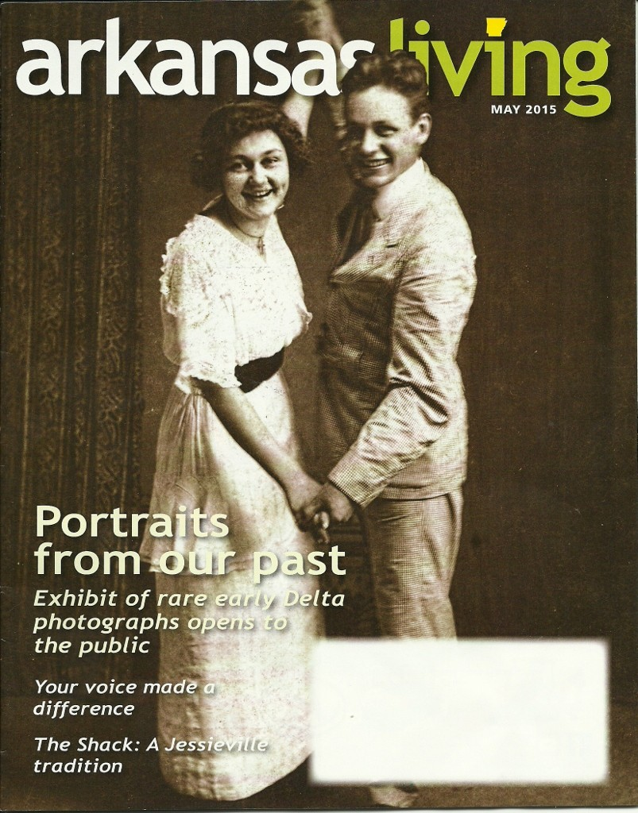
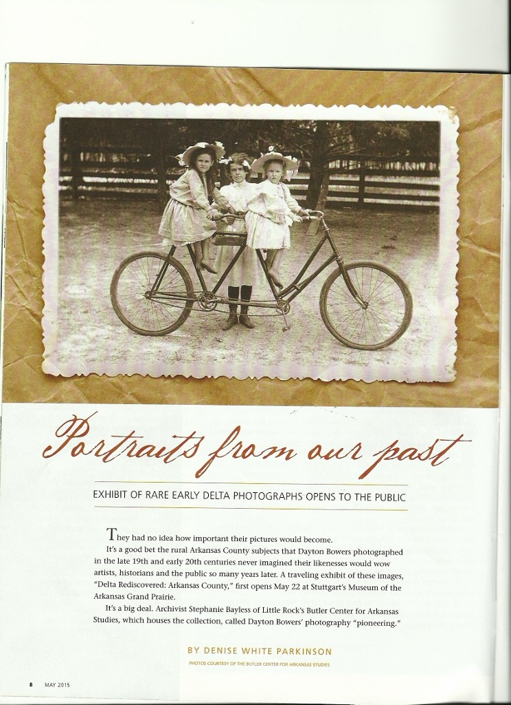
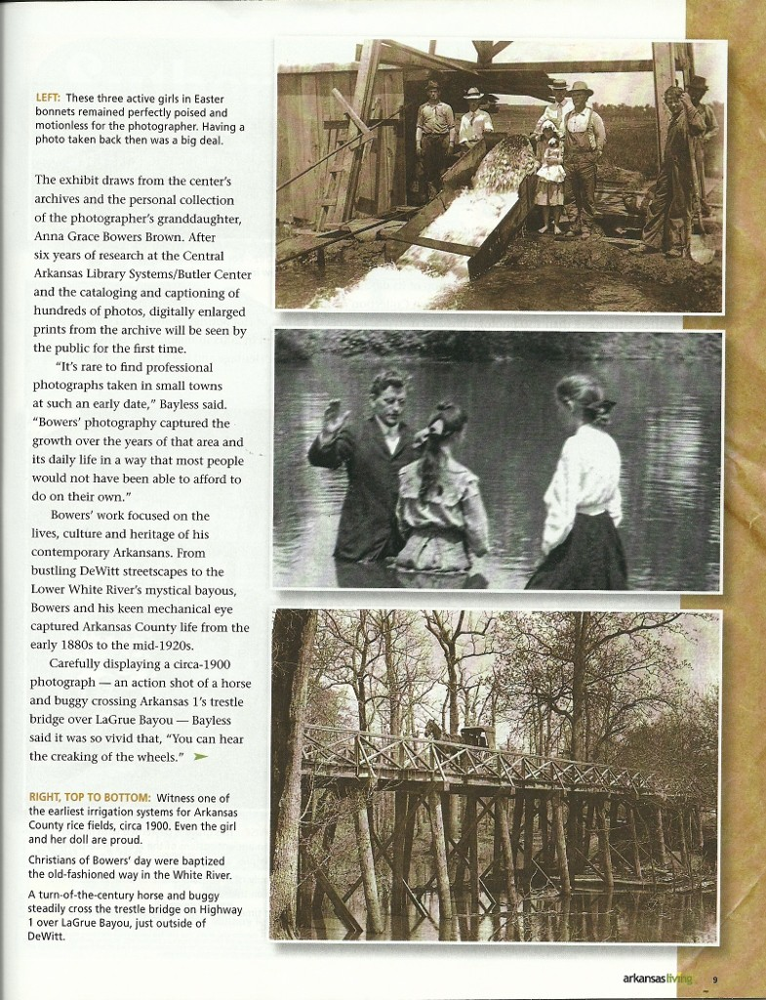

<!--more-->

"DELTA REDISCOVERED" featured at Hot Springs September Gallery Walk

A touring exhibit of rare photographs from the rediscovered archives of Dayton Bowers premiers Friday, September 4 at Linda Palmer Gallery, 800 Central Avenue in Hot Springs Historic Downtown Arts District. Gallery Walk begins at 5 pm; refreshments will be served.

Meet curator Denise White Parkinson, author of _Daughter of the White River_ (History Press, 2013), and travel back in time to a lost world. DeWitt photographer Dayton Bowers chronicled the rise of the Delta from 1880-1924, celebrating growing towns and changing industries, as well as creating portraits of Arkansans at work, play, worship and mourning.

_Arkansas Living_'s cover story showcases "Delta Rediscovered"

The Bowers archive was donated to Central AR Library System's collection more than a decade ago by the late Hot Springs historian LC Brown; several Bowers photographs appear in _Daughter of the White River_, the book Brown inspired. This exhibit is the first to showcase Bowers's diverse style, which influenced another notable Arkansas County-born photographer: Mike DisFarmer.

Dayton Bowers photographed his children throughout their lives

The theme for Arkansas Department of Heritage, 2015: "From the Delta to the Hills: different landscapes, a common heritage," is beautifully realized in this exhibit. For more information, contact 401.276.6870, or visit on FB: The Rediscovered Archives of Dayton Bowers.

Bowers traveled Arkansas County photographing daily life

On display through September at Linda Palmer Gallery, "Delta Rediscovered" is made possible by grants from the Arkansas Department of Heritage, The Morris Foundation and the family of LC Brown.
