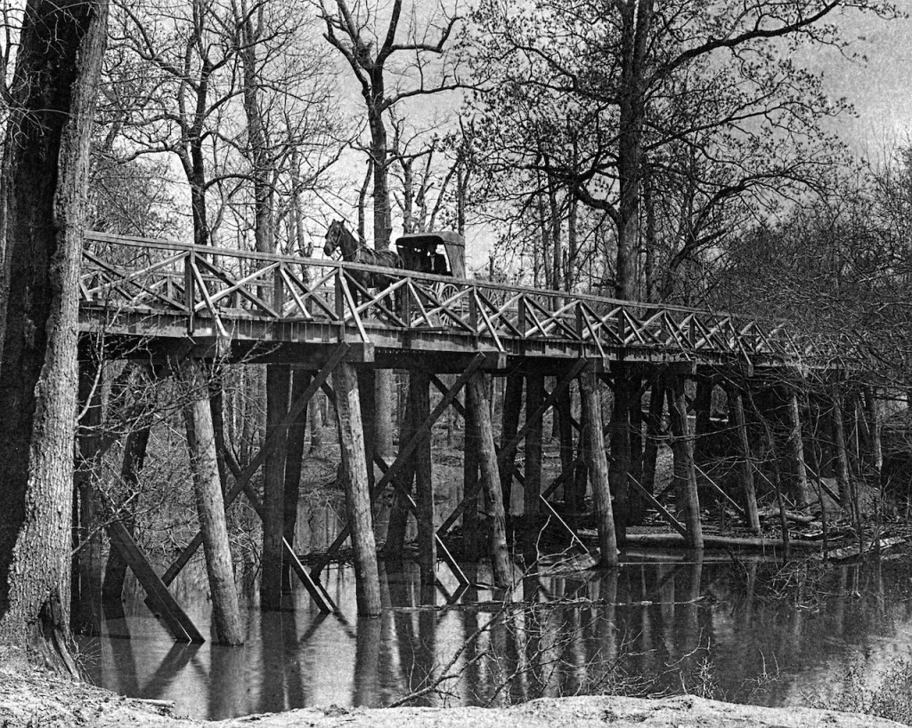
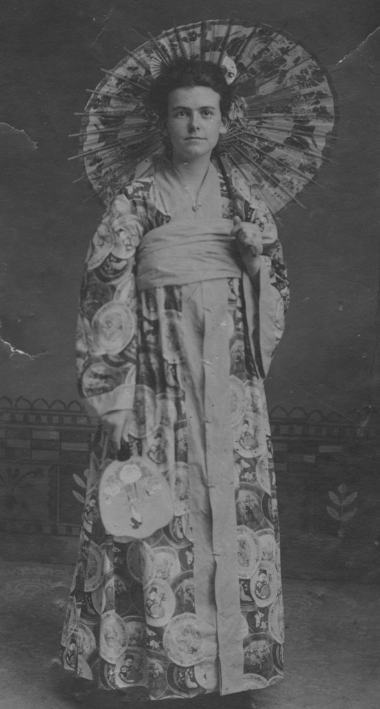
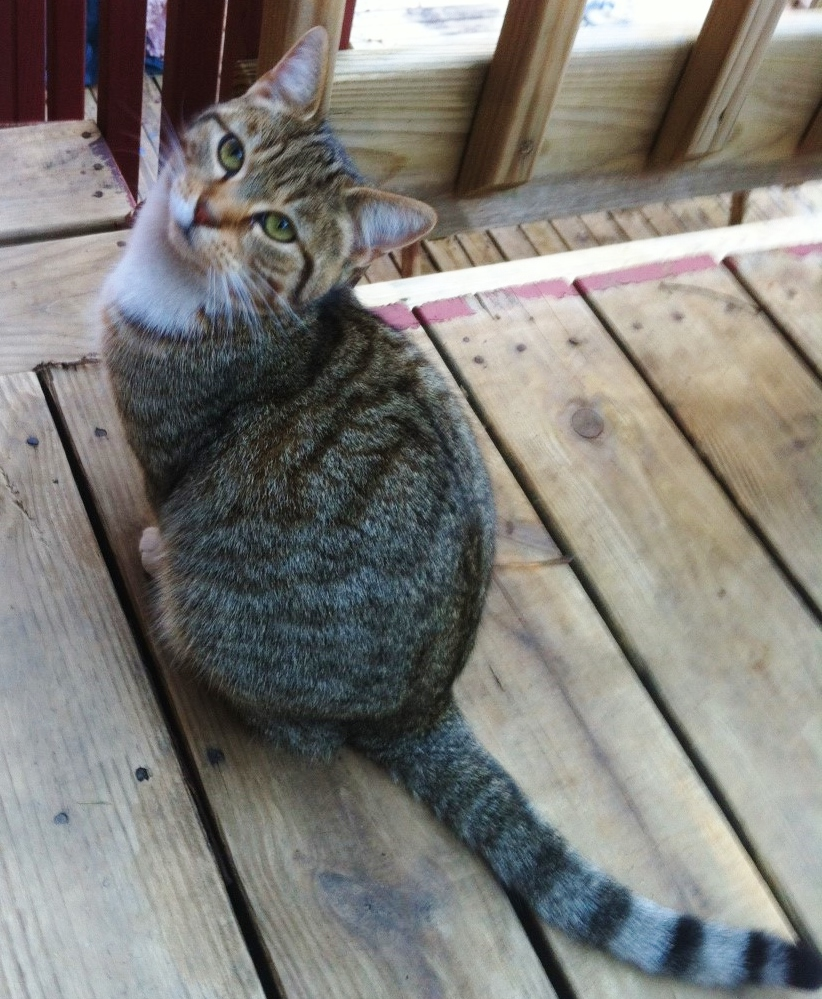
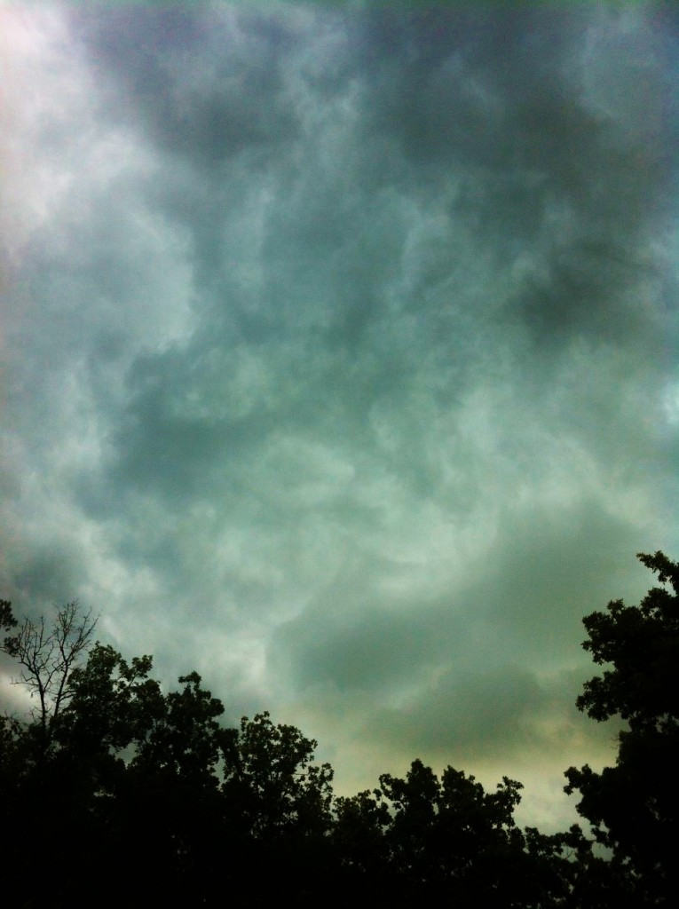

Momma was buried with the baby in her arms at her kin’s plot in Van, a flyspeck in the Delta near St. Charles. Daddy and I went back to Skunk Holler to tend to his affairs. I wasn’t sure what that meant. He spent a lot of time sitting in his undershirt at the kitchen table, staring at piles of documents, chin in hand, and quit going to his job at the mill. When Monday came around and I had to go back to school, I learned right quick how things would be different from here on in.

The kids at Skunk Holler had seen me leave before, and come back to all this. It was a case of mutual bewilderment. They didn’t know what to say and shrank away as if I were contagious. Mattie Lively tried to be nice. She came up and blurted, “Your momma was an angel!” but it bothered me. I remembered something Daddy used to say whenever Momma nagged him about going to church.

“She’s no angel,” I bawled at poor Mattie. “She’s a feisty hellcat with a scratchy tongue!”

I took to skipping school and when Dad found out, he didn’t have the heart to whup me. The rats’ nest of documents on the kitchen table was growing more coffee-stained and crumpled by the day, so when Dad was napping, I tried reading them. Most didn’t make any sense, but there were some official looking papers from Momma’s Great-Aunt Adeline that caught my eye. She passed the year before.

I shook Dad awake and read out loud from the papers. He gave me a bear hug, tears in his eyes—he hadn’t been able to puzzle out the cursive on the deed. We had inherited Aunt Adeline’s dirt farm—10 acres and a creek! Slinging me by the arms, Dad danced like a Holy Roller. He had a mission now.

We were packing up the house when a knock sounded—a rapid rat-a-tat-tat that stopped us cold. “It’s Aunt Eula,” Dad gasped, and we instinctively looked around for a place to hide. She barged in the unlocked door, talking a streak and carrying a tattered parasol, the source of the knock.

“Did you not receive my letters? I have written you precisely every three days since the funeral.” Aunt Eula nodded coldly at me like she always did and Dad escorted her to the sun parlor where they could chat. Aunt Eula was Aunt Adeline’s sister. Momma used to say she was a lot of fun back in the day, when Eula and Adeline were flappers. Adeline stayed sweet and kind, but Aunt Eula soured up the older she got. I guessed she must be about 90 by now.

After she left in her usual huff, Dad gave me the bad news: Aunt Eula was going to be our landlady. Something about her being the executioner of Momma’s estate. “Cheer up, Dad,” I offered hopefully. “Aunt Eula can’t last forever.”

The trip to Van was a slog, but we made it by sundown. We spotted the house down a dirt road, a small wooden structure framed by a pair of big pecan trees. The yard was all grown up with weeds, but the key worked and once inside, we both flopped into the nearest chair and looked around. “Better than the company house in Skunk Holler, ain’t it?” sighed Dad. The front room was dark, so I opened all the curtains. It was definitely a little-old-lady kind of place, but real nice. “Momma would like this,” I blurted without thinking.

I followed Dad into the kitchen. Wood stove, red-handled pump over the sink, a deal table and chairs—he worked the pump until a stream of water flowed into the sink. “Yep, it’s a peach of a place,” Dad said sadly.

He dropped me off at Uncle Harold’s for a few days while he made some repairs to the house. As the Ford rumbled off, Uncle Harold elbowed me, saying, “Want to see a surprise?” I followed him to the kitchen; in a corner on the linoleum was a shoebox. Bo was guarding it, wagging. Inside the box, a tabby kitten peeked out of a nest of lambswool.

I was thunderstruck—here was my first pet. Momma frowned upon “house animals” as she called them. Every turtle, lizard, frog—even chipmunk—that I smuggled home eventually got sent back to the woods, no matter how I begged. All of a sudden, the kitten made a sound like a mudcat does when you pull it out of the water. Scooping up the ball of fur, I asked its name. “That’s your job,” said Uncle Harold. ”She’s all yours.”

“Mudcat. Her name’s Mudcat,” I said, rubbing my face in her fur.

The next few days were spent fishing off the deck with Mudcat. Uncle Harold sat nearby and whittled, giving me pointers from time to time. Mudcat was the ideal fishing buddy. She sat watching and lashed her tail, sometimes darting off to chase butterflies. I landed a good-sized blue channel catfish after a struggle and Uncle Harold put it on the stringer.

“What’s that cat got ahold of,” he muttered, as Mudcat zigzagged across the deck. It was a leopard frog. Uncle Harold chased down and rescued the hopping frog. “Shoo, Mudcat, this here’s my prize,” he chuckled.

For the next two days, Uncle Harold tormented me with that frog. He hid it in the medicine cabinet, where my toothbrush was. He hid it in the mailbox, in my tacklebox and my bedroom slippers. I got so nerved up from that frog jumping out at me and Uncle Harold cackling in the next room that I finally took the thing and threw it in the river. Uncle Harold pulled a long face; after a while I couldn’t stand it. I ran up the stage plank while he was skinning the catfish and on the third tree trunk I found a peeper—a little green tree frog. Smuggling it onto the houseboat, I looked around for the best place to put it to scare Uncle Harold.

“Altha Ray’s here,” Uncle Harold sang out. I darted into the kitchen with the frog, stashing it in the first convenient place: the sugar bowl. Retreating to my room, I hid under the quilt and listened. Altha Ray came into the kitchen and started her usual clatter with the dishes. I caught the words “peach cobbler recipe” and “cup of sugar” and next thing I knew, Altha Ray was howling like a banshee.

She left without making the cobbler after lecturing Uncle Harold on the sin of wasting good sugar. He poked his head around the doorway. “Guess I’ll take this peeper out and put him to bed,” he grinned. I snuggled with Mudcat until the frogs sang me to sleep.

When Dad showed up the next day, we had a heck of a fish fry, with hush puppies and chow-chow. Uncle Harold asked how the repairs were going, and Dad gave a heavy sigh. His work was now being overseen by the constant presence of Aunt Eula. “She showed up the other day and said she’s staying to make sure I fix everything right,” Dad groaned. “And ever since then, I can’t drive a straight nail.” At that, Uncle Harold uncorked his flask and shooed me off to bed. I eavesdropped from there on in:

“Eula ain’t been right since she ran off with that fancy-pants man,” I heard Uncle Harold say. “I understand she took him for a bundle.”

“Right before the Crash of ‘29,” Dad replied. “What was he up to, some kind of new duds or something?"

“He invented clothes without pockets for those as don’t need ‘em…britches for folks that got butlers to tell what time it is, or to fetch their snuffboxes.” Their snorts of laughter lasted into the night.

School in St. Charles was nearly done for the year, so it was decided the way to ease back in was to attend the May Day fair. Dad and Uncle Harold accompanied me as a united front, and the annual school picnic was more fun than I expected. There was a Maypole, a croquet tournament and a big spread, and all of St. Charles was there. I was eating frog legs when a tall skinny kid sat down beside me. “You’re the one took the rap for the flying squirrel,” he declared, putting out a hand to shake.

His name was L.C. Brown, and he was sitting in the back row in class that day I got whupped. He told me not to worry when I came back to the schoolhouse; that nobody was going to trouble me anymore. As he stood to walk off, I thanked him, and invited him to come out to the houseboat any time. To my surprise, the Pentecostal teacher-lady came right over and visited with Dad, telling him what a good student I was. The prospect of a decent end to sixth grade loomed. I wished Momma could see us now.

The following day, Dad went back to the property. I was teaching Mudcat to fetch, or trying to, when Uncle Harold came out and scanned the sky. The air got real still and he said it was time to come inside, a storm was brewing. We played a game of checkers and thunder began to rumble. A blast of hail hit and drummed on the houseboat. I had fun collecting hailstones and piling them in the sink until the storm abated and we went to bed.

It wasn’t until Dad’s next visit we learned about the effects of that storm on the house in Van. He told us how Aunt Eula went for an after dinner stroll to check the property, and while she was off by the potato field, the wind blew up and all hell broke loose. Dad climbed down from the roof where he was hammering shingles and yelled for Eula from the porch, but before he could go look for her, there came a frog rain.

“It was the damnedest thing I ever saw, Harold,” Dad said. “The air was green and thick with frogs—they were slamming into me like rocks. Eula came screeching up the hill and jumped in her roadster, never even came in the house to get her suitcase—she took off down the road like she was hauling white lightning.”

That was the last time we had to worry about Aunt Eula—she retired to Skunk Holler and kept her distance from then on. We never heard her rat-a-tat-tat again. Every once in a while we’d get a letter from her, but since they were all written in cursive, Dad didn’t pay much attention.

Copyright 2016 Denise White Parkinson
