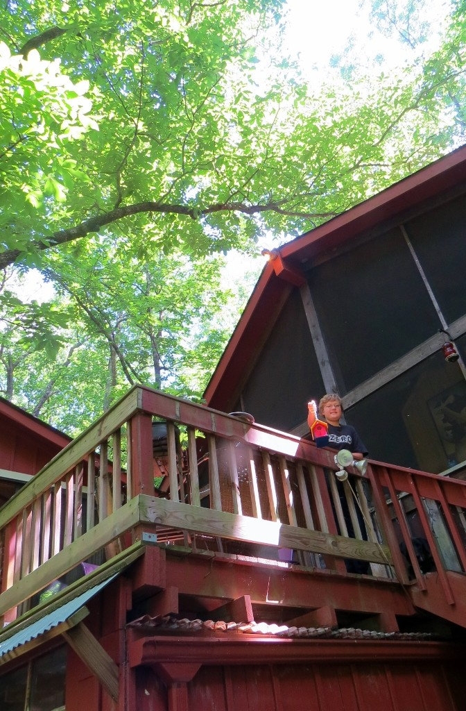
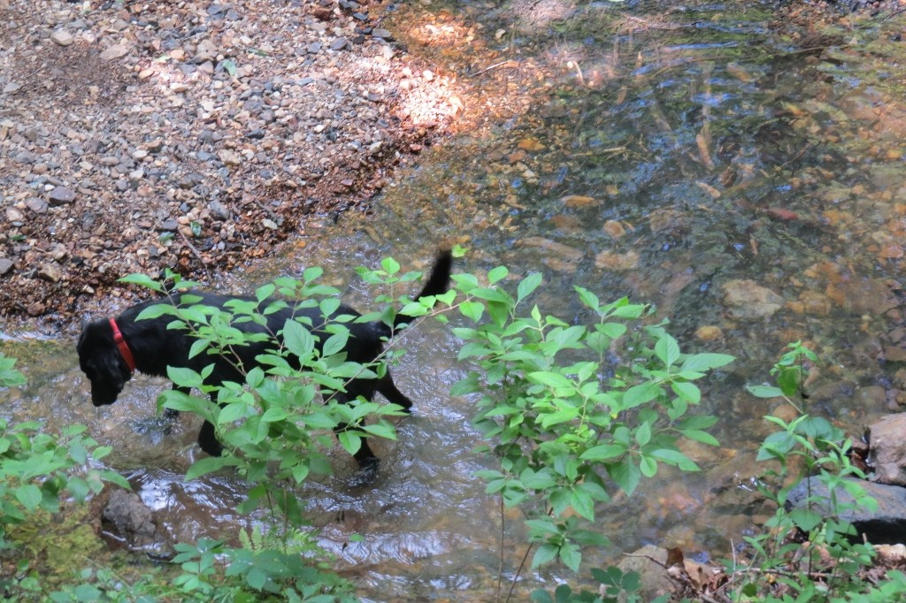

Casey made a birdhouse!

The nomadic life offers beguiling mysteries, but until one comes home, a full sense of homecoming remains unfelt. I never knew until now what home feels like, except for fleeting childhood memories of the White River and the old houseboat at Clarendon, our family’s summer place.

My great-grandfather’s houseboat made a cozy retreat, set up on the riverbank— a vacation home of fishing and campfires and cookouts. At least it was until the Corps of Engineers washed it away. The Corps exiled my family, the same as other families of River People. Our city place in Little Rock was a red-brick Craftsman bungalow with a shiny green roof made of row upon row of semicircular clay tiles. We lived there thru the best years of childhood. The roof being so spectacular against the red brick (especially after a string of Pine Bluff rentals), my sisters and I promptly made up a song that went “Nipple roof, nipple house, dum-da-dum-dum nipple house!” repeated endlessly.

This was during the 1960s-70s. The neighborhood had been built during the Depression along the old trolley route, now disappeared under layers of asphalt. We liked to sit on the terraced front yard and watch cars go by—a purple car was worth 10 points back then. My childhood home rented for all of $100 a month the whole decade we lived there. It was solid and familiar, but it wasn’t ours.

Now, after a slew of addresses over intervening decades, all of them rented (none for $100) Team Parkinson has come home to what our youngest named Parkinsaw. The house overlooks a creek: artesian, spring-fed from the mountain ridge above. The multi-level cabin is built above a waterfall that sends the creek (Cherry Creek) rushing downhill in an S-curve. So far, we count tadpoles, minnows and frogs in the creek. Neighbors say they have had to kill a few ginormous rattlesnakes over the years. They also mentioned bears… !

My husband is reborn, reinvigorated and filled with the zest, zeal, vim and vigor for which I married him and love him so, even more now that I see how happy he is to live in a place that he can call his and ours and our three children’s home.

Parkinsaw is a monument to the visionary family of artists that designed and built it more than a decade ago. The cabin and studio, linked by a trio of descending decks and patios, have come alive again after several years’ vacancy. The timing is all, says the bard! Gratitude is the attitude. (There’s no place like home, she typed, as the Hubbie downstairs began happily tuning his Strat in the Man Cave…)

Our youngest foretold of Parkinsaw one afternoon several years ago. We were at the dining room table in our old rented place, absorbed in making a village out of clay, just for fun. As we molded the clay into blue houses, green trees and red fences, I asked our little boy, “What’ll we name this place? Parkinsonia?” He thought a second. “Let’s call it Parkinsaw,” he said, and so we did. The Hubbie promised then and there to get the Real Parkinsaw.

After four years spent searching for the Real Parkinsaw, we had seen sharp disappointments—one forested property was to have a powerline cut right through the middle; another was located past a neighbor’s fencerow decorated with macabre mannequin heads, and so on – we considered giving up the ceaseless quest for a home, at least temporarily. There seemed no escape from the degradation of “renter,” the tyranny of slumlords.

And then the house on the creek appeared like a ship on the horizon. Finally, Parkinsaw is a reality, one that we strove for and achieved, that we can leave to our three children. What finer thing can life bestow than a realized dream?

As the waterfall’s endless music sounds below, the bass notes of a bullfrog blend with the splashes of our Lab mix jumping around in the creek. Buzzy the Wunderdawg, the gladdest rescue dog in Garland County, loves to fish for minnows where the pool deepens below a little cascade.

Buzzy loves Parkinsaw. Perhaps the only thing sweeter than realizing a dream is having a happy dog. If so, we are doubly blessed.

] Buzzy in Cherry Creek
