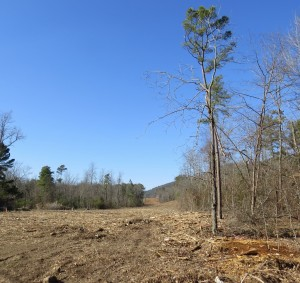
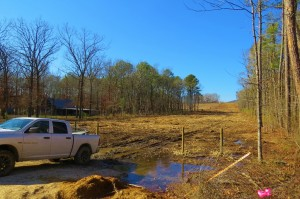

a close shave

 who will stand for the Natural State?

The Big Lie vs. the Natural State

by Denise White Parkinson

Three years ago, my husband and I found the perfect place to call home. As longtime renters, we knew a good deal when we saw it: a vintage A-frame house in our price range, with 10 acres, woodsy, on the outskirts of Hot Springs and (miraculously) in our son’s school district. There were even some cute little chicken coops on the property—our dream of farm-fresh eggs was finally within reach. So we made an offer. But the property owner, who had moved out-of-state, regretfully informed us that a high-voltage transmission line was planned to run straight across the acreage; did we still want to buy the property? My husband searched out the information online and there it was: a planned Entergy transmission corridor, 100 feet wide, stretching for miles past the base of Mount Riante. The map showed it cutting the property in half, plowing right through the chicken coops. We withdrew our offer. We are still renters searching for our “forever home,” as folks are wont to say. Recently, I heard the transmission line was finally being cut. So yesterday I drove to Mount Riante to see for myself. I headed out of Hot Springs on (formerly scenic) Highway 7 South to find a huge swath littered with ground-up wood chips and bark stretching as far as the eye could see. Where there was once thick green forest and secluded properties, now there is a naked, empty corridor. In places, the scar comes within a few feet of homes. Thanks to eminent domain, more than a picturesque view has been lost. Property value vanished too, along with the million or so oaks and pines. Entergy’s so-called “Woodson” line through Ouachita Mountain forest may be a foregone conclusion, but the prospect of a much bigger transmission line looms for families living across the northern tier of Arkansas. This proposed high-voltage transmission line is not like Entergy’s. For one thing, it would be twice as wide (200 feet of passageway taken by eminent domain) and hundreds of miles long. It would cut the Natural State clean in half. Ironically, that’s the name of the proposed transmission line: the “Clean Line.” Unlike Entergy’s line, the “Clean Line” would merely use Arkansas as a conduit to carry electricity across the entire state. The “Clean Line” would originate along the north Texas panhandle, crossing Oklahoma before carving countless Natural State watersheds in half. Its final destination would be Tennessee’s TVA. The company that launched this unprecedented plan is not a public utility like Entergy. Instead, it is a privately-held venture capital group of wealthy investors. Even the company name—“Plains and Eastern”—is a misnomer; “Plains and Watershed” being more accurate. The Ozark Mountains are home to a savvy strain of Arkansan unafraid to stand up against threats to the Natural State. Sometimes these hill-country heroes lose the battle, as in the case of Cargill Corporation’s factory hog farm upstream from the Buffalo National River. Sometimes they win: the volunteer group “Save the Ozarks” announced a major victory this week in the years-long battle to stop yet another high-voltage transmission line through Ozark watersheds. That transmission line was proposed by Southwestern Electric Power Company of Louisiana, aka Swepco. If the name Swepco sounds familiar, these are the same folks that saddled Arkansas with the Hempstead Coal-Fired Power plant. The coal-fired plant prevailed, despite a hard-fought legal battle against the project. But at least Arkansans can rejoice this New Year at Swepco’s withdrawal of the planned “Shipe Road to Kings River” transmission line. The 60-mile line was supposed to run from Benton County to Carroll County, Arkansas. However, after much public outcry, the company has deemed the line “not needed.” The plan was withdrawn only after Swepco had already taken and clear-cut countless acres of forest via eminent domain. Swepco’s corridor to nowhere leaves behind ugly, useless metal poles standing amidst private property. Swepco’s needless land-grab also destroyed portions of a popular safari park, resulting in deaths of animals due to stress. I called a friend in Tennessee, a longtime environmental activist. I wanted to hear his take on the “clean line.” At first, he didn’t want to talk specifics and rambled on about a group called Beyond Coal, saying the organization has been stacking Sierra Clubs nationwide with paid staff. He described the staffers as Ivy League-spawned policy wonks. “Beyond Coal is controlled by big investors,” he explained. “It’s causing volunteers and local environmentalists to be pushed aside.” When pressed for his opinion of the Clean Line project, he responded with the Sierra Club party line. “It’s a great idea, because it will result in wind energy that will replace coal-fired plants,” he said. When I pointed out no wind farms yet exist to power the proposed Clean Line, he got a little agitated. “Sierra Club is looking at the big picture,” he snapped. “Clean Line is just one little segment of a bigger energy plan.” I persisted: How can Clean Line be a little segment if it cuts Arkansas in HALF? Exasperated, he replied, "Look, as far as the Sierra Club is concerned, the Plains and Eastern Clean Line is a great plan, okay?” I never did get his personal opinion on the whole mess. This daunting conversation brought to mind something a friend confided several years ago. I was interviewing the state’s leading environmentalist for a magazine article. I had interviewed her before, as she was something of a shining star in Arkansas—a true “bioneer.” Her name was Nao (pronounced “now”) and, like most everyone that knew her, I adored and admired her. From her witty blog, GreenAR by the Day, to her inspiring work on behalf of sustainability groups and Audubon, Nao was a force of nature. She walked the walk, whether raising her own chickens and bees, wild-crafting herbs and native plants, or bicycling all over Little Rock instead of driving a car. A font of information on all things green, Nao was a great interview subject. So when she suddenly asked if she could tell me something off the record, I stopped taking notes and listened. “I want to tell you the real reason I’m going back to school to become an environmental lawyer,” Nao began. (She’d resigned from her position at Audubon after the settlement involving Swepco’s Hempstead Coal-Fired power plant.) “Arkansas was winning the court battle against Swepco,” she explained. “But the national Sierra Club sent their legal team in from the coast and ordered us to stop fighting the coal-fired plant. They cut a deal with Swepco because they consider Arkansas expendable.” I sat in stunned silence as Nao added, with a bitter laugh: “The Sierra Club calls Arkansas a flyover state. But when I pass the bar, I plan to fight on behalf of Arkansas. I won’t be the one to sell out.” Her words come back to me now, along with her trademark lisp that I always found enchanting. Spring 2015 would have marked Nao Ueda’s graduation from law school and the beginning of an important career by a dedicated public servant—except for the fact that Nao is gone. She was found dead in her home less than a year ago. Her off-the-record message can finally be shared. It is, moreover, the only explanation I have found for the stance of Arkansas Sierra Club toward the planned Clean Line. The local Sierra Club chapter not only supports this proposed 700-mile-long path of destruction across Natural State watersheds and forests, it approves Clean Line’s unprecedented eminent domain land-grab. The tragic and inexplicable death of my friend can never be accounted for, in my very humble opinion. But perhaps that is simply because (like the blatant apologists for the Plains and Eastern Clean Line) I am fated to see the Big Picture. In this case, the big picture only requires you, dear reader, to imagine a 700-mile-long clear cut that is twice as wide as what you see in these photographs I took yesterday in my hometown.
