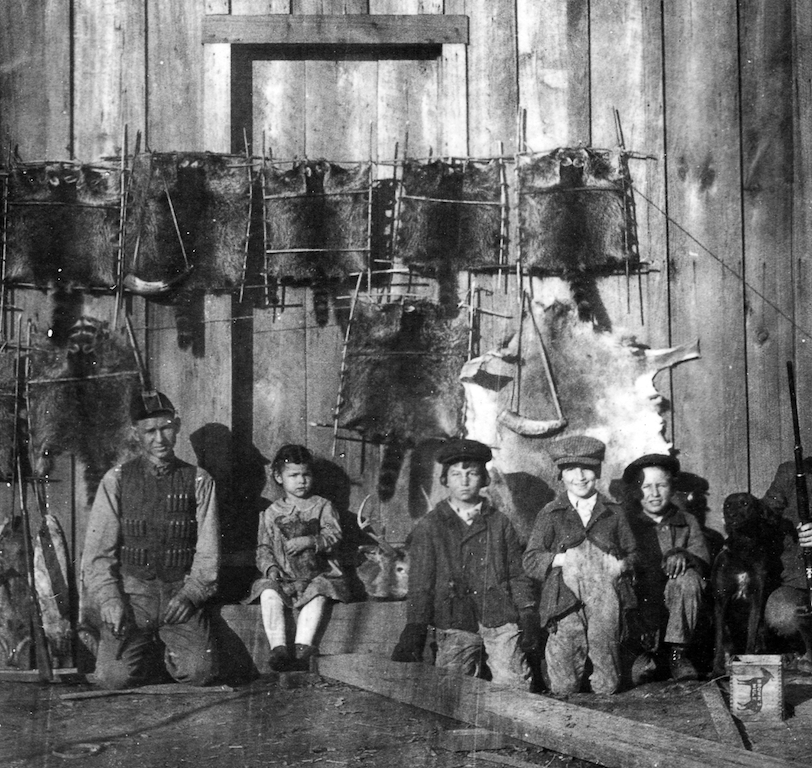
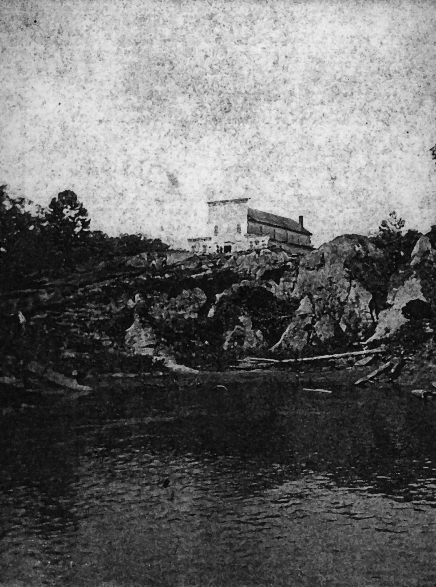
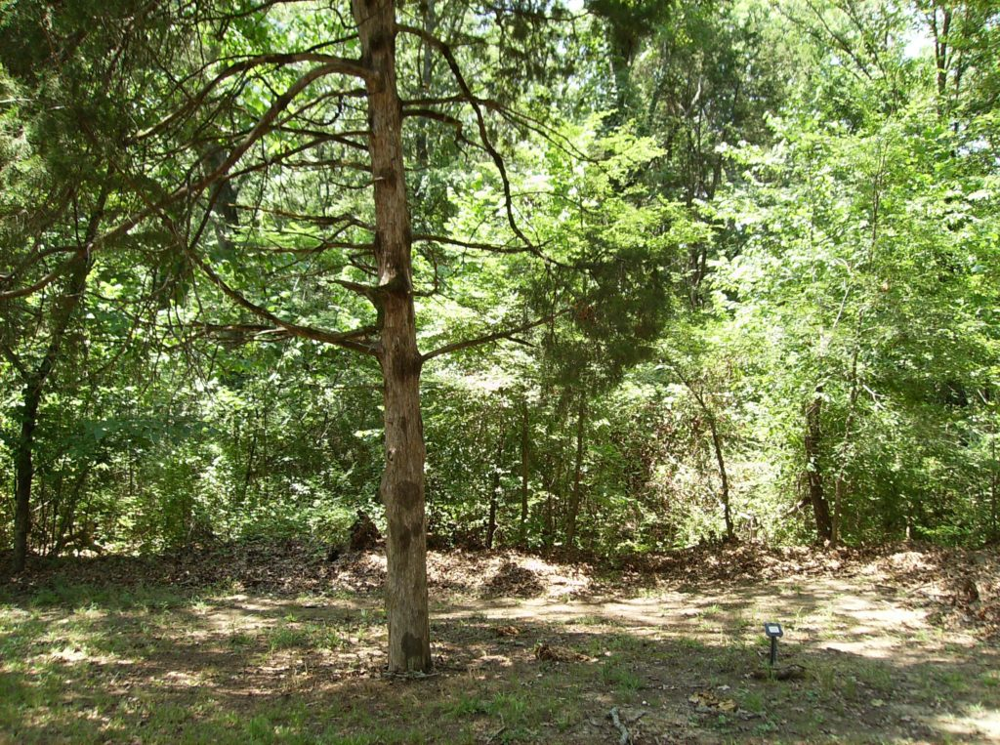
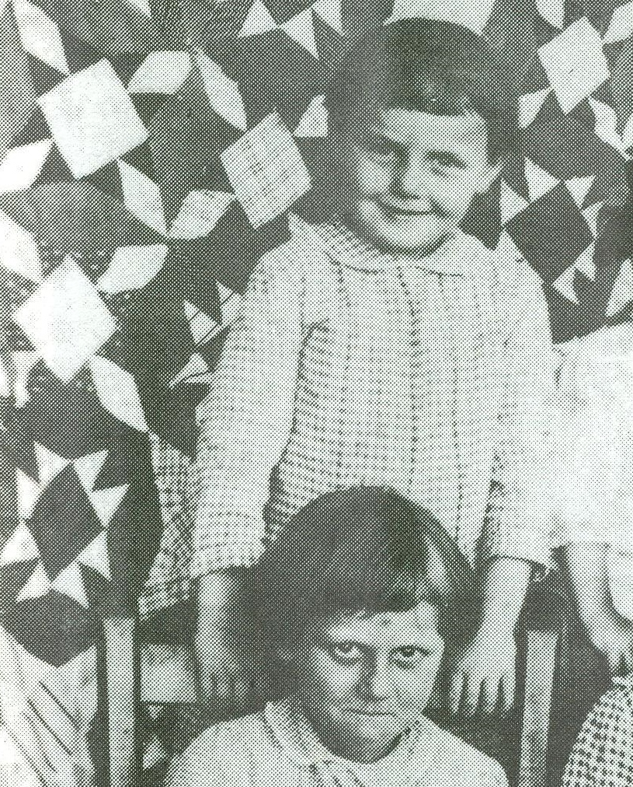
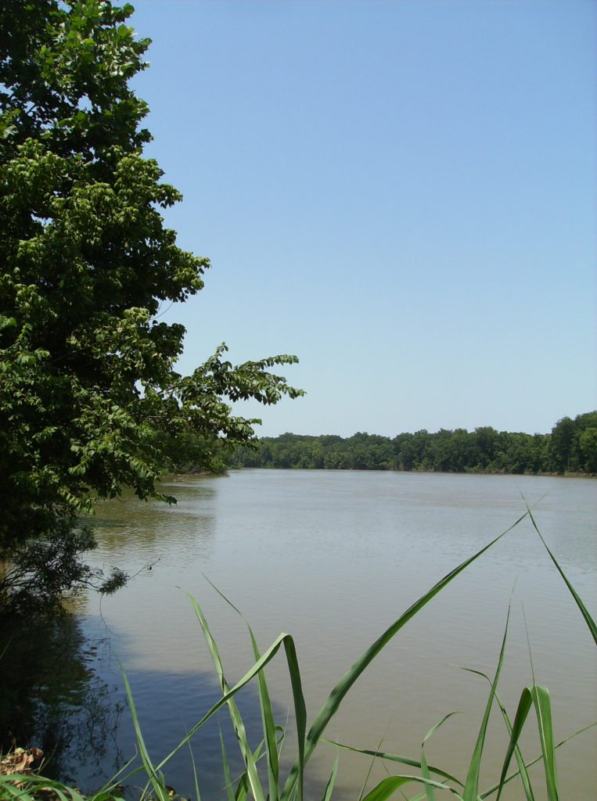

Snow on the Cedar

The Reunion marks the beginning of the Holidays, with Thanksgiving and Christmas and the New Year just around the corner. Camp Doughboy near DeWitt draws families from across Arkansas County, but Dad could remember the old Reunion ground, Camp Fagan, on the lower White River. Camp Fagan was named after a Confederate general; you can still dig up a musket ball on the riverbank there—even cannon balls. That part of the River was known as Indian Bay until a Civil War battle filled the water with dying soldiers and horses. Afterward folks renamed it Stinking Bay.

I rode with the Browns again and before we saw Camp Doughboy through the trees we could hear the music. Anybody carrying an instrument gets in the Reunion for free. There’s a merry-go-round with wooden horses and a calliope and even a magic lantern show. At dusk, folks file in the big tent to sit on benches, waiting for dark. Then they light up the lantern that projects pictures—the wonders of the world flicker across the canvas. My favorites were the Taj Mahal, Sitting Bull, the Sphinx and Niagara Falls. Niagara Falls made me seasick, it looked so real—or maybe it was just too many candy apples and rides on the merry-go-round.

“Altha Ray makes the finest fried chicken,” sighed LC, sprawled beside the fire. “I’m fuller’n a tick,” John groaned. We were camped by the River, away from the main campgrounds, and Wolf stood guard. “Tonight’s Halloween,” LC mused. “Did I ever tell y’all about the ghost up at the Icehouse?” The Icehouse at Saint Charles set up on a hill like some gray skull made of cypress instead of bone, but it wasn’t haunted. “I don’t want to hear your fish stories,” I challenged. “I seen a real ghost—it shook my hand!”

John whistled. “Still waters run deep. You don’t talk much, but when you do it’s a doozy!” We drew up in a circle by the fire and I told them all about meeting Helen Spence in the graveyard and how she saved me from the storm. “Here’s the quill my Uncle made,” I said, pulling the string necklace from inside my shirt. “If I blew this whistle—right now—would it wake the dead? Do y’all think Helen would come?”

“Do it!” hollered LC. But John shook his head. “Brent, you know you can’t. It ain’t right to trouble an unquiet spirit. Helen’s an unquiet spirit.”

I put the whistle back inside my shirt as LC fumed. “Well I wanna see ‘er! Y’all are scaredy-cats!” John stared into the fire. “LC, you talk like a drylander! Were you there when we broke her outta that damned funeral home in DeWitt? Where they had her dead body set up in the winder like Bonnie Parker? No. It was us River folk went and got her and brought her home to Saint Charles. Your Uncle was with us, Brent.”

“That was the first time I ever saw my momma cry," LC said. "I miss Helen. You know where to find her grave?”

“I oughta know—I helped dig it,” John replied. “We planted a cedar tree to mark it. Next to where Cicero is buried, back in the potter’s field. The night we buried her, the moon was so bright it give me freckles.”

We agreed to visit Helen’s cedar tree after the Reunion was over, but there came a hard freeze. “Looks like the persimmon seeds predicted right,” Uncle Harold said, stoking the fire. “Back when your dad was a boy, there was a winter so cold it froze the River—folks went ice-skating!” Dad was toughing it out at the farm—he had closed up the house and was sleeping in the barn with the animals. In the middle of the night I woke to a strange sound, so loud it drowned out Uncle Harold’s snoring. Bundled in a wool blanket, I crept through the dark houseboat and went to open the door—it was stuck. I pried it open a crack, put my head out and felt something like needles on my face—an ice storm!

We were iced in all right. For the next few days we holed up, listening to trees exploding outside. My nerves were shot from worrying if the ice storm would fell Helen’s tree. Uncle Harold wore me down asking “Why so blue?” When I explained the reason, he nodded sympathetically. “Please—tell me about Helen Spence,” I asked, and he stoked the fire and began:

“They called her the Swamp Angel, but she’s just a little River girl. She could shoot straighter’n a man, and sew and tat lace finer than any dry-lander lady. She lived by a code; the code of River Justice. The River gets its revenge. She shot the man who killed her daddy; shot him four times in such a tight pattern you could put a hat over it.”

“At the trial? In the courthouse?”

“You ain’t just a wolfin’. Folks were jumping out the courthouse winders to get away. The judge hid under his desk. She had a pearl-handled lady’s pistol tucked into a fur muff she wore—it was cold that day, like now. After she shot that no-good, she handed over the gun to LC’s daddy. The judge never should have sent her to the Pea Farm, because she were from the River. She kept escaping—always headed back to the River though, so they always caught her. One escape she planned for months. They had took her off the field crew and put her to work in the prison laundry. She saved up a bunch of cloth napkins—the red and white ones.”

“Gingham?”

“Yes, gingham-checked napkins,” Uncle Harold continued. “She saved ‘em and sewed ‘em into the lining of her prison dress. And when the mean ol’ prison matron, Miz Brockman, sent the gals up to Memphis and the bus stopped off at the station, what do you think Helen did? She went to the ladies room, turned her dress inside out, and waltzed off! But like I say, they always caught up to her, and give ‘er ten lashes with the blacksnake—a leather strop.” When I asked why Miz Brockman bused the prisoners to Memphis, Uncle Harold hesitated. “They done a lot of bad things back then—I’ll tell you another time. Get on to bed.”

I woke burning with fever and poor Uncle Harold didn’t know what to do. As a result, he tried out all his home remedies on me: A knife under my cot “to cut the pain,” doses of turpentine “to clean me out” and hot oatmeal and onion plasters on my chest “to draw up the bad stuff.” When he came at me with yet another steaming cup of godawful stewed leaves he called “senny,” I begged for mercy. “That stuff puts me in the outhouse—it’s too dang cold out there,” I wailed. As a compromise, he brewed a strong pot of coffee and poured the last of his “special reserve” into the pot. After a few cups, we both felt stronger.

I lost track of time, but one morning brought a moist breeze that started things to thawing. I felt strong enough to go outside and from the top of the stage plank, I watched chunks of blueish ice float past the wet black tree trunks. The snow was so bright it hurt my eyes. I went back inside the houseboat, resolved to walk to the cemetery the next day no matter what. I would go alone, since I didn’t have the wind in me to walk to LC or John’s place and fetch ‘em.

I was sure I could find the right tree—when Uncle Harold described it, I recognized the place I met Helen. I went slowly, breathing hard, as the drip and crack of melting ice sounded through the woods. Fallen trees blocked the road; it looked like the cedars got hit bad—split from the top down, branches sheathed in gray-green ice. At the cemetery entrance, I leaned against a pillar, staring over the sea of white drifts and broken limbs. How would I find Helen’s tree? I looked down to see a line of rabbit tracks leading off among the headstones, so I followed them. The tracks led to the back corner of the graveyard and there stood Helen’s cedar tree, untouched by the ice storm.

I blew softly on the quill and waited. “Helen,” I whispered. “Are you there?” When nothing happened I leaned my head against the slender trunk; I was all give out. The sun came blazing from behind a cloud, and through my tears the ice sparkled like diamonds, little rainbows everywhere. By my foot, a bright red droplet appeared on the melting snow—it was red as blood. I knelt down and brushed away the snow to find a tiny patch of wild strawberries. What in the world—berries in the dead of winter!

“Brent? Son, are you there?” Dad’s voice called from a distance. I answered and soon he was standing beside me. “So this is her tree,” he said. He had driven to Uncle Harold’s to fetch me and found me gone. “Son, let’s go home—you ain’t well yet.” I took my quill necklace and tied it around the tree trunk, and Dad helped me to the truck.

That spring brought the best strawberry crop in years. At Eastertide, Dad and I went and planted dahlias at Momma’s grave. I didn’t return to the Saint Charles cemetery for a while, but LC used to say that whenever the dogwoods were in bloom and a breeze came off the River just so, the little quill gave a whistle, a pan-pipe call, and Helen’s laughter drifted like distant music through the trees.

