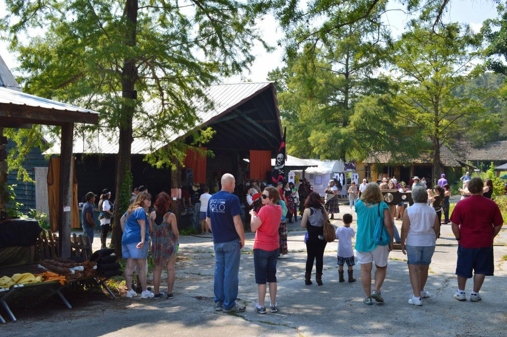
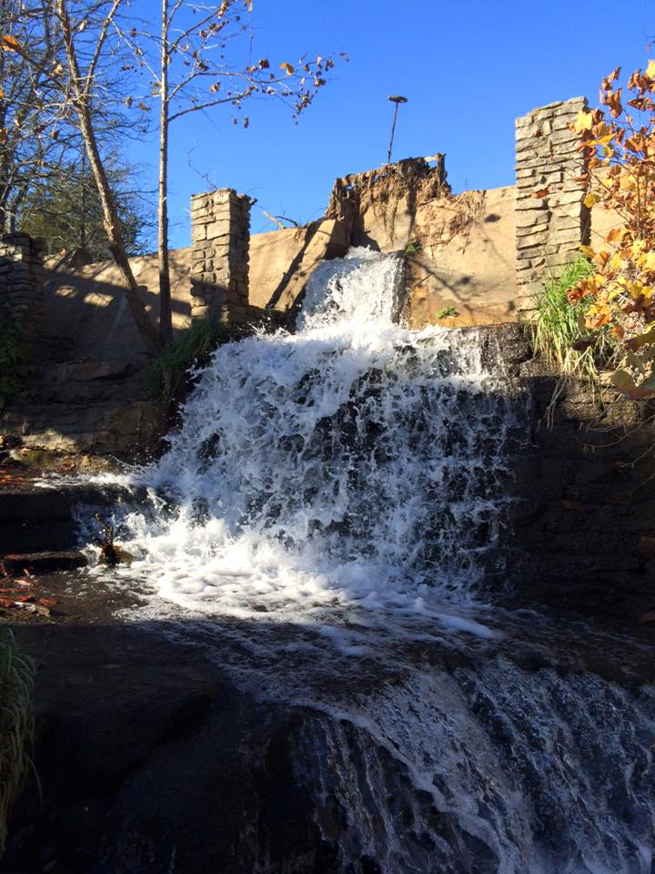
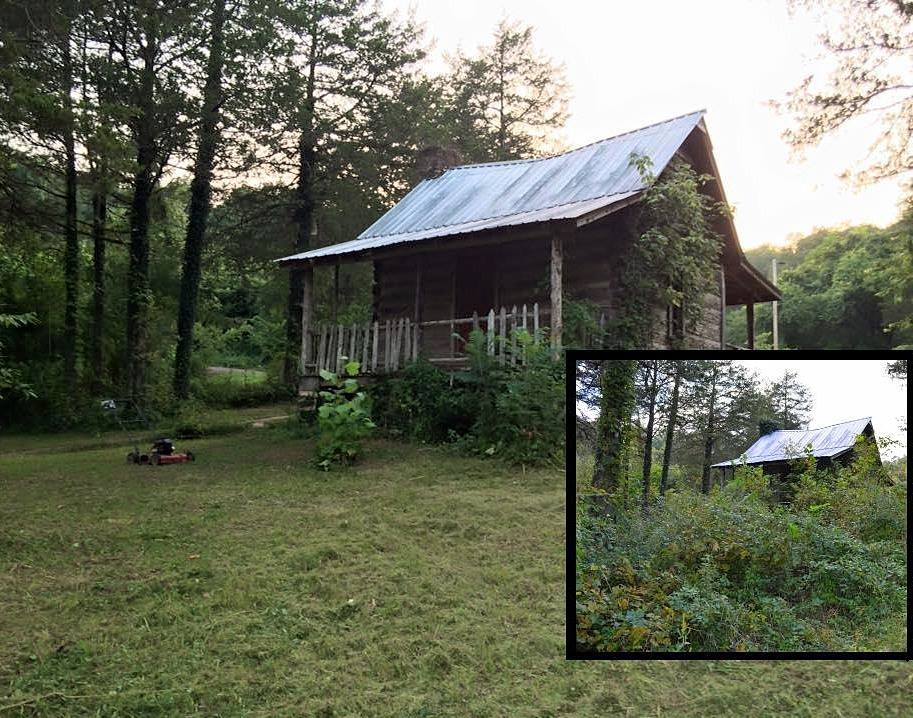

 Families streamed into the park for a September event, and more are planned!

On dreary Mondays like today, when the world is chock full of bad news, it’s a comfort to remember that there are good folks doing good things, and some not so very far away.

In fact, just up the road a ways (Hwy 7 North, the Natural State’s Scenic Route) there’s a place that Arkansans of a certain age remember well. A place dedicated to fun and families. As a concept, first created in two dimensions by a cartoonist named Al Capp: Dogpatch, USA. A place we thought we had lost forever.

When I was a kid, my sisters and I LOVED going to Dogpatch. Arriving there after a couple hours’ journey up the Pig Trail was like entering another dimension of time and space – a universe of laughter, silliness and good times. For an eight-year-old with an overactive imagination (me), it was sheer heaven. The setting—gorgeous Ozark mountains, forest, waterfalls, the whole bit—was beyond beautiful.

 The stonemasonry was built to last, as evidenced by the park's waterfalls.

These days, the property is getting help from some highly motivated hands: Eddy Sisson, part of the team of photographers called “Abandoned Arkansas” together with partner Mike Schwarz, is archiving the rebirth of the place as “Dogpatch Village.” Eddy’s been updating photographs over the past year via his Facebook page and event pages – there’ve been some fun shindigs up in yonder hills, and folks are helping bring the area back to life.

I interviewed one of Dogpatch’s most memorable characters a few months ago: award-winning Arkansas actress Natalie Canerday remembers the theme park fondly and counts it as a foundational part of her life. Her thoughts on the place are worth repeating.

A native of Russellville (“God’s Country,” she interjects), Natalie got her first break performing at Dogpatch. With news of the property’s sale to a motivated owner, generations of Arkansans are expressing hope of a hill-country renaissance. Natalie counts herself firmly among the optimists wanting the park to prosper, in whatever form it takes.

“I was a senior in high school when mother saw they were holding auditions for characters at Dogpatch,” Natalie recalls. “I worked up a song from Oklahoma (‘I’m Just a Girl Who Can’t Say No’) and a few bars into it, I forgot the words!” Instead of freezing in panic, she sashayed up to the man accompanying on piano. “I got behind him so I could cheat and read the words on the sheet music,” she laughs. “I began rubbing his bald head as I sang.” She won the part.

 Natalie Canerday as "Moonbeam McSwine" stands with Pappy Yokum.

As the youngest performer of the 1980 summer season, Natalie embarked on an adventure. For young’uns who did not have the good fortune to experience Dogpatch USA during its wild and wacky heyday, a brief intro: the 800-acre theme park near Harrison, Arkansas, was a destination from the late 1960s until its closure in 1993. Since that time, the abandoned site has attracted intrepid photographers and indie filmmakers that venture into the hills to capture its eerily beautiful landscape. (New owner Bud Pelsor has purchased the property and is currently reclaiming it from years of decay.)

But in the summer of 1980 the place was in full swing, with rollercoasters, musical shows, non-stop roving skits and improvisational performance featuring characters led by Li’l Abner and Daisy Mae. (A thesis could be written on the significance of Li’l Abner’s and Daisy Mae’s archetypal foreshadowing of Jethro Bodine and Ellie Mae Clampett, but probably never will.) Harrison, Arkansas, and surrounding hamlets were amply rewarded for embracing Dogpatch’s hillbilly caricatures as tourism boomed, boosting the local economy.

By the time senior prom arrived, Natalie had been commuting to perform on weekends for over a month. After high school graduation she went full-time at the park. It soon became apparent that the summer of 1980 would go down as the hottest in Arkansas history. Natalie, with trademark enthusiasm, welcomed this trial by fire.

“I drove up in my ‘76 Monte Carlo,” she says. “They housed us in a little circular trailer park called Rock Candy Mountain—honey, it was smaller than any dorm room. All the performers stayed there. The others were in graduate school from Texas, Louisiana and elsewhere. At night, it was cool—they’d sit on the steps drinking, singing songs and playing guitar.” Natalie, all of 18 and away from home for the first time, was captivated by the atmosphere of laid-back creativity.

“That first year I was Dateless Brown—she carried a shotgun looking for a husband,” she explains. Lugging around a heavy antique rifle as a prop, Dateless Brown roamed the park searching for unwary little boys. “If they looked like they still thought girls had cooties, I’d come up to them and say ‘hey little feller, wanna get hitched?’ and make smooching sounds,” she says. The boys would run off screaming in terror and delight.

 "Dateless Brown" roamed the park scaring little boys.

The following summer, five days a week, she portrayed Moonbeam McSwine, sort of a hillbilly Veronica to Daisy Mae’s blonde Betty. Every sixth day, Natalie played “Nightmare Alice,” the witch of Dogpatch. “I had so much fun—I carried a rubber snake and leather pouch full of potions and things, blacked out my front teeth,” she says. “As Moonbeam, though, I was all pretty and made up.”

Natalie attended college at Hendrix (Class of '86 4-Ever!) and majored in theatre but maintains she learned everything she knows about staying in character during those sweltering Dogpatch summers, where heat stroke was a daily occurrence and the whole place, from town square to train depot and lake, was a theatre in the round.

“You could never break character, no matter if the train jumped the track (the heat kept loosening the rails) or if someone fainted,” she muses. “You couldn’t stop to tie your shoe, much less adjust your bloomers or wipe away sweat. Dogpatch was also the biggest influence on my accent—thanks, Al Capp!”

She remains in touch with fellow character James White, formerly the Shmoo, now associate editor of the Harrison Daily Times. “We bonded because James was one of the few kids my age. He toured Dogpatch with the new owner and wrote that it’s in better shape than he thought it would be.”

 A before-and-after pic of one of the park's cabins.

At Harrison’s annual Women of Distinction awards banquet, Natalie was invited to be guest speaker (“comic relief,” she interjects). The organizers wanted her to share how Dogpatch influenced her career. “Afterward, every single person came up to me with some kind of connection with or good memory of Dogpatch,” she recalls. “People in the region know that back in the 1970s-80s, Dogpatch was a bigger draw than Branson and Silver Dollar City. It really affected the economy when that place closed. At one point I even dreamed about buying Dogpatch. I wanted it to become an artists’ colony—the Sundance of the South!”

And thanks to the artistry and hard work of some very dedicated folks, there is indeed a future for the formerly abandoned place. The sky is the limit where Dogpatch is concerned, so let’s dream big!

 BEFORE: train station

 AFTER: train station
