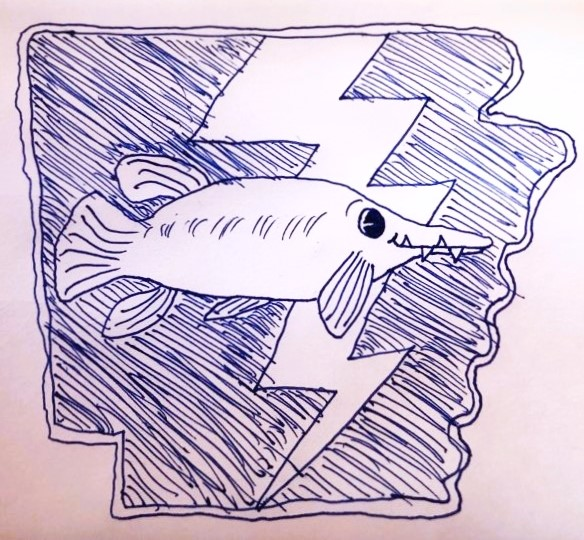

  
  
by Denise White Parkinson  
  
“The bird that would soar above the level plain of tradition and prejudice must have strong wings.” ~ Kate Chopin  
  
“I’m hard to kill.” ~ Jase Le Trip  
  
  
  
  
  
  
  
Chapter 1: The Mute  

  
The number of people mucking out was low at first but grew exponentially. Every day more folks dropped off the map and/or gave themselves up to whatever happened next. According to scientists, the ongoing diaspora was one of many results of mass trauma. These were not missing persons, exactly; they simply did not want to be found.

  
The mute considered this as she walked a path through a dusty tunnel of goldenrod. Sumac bushes nodded velvety red clusters overhead as memory’s thought-loop proceeded. “Mass trauma affects everyone in slightly different ways,” her former doctor was stating for the umpteenth time. “For example,” the doctor murmured. “We as a society no longer refer to the numerical year due to the mass trauma generated by events associated with a particular time-period. Your speech loss developed during early 20-Umpteen, but it’s likely temporary.”

  
She'd sought a diagnosis after losing yet another degrading job due to “communication issues.” The position was quickly filled via Artificial Intelligence – apparently A.I. communicated better than she did. Leaving the doctor’s office in a daze, she decided to muck out, cut her losses and avoid any medical follow up. She was done with this game of categories.

  
As the eviction/inflation crisis deepened, aka the Slumlord Boom, things reached a point where she stuffed her meager belongings into a pack, laced up her well-worn boots, left the room key on the apartment’s only table and took off walking. She did not tell anyone. She would at least avoid being categorized as a burden on society.

  
The city’s ragged concrete edges gave way to two-lane blacktop, then gravel and eventually dirt roads. The few people she saw appeared phantom-like among the country’s signature brand of debris: boarded-up strip malls, abandoned car lots, piles of rusting refuse, empty grain silos. Miles of identical metal storage units lined the road, filled with belongings of the moneyed set. Chain-link fences sagged, clogged with trash.

  
Somewhere past the rim of metallic entropy a path suggested itself, pine-needled and skinny, leading into a forest. She had taken the path in the general direction of the river. An inner singsong accented her steps: “Oh, miles and miles of piles and piles, then tunnels through the trees, oh!” Absorbed in a moving daydream, she failed to notice quickening steps approaching from behind.

  
“Shake a leg!” came a breathless voice as a wiry figure darted past, brushing her backpack. “They’re blowing the bridge, come on,” the runner urged racing down the path. After walking all day, the mute could only trudge. Another bridge demolition – how many did that make so far in this land of rivers?

  
The trail ended in a clearing where a group of people stood talking. She could smell the river on the breeze and took in deep breaths. The runner from the path glanced over, shaking his head. “I thought you were Artemisia,” he said. A tall woman next to him snorted with laughter. “How could you mistake her for me? She’s just a little cigar-nub of a gal,” to which the runner retorted, “She may be a dang shapeshifter but I ain’t waiting to find out!”

  
The half dozen or so people made their way to an enormous sycamore tree. A thick knotted rope dangled against its mottled, bumpy trunk. One by one, including a pair of small children, they scrambled up the tree and disappeared into the canopy. “Well, are you a shapeshifter?” asked Artemisia. The mute shook her head. “Then drop your pack on that stump, it’ll be okay there.” The woman grabbed the rope and planted her right boot, a large steel-toed boot. Bracing, she adjusted her canvas britches, squared off and walked slowly up the trunk, grunting. The mute followed in a cold sweat. Heights, like a lot of things, unnerved her.

  
The others pulled them through an opening onto a wooden platform and the mute dropped to her knees in alarm – there was no railing. The treehouse was a makeshift observation deck of wooden boards lashed to limbs with rope. The runner perched in a branch overhead, peering through binoculars while the kids (twins?) whined for him to let them see.

  
“Look where I’m pointing,” he said, shushing them. The mute closed her eyes against a wave of dizziness, hunkering as low as she could. The others stood straining to see upriver where a glint of silver marked the bridge a mile away. Their collective gasp was followed seconds later by sonic booms echoing across the bluff.

  
“I’m heading to the Tinkers,” muttered the runner. The mute opened her eyes to see him launching away on a zipline in a hail of leaves. The group began a slow, silent descent punctuated by whispers from the children. What did he mean by Tinkers – did they blow up the bridge? Back on solid ground she retrieved her pack and instantly the twins were upon her.

  
“What’s in your backpack? What’s your name?” Rummaging in the knapsack, the mute found a small plastic bag of salted peanuts and offered it to the children. The snack, souvenir of a long-ago trip to a gas station, marked a time before gas and even peanuts grew scarce. Artemisia approached with a tin cup. “Here you go, some spring water – yeah what’s your name?”

  
The others gathered around as Artemisia read aloud from a scrap of paper: “I have Aphonia and cannot speak. My name is Larkin. I have my I.D. card.” Everyone swooped in leading her to a picnic table on the edge of the clearing. A fish fry commenced, and plates of food began appearing so quickly she had to force herself to slow down, trying to remember when last she ate.

  
The children raised cups of water as the grownups toasted with wine. “Cheers to Larkin! You’re finally here! We knew you’d make it,” filled her ears. Midway through the meal the sun began to set, and someone brought out a guitar. Larkin’s head drooped lower, coming to rest beside a bowl of soup. The homemade wine (muscadine?) was strong. Soon her soft snores blended with the music.  
  
  
  
Chapter 2: The Twins  
  
  
The dream was a recurring one. Larkin was back at her old media job selling ads to flog the building trades. The dreamscape consisted of a hastily built mansion (engineered stone) set in a gated community. A nearby billboard proclaimed, “Welcome to Vanity Shores.”

  
The interior of the house showcased the bland decor of a lakeside vacation retreat. Floor-to-ceiling windows framed a waterfront view, but the man-made lake had dwindled to a putrid greenish puddle choked with algae. Suspecting a golf course upstream, Larkin reached to pull the curtains only to have the dream-fabric disintegrate in her hands. “Behold Lake PawPaw,” came a familiar voice she couldn’t quite place. “You cannot unsee it. Or unsmell it.”

  
It was an advertorial assignment for the magazine cover: “Lake PawPaw, Where the Living is Greener.” In the dream she was saving her publisher’s ass after the diva photographer up and quit. Fumbling with the camera, Larkin struggled in slow motion through mudroom, rumpus room, mancave, chef’s kitchen, exercise room, home office, theater, master suite, guest wing, en suite Jack-and-Jill bath and walk-in shoe closet, every shot godawful. “We’ll photoshop in the lake later!” bawled the disembodied voice of the publisher. The dream dissolved into a generalized sense of shame and Larkin woke blushing.

  
“She’s up,” the twins yodeled. How long have they been watching? Stretching, Larkin vaguely recalled being led through a moonlit forest and getting tucked into quilts. She was in a wicker structure, a giant basket lined with what looked to be mullein leaves. Peering over the edge, she saw it wasn’t up in a tree but rather at the base of a clump of privet inside a dome of greenery.

  
The twins pulled her from the nest of quilts. “We helped take off your boots last night,” crowed the boy as they helped her into them, kneeling to tie the shoelaces. “We can do the bunny ears,” lisped the girl.

  
Something about the girl’s voice struck a note, but Larkin had never met children like these. Their copper-colored hair fell in ringlets, what her granny used to call “sausage curls.” Their rosy freckled cheeks flushed deeper as they took great care tying the laces. Suddenly she knew the girl’s voice, recognized from the quickly fading dream. Only now with a lisp.

  
“What a ugly houth,” mumbled the girl. The boy jumped to his feet. “Breakfast is cookin’ – come on.” In the clearing the picnic table was already set and Artemisia stood at a Dutch oven waving a spoon. “Good morning! Grab a basket and fetch me some eggs.” The twins steered Larkin down a side-path to another wicker structure, a chicken coop. They filled the basket and returned in triumph. Artemisia cracked eggs into an iron skillet. “I hope you like frittata, Larkin. A double-yolker, now that’s a good sign!”

  
And so began a muckrat rhythm the mute fell into gladly. She found that everyone from the day before lived in and around the camp. They all stayed busy because there was a lot to do. The forested bluff was picked clean of fallen limbs to keep the cookfire going. There was a solar oven too. Some of the log piles were inoculated with mushrooms – shiitake logs, where grow the pride and joy of muckrat cuisine.

  
Mornings she and the twins helped Artemisia with breakfast, afterwards hauling water from a sand-boil spring in the woods. An iron cylinder set into the ground made a well of sorts. All you had to do was raise the heavy lid and dip your jug into sparkling cold water, so clear it was invisible. At the base of the water column a finger of golden sand danced and spiraled. Larkin liked fetching water, feeling her muscles in use. For the first time her muteness became a non-issue.

  
She roamed the bluff with the twins, forest and thicket and clearing. Everywhere they went birds sang and squirrels fussed. Summertime brought herbs in profusion and a variety of berries and mushrooms. Muckrats hunt and fish but also forage for food and medicine. A different kind of foraging was practiced at Tinker Camp. They scouted dump sites for items to repurpose. Bicycle parts, broken machines, old tools – whatever could be re-used, they gleaned. The Tinkers set the iron cylinder into the spring. Awhile back they built a small bladeless wind turbine using metal scooter parts and odds and ends. Based on a baffle design by Leonardo DaVinci, it powers the only radio for miles.

  
The runner was called Jerry; he visited the Tinkers often. Ranging far and wide scavenging, Tinkers carry the latest gossip. And ever since the Electroplasma Storms of 20-Umpty-Aught, anything hitched to the grid is less dependable than ever. Gossip remains dependable.

  
Larkin listened to conversations flow as she learned to weave baskets from grasses, grapevine and willow. She listened while washing or sewing with Artemisia and formed a concept of muckrat existence, at least the small group at this place called Connector Camp.

  
It was named for a network of ziplines strung from tall trees on the bluff. For those brave enough to use them, the lines offered shortcuts to other camps up-and-downriver. Supplies flowed in and out of Connector Camp along with updates on Yonder, a generic term for cities and towns. Yonder takes money to live in but the main muckrat currency has always been trade and barter. As the saying goes, “Can’t tax barter.”

  
Besides Artemisia and Jerry, there were a couple of couples: DaveyNJosh, a pair of gentle giant musicians with salt-and-pepper dreadlocks, and JinnyNMark. Larkin guessed JinnyNMark to be high school sweethearts the way they mooned over each other.

  
The twins were a mystery. They went by lots of pet names: Twinlings, Boo-Boos, Young’uns. Larkin wondered who their parents were but shied away from writing a question to Artemisia. Children (especially a set of twins) were a touchy subject after the Infertility Epidemic of 20-Aughtyleven.

  
Some evenings the folks of Connector Camp gathered along the bluff to watch what they called the Light Show. Whoever spotted the sky lights first would bang the gong, bringing everyone running. Were the red spiderwebby ones with purple rings called “sprites” and if so, what the heck is a sprite? Are the yellow and green streaks aurora borealis? They wondered, slapping occasional mosquitoes. Is that a mushroom cloud without the shockwave, or what? The debate over possible causes of the phenomena went on for hours under a mad psychedelic sky.

  
During lunch one day Jerry returned to the subject of the destroyed bridge. “After that last demo there’s maybe three bridges left over the Old Man,” he declared. Artemisia gasped, “You mean from here to the Gulf, that’s all that’s left?”

  
“According to the Tinkers, yep. And whoever’s got the salvage job on these bridges nobody will say. It may be time for us to think about heading downriver. We’ve been here too long anyway.”

  
“Somebody’s collecting a debt or paying off on a favor,” observed Mark. “Prolly both,” said Davey. “That steel was made the old way, during the Before Time. It’s stronger.” The talk turned to the tragedy of infrastructure neglect and the scourge of saboteurs. “Such is the way of Entropy,” sighed Jinny as the muckrats nodded sadly.

  
As if on cue the twins launched into song: “My country ‘tis of thee, sweet land of entropy –” but fell silent when Jinny glared at them. The twins whispered together, laughing. They’d wolfed down their lunch already. Larkin ate slowly, savoring the barbecue provided by nearby Pit Boss Camp. A dozen baskets had gone in exchange for the ‘que and Larkin took pride in her small part in the trade. “What’s so funny, Twinsters? Yeah, tell us the joke,” said DaveyNJosh.

  
“Larkin’s joined the Roadkill Gang and don’t even know it,” the boy blurted as the girl burst into giggles. The adults chewed silently, staring everywhere but Larkin’s direction. She leaned over and tugged Artemisia’s sleeve in a questioning way and Artemisia sighed. “Yep, we should’ve told you about the Pit Bosses. They barbecue anything they can get their oven mitts on, and I mean anything. Except people, of course. This here’s raccoon with maybe some possum thrown in. They do have a talent for barbecuing wild pig, though, when they can get ‘em.”

  
“Thanks to the Pit Crew we don’t have to worry about packs of wild dogs,” Jerry grinned, licking sauce from his fingers. The twins rushed to Larkin’s side, rubbing her arms, patting her back, apologizing for spoiling her meal. Finally, she smiled. “I’m Windy,” whispered the girl. “Windy with an ‘I’ – and my brother Thephyr.”

  
The boy added, “That’s Zephyr with a ‘Z’.” They petted Larkin’s hair. It was nice being the twins’ toy.  
  
  
  
Chapter 3: Weather  
  
  
A rainy spell broke the heat. It was a rain without wind, thunder or lightning, and the forest shimmered. The privet nest was abandoned as the twins slept in Artemisia’s little hut. Everyone huddled under tarps strung round the clearing or went indoors noting good sleeping weather. Snores drifted over the bluff, blurring with the song of frogs. Clouds descended cloaking everything in a fine opaque mist.

  
Larkin admired the converted school bus where DaveyNJosh lived. Hidden in the woods and painted camo, it once belonged to a deer camp. There was a lean-to shack where JinnyNMark stayed, and Jerry alternated between treehouses. Larkin set up a pup tent on some moss shaded by a big oak, grateful for this gentle rain. Weather of all kinds frightened her when she lived in the city, cowering in the box-like apartment. Here there were rain barrels and every bucket and washtub set out to collect precious water.

  
While the twins were taking a rare nap Larkin slipped a note to Artemisia asking about them. Artemisia replied, “I don’t like to talk about folks or about past things and such, but this is different. Let’s have us a chinwag.” The two were keeping dry under a tarp shelling pecans and Artemisia began:

  
“The twins just showed up one day. In the Spring a while before you came. It was laundry day, and I was in the clearing at the washtub when two little kids come skipping up the trail. It was such a surprise I hollered, where’d y’all come from?”

  
The pair ran right up to her, not the least bit shy and not acting lost. They said they wanted to play the washing game, too.

  
“You can play the washing game if you tell me where you came from,” Artemisia replied, studying their embroidered tunics of an unfamiliar weave. Their moccasins looked like dance slippers.

  
“We got here quick as we could,” the girl panted. “We had to find where that humming came from—”  
“No, no,” the boy interrupted. “She means where WE came from. Before, silly! Let me tell.”

  
The girl took a deep breath. “We were with the Flotilla and came here quick as we could. They let us off up the trail and we ran the rest of the way.” The boy stomped his foot in frustration.

  
Artemisia suggested they both looked thirsty and needed a drink. As the children downed cup after cup of spring water she invited them to pull up around the tub. “We can play the washing game and swap stories at the same time – now flip that bucket over and take a seat.” After an hour of interruptions and splash fighting, the clothes hung on the line and Artemisia was certain of one thing: The twins were not from here.

  
“They’re not shape-shifters or gubmint agents. They say their names are Windy and Zephyr, they have no parents and they’re here because they can go through anything.” Larkin pondered this detail as Artemisia shrugged. “Yep. Exact words: ‘We got picked to come here because we can go through anything.’ They say their home-place is called Neutrinia but whenever we ask ‘em about it they just laugh and make like it’s a secret. So, your guess is as good as mine.”

  
Before Larkin could hazard a guess, the twins woke from their nap. What in the world, or out of the world, did it mean? Artemisia inspired a sense of awe. A skillful manager, diplomat, and instigator, she herded the children around camp turning chores into games, patiently answering questions. But Artemisia was not their mother. Larkin began to remember her own mother and stopped quickly. Her mother had been nothing like Artemisia.

  
Artemisia, examining a leaf: “Yessirree, that’s a Mockernut Hickory. Remember where it’s at and we can get some nuts in the fall.” Sometimes she would let out a Tarzan yell or random ululation. “Who can find the finest chanterelles today? Who’ll win the prize?”

  
“Me, me, MEEE,” sang the twins, and Larkin ran to keep up as they plunged into the woods, baskets swinging. Larkin was their toy and playmate but also a sort of rustic nanny. “An au pair of aces,” murmured the inward voice, lisping a little.

  
She went about her chores in contentment, unquestioning. Living in the moment took all her time. Remembering to breathe required constant attention. Standing on the green bluff overlooking the river bend far below, Larkin shed tears at the depleted scene. For the umpteenth year the once-mighty river was barely a trickle. Abandoned barges lay half-buried in the mud, picked clean of their cargo. Ragged stobs poked up beside stretches of quicksand. But she came often to the river to make vague soundless prayers among the trees.

  

Chapter 4: The Moon  
  
  
On a warm autumn night Larkin woke to humming in her ears and the full moon in her eyes. A beam was bearing down like the headlight of a freight train, only trains didn’t run anymore. She slid over the side of the nest, careful not to wake the twins. Leaves carpeted the ground, shiny as coins. The fragrance of some night-blooming flower hung in the still air. Too still – no cicadas buzzing, no crickets chirping.

  
The humming sound faded as she padded barefoot to the oak tree. Curling on the moss like a cat, the moment her head touched the green pillow there it was again: Hummm. It broke off for an instant of silence then started up, a gentle yet slightly menacing throb in the throat of the earth. Some faraway machine?

  
Larkin sat up and leaned against the oak. Putting her ear to the tree, she detected no sound. The bright moon made shadows on the bark, zigzags of white and black tattooing a vivid pattern upon the skin of the tree, its rough gray trunk. In the dark, trees become elephants, why not? Ganesh the benevolent elephant, remover of obstacles. She stared as the bark pattern settled into lines of runic script carved by moonlight. The shadowy letters grew clear: “Live and Let Live.” Was she in a dream?

  
“Ah-HA! We thought so,” cried Zephyr. Larkin turned to find the twins yawning nearby. “Wake up the muckrats – she can read trees!” Windy squealed, running to clang the gong. Artemisia emerged from the hut, braids swinging like a backwoods Valkyrie. “What’s wrong? Here, gimme that stick, you’ll wake the dead!” The others arrived groggy and muttering.

  
“Pajama party,” sang the twins while Artemisia re-lit the fire and put on a pot of chicory. “Why does it have to be in the middle of the night,” groaned Davey, to which the twins replied, “Y’all promised!”

  
Jerry stood at the head of the picnic table and when everyone had taken a seat, he began: “Back in the spring, Larkin, we promised to give Windy and Zephyr a chance to show us something. They say they came here to show us a way through whatever is fixing to happen, what they call Something Big.” He paused and Davey intoned, “Hear, hear.”

  
“First, they asked us to collect seeds,” Jerry continued. “It got our attention since we’ve been doing that along with Seed-Swapper Camp. Then they asked us to calculate an equilateral triangle on a map according to some specifications they provided. Which we did (thanks for working that out, JinnyNMark, hopefully we learn why tonight)—” at this Jinny piped up, “That’d be nice!”

  
Jerry went on, “The twins predicted you’d come, Larkin. Well, here you are. They even said your name would sound like a bird. I guess we’re gathered here for the latest news from Neutrinia. Let’s sip our coffee – thanks, Artemisia – and open our ears. Kids, you got the floor.”

  
Larkin noted the expressions of the grownups gathered resignedly around the table, by turns sleepy, blank-faced or bemused, lit by a few candles and the moon. The twins whispered and giggled. The children were fun, they could be enchanting and annoying and downright eerie but did the others take them so seriously?

  
“I go,” said Windy. She climbed onto the table and stood arms akimbo, eyes flashing at the grownups. “We made it to where Larkin can thay yeth or no.”

  
“By nodding or shaking her head,” added Zephyr. “Right,” Windy continued. “We found out tonight Larkin can read tree language! We can prove Larkin can find the Door before the Big Thing happens. The doorway out!”

  
“And in,” Zephyr added.

  
“Right. And we got to get through the door before – well, we got to.”

  
“So, you’re saying Larkin is the key to this door?” Jerry asked. “Right, the key!” nodded Windy. “Ready, Zeph?” The boy stood up beside and the others realized the questions were memorized. Of course – the twins were still learning their written alphabet.

  
“Question number one,” chorused the twins, crossing their hearts in unison. “Did you lose the one you love?” Larkin looked at the ground and nodded.

  
“Was it your son who died?” Larkin nodded.

  
“Did you anoint his head, hands, and feet before he died? \[Yes\] Was the balm of myrrh and frankincense, golden beeswax and herbs? \[Yes\].” Their audience swiveled back and forth at the volley of questions, coffee cups stalled in midair.

  
“Did you forage the herbs on hands and knees, praying? \[Yes\] and was his body unmarked, no tattoos or piercings? \[Yes\]—”

  
Artemisia let out a low whistle as a cloud obscured the moon. The twins took deep breaths and plunged on:

  
“Did you see Jacob’s Ladder in the sky? \[Yes\] Did flocks of birds dash themselves to death against his window? \[Yes\] And was his name a triple name? A name with a triple meaning?”

  
Larkin rose, moving away from the table. “Circle ‘round!” Jerry cried and instantly she was surrounded. The twins continued inexorable as the humming had been:

  
“Was his death caused by betrayal? During an eclipse of the full moon?” Larkin trembled, spinning around inside the ring of faces. Opening her mouth as if to speak she folded like a piece of paper and collapsed to the ground. “Get her to the hammock,” gasped Jerry. “She forgot to breathe. I was watching – she forgot to breathe and passed out.”

  
When Larkin came to in the hammock the moon was still blaring through the trees. Around the firepit the others sat in conversation. She stared at the glowing circle and listened, storing their words in her heart.

  
“It’s happening all right,” Jerry was saying. “The First Peoples are on the move already. They’re coming from all directions to converge on the Great Plains, on the ceremonial dancing ground.”

  
“And then what?” somebody asked.

  
“Dancing! The likes of which this world has never seen. A dance that combines all the old ones plus some new moves. They’ll take turns to keep going 24/7 until the portal opens.”

  
“Where do we go? Can we open a portal?”

  
“You downstreamers need help getting to your portal,” Zephyr piped up. “It’s a muckrat portal so it’s hidden, but we’ll find it. Lucky for y’all Garlotta’s on our side.” Windy said, “Garlotta’s up to something. That’s her humming, you know.”

  
Wondering who Garlotta could be, Larkin soon drifted off to sleep again.  
  
  
  
Chapter 5: The Portal  
  
  
_Golden yancopin flowers, a species of lotus, grow here afloat with their green lily pads. Yancopin also blooms underwater, yellow petals submerged reaching for the surface. According to custom, Yancopin blossoms are placed (along with mussel shells) on the graves of river people. Lotus of compassion, filtering light as in a tea bath, appearing and becoming. Your scent is pure feeling._

  
The musical dream-voice subsided even as Larkin could see a yellow flower waving from the shallows, glowing underwater. It recalled the yellow light around her son’s head, a glow that appeared around him whenever she visited him in prison. An infamous Delta prison: Tucker Unit, home of the Tucker Telephone. He’d seen one of these torture apparatus in a barn he was sent to clean.

  
He was consigned to prison for using his house key to visit his girl, a stripper with a new (unbeknownst to him) boyfriend. As the boyfriend was a local narc, the pair set the law on her son for coming over to cry about his dog that died. Rest in peace, Biggie the pit bull, feral from the get-go.

  
Strolling into the visiting room in a clean set of prison whites that set off his bronze skin, her son stood tall filling the doorway. His blond curls were cropped short, sun-streaked from long days in the fields working the hoe squad. The prison was after all a farm that depended on slave labor. There in her mind’s eye he stood flashing his brilliant smile, putting on a brave face.

  
“When I was getting processed,” he chuckled, “there was this cool old lady from the Delta who checked me in. She’s all feisty and goes, ‘Why you be in here for B&E? For B&E? That ain’t shit!’”

  
They sat shyly on folding chairs amid the noise of the gymnasium-sized room echoing with visitors and inmates. She bought ice cream from a snack vendor. “I like it, even though I can’t taste it,” he sighed. His sense of smell and taste disappeared the day he jumped from a moving car and landed on his head in a failed attempt to escape a bounty hunter. When Larkin found out what happened, she went on a mission to rescue him from the town where he’d been living. It was a shitass town.

  
They went from hospital to hospital, eventually driving across the state while he moaned in the passenger seat. Every place they tried turned them away for various non-reasons. One hospital accused them of being a pair of drug dealers, conning doctors out of painkillers. The head nurse called security before kicking them out.

  
Nobody looked at the brain scans or read the paperwork Larkin waved before countless averted eyes. No one explained anything, despite Larkin’s efforts at being a “patient advocate.” The medical folks did not seem to believe Larkin was his mother. She couldn’t help it that the two of them looked more like siblings. She was still somewhat young, and he was just so tall…

  
“It worries me that I can’t smell smoke,” her son was saying for the umpteenth time. His father having died in a fire, thoughts of such a horror persisted. Suddenly the memory-dream rippled and jerked. A large boom shook the prison and everyone in the visiting area stopped talking. The lights winked out and for a timeless moment the windowless room went pitch dark, silent as a cave.

  
Light returned as a backup generator came on and the crowd exhaled. Apparently, a summer storm was brewing over the detention complex. The voices around them grew indignant – the forecast said clear skies, not storms! In the dim amber light her son caught her eye and they laughed.

  
This is a dream, she told herself. My son is gone on. He’s restored to wholeness for all eternity and recovered all his senses and then some. He’s together now with his father, like he always wanted. They’re both safe from this world of saboteurs.

  
She recalled escaping from her son’s wealthy, politically connected family that terrified her. Upon learning Larkin was pregnant, the parents went stone-cold. They threatened to deny their son access to his own grandmother, the person in the family he loved most, if he married Larkin. His family refused to be seen with anyone from the wrong side of the levee, especially the one bearing the first grandchild. After a while Larkin just up and ran away.

  
She went as far north as she could go, taking the child with her. The first family member to label her son a bastard being none other than her own mother, Larkin resolved to stay away. She made a home in an alien sphere, working in her son’s preschool in upstate New York.

  
The following summer Larkin allowed him to stay with his father down South. She harbored a slim hope she might be invited to join them but as summer ended her son returned. Then came a phone call saying his father’s house burned down in the middle of the night. It was not actually a house per se, but a trailer, the kind that burn fast. His parents having cut him off financially, it was all he could afford. He died in the fire.

  
When Larkin and her son arrived heartsick to attend the (closed casket) funeral, the father’s family launched proceedings, eventually taking the child. They were well connected while Larkin was for all intents and purposes an orphan. After they installed the boy in a faraway boarding school, Larkin’s hair fell out in a sort of bodily protest.

  
In her heart she knew she was meant to run away; if she hadn’t, all three of them could’ve died in that fire. She saved her son from one fate but not from his own. Could anyone ever be saved? Awed, Larkin felt an inner tremor and heightened senses, as during the long-ago pregnancy when she was “eating for two.” But she was not pregnant and never would be again; the Infertility Epidemic had seen to that. Is my soul queasy? Am I _feeling_ for two? She wanted out of this dream but could not wake up.

  
The prison’s visiting area was changing, transforming to a much smaller dream-space: a tiny room with a windowed wall. They were in a hospital on an upper floor overlooking flat rooftops and a jumble of buildings. The nurse was out of the room, so Larkin quickly turned to the motionless figure in the bed, rubbing salve on her son’s face and scalp, hands and arms, feet and legs. Intubated and heavily sedated, his skin nevertheless glowed with health while electronic machinery beeped nonstop, measuring the inner workings.

  
The nurses did not want Larkin putting salve on the patient, especially herbal beeswax balm she made at home. They objected sternly, saying it was not sterile. His skin won’t be ashy on my watch, Larkin decided. Opening a fresh jar, she bent over the hospital bed that was too small for her son’s 6’3” frame and massaged fragrant balm over his feet, tears streaming down her contorted face.

  
Holding his foot in her hand, the high arch so graceful, on impulse she leaned down and pressed the sole to her forehead. Larkin was unaware of performing an ancient ritual. The old Hindu sky-god Indra did the same thing, loving the lotus feet of Vishnu. But Larkin didn’t know this because she had not read the Upanishads…

  
“I can’t do it,” wailed a despairing voice and Larkin woke up. The muckrats were standing around the hammock and the sun was up. “I can’t, I can’t!” the wail went on rising to a shriek. Windy was having some sort of meltdown. Artemisia gathered the child in her arms and carried her to a rocking chair. Larkin clumsily climbed from the hammock while the others attempted to fill her in.

  
As the muckrats clamored insensibly, Larkin looked down at her hands. They were covered in ink. As she realized this a pen dropped from her left hand. Jerry retrieved it and offered it to a puzzled Larkin, an old souvenir ink pen with a faded logo, “Jasper Engines & Transmissions.”

  
“What’s all over you?” Jerry asked. “Been doing some automatic writing?” Larkin shrugged, rolling up her sleeves to reveal both hands and wrists covered in scribbles. Everyone gathered round the table and Jerry read while Jinny jotted the lines on a scrap of cardboard, forming verses:

  
Mend the net Indra sends downriver  
Weave it with jewels to catch Her eye  
Cast when the Sun crests the midday sky  
As the Bird flies follow the way  
Twin spires frame the Lotus Door  
Eclipse of the Sun meets a Comet this day.

  
Everyone was quiet until Davey said, “Guidance comes in visions and symbols, in dreams and signs. Words can be a source of misunderstanding. But poetry is more than words.”

  
“Amen, brother,” murmured Josh.

  
“Y’all, we got an upset child over here,” Artemisia hollered. “Let’s stop all the hoodoo and have something to eat. We can think better on a full stomach!”

  
Larkin gave thanks for the umpteenth time for Artemisia’s nail-gun timing.  
  
  
  
  
Chapter 6: The Message  
  
  
Over a hasty breakfast the muckrats came up with a plan to solve the mystery at hand using a team-effort approach. What with Larkin’s tendency to fall over like a fainting goat and Windy’s sudden tantrum, they sought a middle way forward. After rocking Windy to sleep and tucking her in at the hut Artemisia returned asking what next?

  
Zephyr offered to do the mind-reading, explaining modestly that he was better at it but let Windy go first out of politeness. “Ladies first,” he grinned. The others stood in a circle around them as Zephyr took Larkin’s ink-stained hand in his pudgy, grubby one. For safety’s sake the two sat cross-legged on the grass.

  
“Let’s start with something nice,” Zephyr began. “How about: what’s the best thing your son ever told you?” Immediately Larkin smiled. Zephyr shook his head. “I love you is always good, but these words are more like…” he faltered. “What do you call it when somebody gives you a helpful tip you use every day?”

  
The muckrats called out suggestions. “Password? Advice, mottos? Fables, morals?” Zephyr replied, “Sort of like advice or a motto, I guess.” Artemisia said, “Recipes?” and Jerry added, “A mantra – is it a mantra?”

  
Immediately Larkin understood the question and Zephyr relayed her silent message: “Larkin’s saying her son taught her how to stay strong. He said always remember to strengthen your core.” Zephyr patted his middle. “So, every day she repeats to herself: ‘This is an opportunity to strengthen my core.’ Those are his exact words, she says.”

  
“Your son must be a wounded healer,” Jerry said excitedly. “Let’s all do this. We can start –” Jinny’s sudden hoots of laughter interrupted.

  
“I cannot believe you people,” she sneered. “First you had us plot a map to nowhere, with no explanation, and now you want a group mantra?” Artemisia stamped her foot. “Jinny! We all get how things are weird these days. It’s the endtimes. And Entropy too, of course.”

  
“I don’t fucking see how a tight core is a plan for the endtimes!” Jinny screamed. Instantly Zephyr reared up, tucked his chin and ran forward, head-butting her in the stomach. She doubled over gasping as the shocked muckrats froze. “Zeph! Don’t you ever—” began Jerry angrily but the boy bellowed, “She asked for it!”

  
Mark helped Jinny to a bench. “Things are definitely weird,” Davey said. “Weirder than the Sinkhole Swarms of 20-Aughty-Aught,” added Josh. Artemisia launched into a passionate appeal for breaking out the “medicinal” elderberry wine and in the ensuing chaos of finding clean cups Jinny moved, sneaking into the woods. Larkin saw and grabbed Jerry’s sleeve, tugging urgently. “Something’s up,” Jerry said as they took off in pursuit.

  
The muckrats reached the shack to find Jinny rushing frantically in and out of the doorway with a box of matches, lighting them one by one. The humidity had gotten to them so that each time the flame sizzled out Jinny shrieked louder. Jerry shouldered her away, ducked inside and retrieved the undamaged map. Rolling it up, he muttered, “Good day. See y’all at supper.” The others followed him back to the clearing as Jinny sobbed against Mark’s shoulder.

  
By the time Connector Camp assembled that evening, Jerry was late returning from the Tinkers and JinnyNMark were no-shows. The beans, cornbread and greens were a somber affair despite Artemisia encouraging everyone to eat up. “Soul food is what we need,” she pleaded. Windy, somewhat recovered, was first to notice Jerry coming down the trail with one of the Tinkers. The two silently grabbed plates and joined the table. “Where’s JinnyNMark?” Jerry asked.

  
“She’s gone!” called Mark, soon visible coming through the trees. He staggered into the clearing and collapsed onto a bench. He had a black eye.

  
Mark recounted how Jinny began packing to leave and when he begged her to stay, she coldcocked him. “She said she’ll be damned if she’s going to listen to our mumbo-jumbo and be slave to a pair of shape-shifting brats. I think she took off toward Yonder.” At this, Jerry’s companion, a Tinker known as Dub, set down his cup. “That may be. That may be, son. But word’s out on Miz Jinny. Some folks you got to feed with a long-handled spoon.”

  
Larkin wondered what the Tinker was talking about until Artemisia sang out mournfully, “Who would ever o’thought? Jinny a gubmint agent!” As the news sank in, Jerry jumped to his feet. “Where’s the message? Did she take it with her?”

  
Windy rose. And then she kept rising as the muckrats gaped in astonishment. “So, Miz Jinny says we’re shape-shifting brats, does she?” Windy called, levitating over the beans and cornbread. The lisp had disappeared. Zephyr ducked under the table hollering, “Take cover! She’s goin’ all in!”

  
Larkin watched in awe as Windy stretched, growing tall and majestic before their eyes. Her curls turned a deep shiny auburn, spiraling in flowing locks past her muscular shoulders. Everyone craned their necks as she towered over them. The tunic and long johns she wore when the transformation began were stretched beyond the limits of woven flax. “Lord love a duck,” whispered the Tinker.

  
“What do you think children are besides shapeshifters?” Windy cried. “Changing and growing all the time, especially in our sleep. Every time you lay eyes on a child, we change like a flower changes. Fools!”

  
Now that Windy held their undivided attention she calmed down. Gesturing for folks to come in for a group hug, she sighed. “Let’s get some rest and meet first thing in the morning. There’s no need to worry about Jinny and we still have time to find the Door.” With that, she bid good night to the bewildered muckrats and retired to the nest. Zephyr followed Artemisia to the hut and the rest of Connector Camp slunk off to sleep fitfully, if at all.  
  
  
  
  
Chapter 7: The Sign  
  
  
One of the best places on the bluff for solitary meditation was a holly grove encircling an outhouse some distance from the main clearing. The water closet’s sturdy roof included an overhang to shield from rain because the frontage, doorless by design, was open to the view. From this elevation a solitary meditator, hidden in the holly, could see across the river over miles of forest here and there slashed with bald patches.

  
Watching the sun rise, Larkin noticed the trees – whether from drought or change of season – were beginning to turn color. Sprinkles of yellow dotted the green canopy. Far above a hawk circled soundlessly. Then the gong began to clang so she hurried back to camp, on the way remembering to tighten her core.

  
She arrived to find a crowd of strange muckrats milling about. They all wore camo and carried intricately carved walking sticks. The tips were pointed like javelins – these walking sticks doubled as spears. Artemisia came over and took her arm. “Larkin, meet my cousin Snuffy. He’s here with the Pit Boss crew. They brung us some bacon.” Artemisia chuckled, “We nicknamed him Snuffy back when he was just a little critter with a runny nose.” Larkin nodded at Snuffy. His braided beard made her smile. “I’m afraid we are meeting under a cloud,” he said softly. Larkin looked up – the sky was clear.

  
DaveyNJosh arrived with the guitar. “Let’s start the day with some breakfast music,” they urged. Soon the walking sticks were stacked to one side and the sound of strumming and smell of bacon wafted through the clearing. The Pit Bosses stood talking with Jerry and the Tinker. Waving Zephyr over, Jerry asked, “Would you please wake your sister? I’m a little scared to myself. Everybody needs to hear what they came to say.”

  
“Good morning glories!” Windy sang, sweeping into the clearing. “What’s all this, a party for little ol’ me?” She’d fashioned a sort of wrap-dress toga from a chenille bedspread and the Pit Bosses bowed in silent awe. After greeting Larkin and Artemisia, Windy strolled over and mussed Zephyr’s hair. “Why don’t you stretch out and join me,” she laughed. “The weather’s fine up here.”

  
“No way, Sis,” Zephyr retorted. “I like being a kid. It’s fun to be small!” Jerry was clearing his throat trying to get everyone’s attention when Dub gave a loud whistle that quieted things down. “What’s the news?” sighed Josh, setting aside the guitar. Jerry slowly replied, “I don’t know which is worse, to hear it on an empty stomach or a full one.” Snuffy stepped forward. “Let me then,” he said. “I found her.”

  
“Found who?” Mark stammered. Snuffy took off his cap and held it as the rest of the Pit Boss crew did likewise. He handed Mark a strand of plastic beads. “Jinny’s ankle bracelet,” Mark said. “Where’d you get it?” Jerry motioned for Mark to sit beside him.

  
“We’s trackin’ wild hogs through the old quarry,” Snuffy said. “It got dark, and we’re about to pitch camp when there’s a commotion up the trail. We got there too late to save your gal. She put up a fight, but it was razorbacks. We covered her with branches and got here quick as we could.”

  
Mark hung his head as everyone murmured sorrowfully. Then he stood, no longer shaky. “How many shovels we have around here? I’m giving her a proper burial.” The muckrats swung into action. As they marched out of camp carrying an assortment of pickaxes, hoes and shovels, Snuffy handed Artemisia the piece of cardboard. There was a splotch of dried blood on it.

  
“Jerry wants you to stash this message and for y’all to stay with the twins ‘til we get back. Thanks for the oatmeal.” He gave a stiff bow and left.

  
Windy snatched the cardboard and turned to study it. “Is there any more bacon?” she asked. “Let’s figure out the message before they return.”

  
“First you’re gonna explain why you said we didn’t have to worry about Jinny,” Artemisia burst out. “Did you know she was going to – well what do you have to say for yourself?”

  
Windy motioned for them to gather round the table. “When I said that last night, all I knew for sure is that she was exposed as a traitor. Right now there’s a lot of Biblical, legion-type stuff going on towards Yonder – which explains the herd of possessed swine.” To which Zephyr added, “But there’s miracles going on, too!”

  
“Right,” said Windy. “All the metaphors are becoming real now that the floodgates are open. Zephyr can fill you in, I haven’t got the patience. Something about archetypal return. There’s a quantum equation –” Zephyr interrupted with a blast of cryptic lingo and Artemisia clapped her hands to her ears. “Never mind! You two would try the patience of a saint. Let’s play a game instead. Let’s see who can be first to puzzle out this message.”

  
When the crew returned from their grim task the message was decoded, wine uncorked and meal ready: shepherd’s pie. The famished muckrats made short work of it, praising the chefs. After folks got settled and Dub lit his pipe, Jerry called for a chinwag. “We hear y’all might have it all figured out?”

  
“Yessir, sort of,” a suddenly shy Windy answered. “Hold on, wait a sec,” Jerry interrupted. “Listen: anyone hearing my voice, tell us right now how we know we can trust you.” Larkin jumped as the muckrats chanted, “All drought ends in flood!” and Artemisia responded, “Yep that’s the password. Go ahead, Windy.”

  
Windy resumed, “The message is a list of instructions that depend on an astronomical event. For the timing, I mean. The line about an eclipse of the sun meets a comet on the same day. We need an astronomer.”  
“You got a Tinker instead,” said Dub, reaching in his pocket and handing something to Windy. The crowd sighed at such a treasure, an antique brass spyglass. “It’s retractable, see? Look through this tonight after sunset and you’ll see that comet. We been tracking it awhile now.”

  
Windy handed the telescope back to Dub. “This is something. But if you’ve seen the comet, then it’s time to go. That eclipse could come any moment. How long does it take to get downriver? To the trinity – to Rivers End?”

  
Jerry shifted nervously. “If you’re talking about the confluence where the Old Man meets up with the Arkansas River and the White River, it depends on the flow. It’s a hundred miles southward as the crow flies, but –”

  
Windy snapped, “No buts! It’s bug out time. Larkin, Artemisia – help me pack the seeds!”  
  
  
  
  
Chapter 8: The Map  
  
  
The muckrats stoically set about breaking down Connector Camp. Amid sorting gear and bundling tools, Artemisia shed a tear freeing the small flock of chickens. They would have to fend for themselves. Windy was in an uproar over packing the seeds. It being a heavy mast year the acorns were plentiful, and she wanted as many as could be carried. “They’re our calling card,” she insisted. “We’re going to plant, not lay waste!”

  
Zephyr explained the message’s instructions while Windy, Larkin and Artemisia began attacking the storage lockers. The main thing was to assemble tomorrow on the riverbed at the bend below the bluff. “Before noon,” Zephyr repeated.

  
“How the heck is a net supposed to get sent down the river?” Dub kept asking. “There’s barely any current and no rain coming anytime soon.” Jerry reminded them great risk calls for trust and besides, what if Jinny had already reported their location? “This space is too hot. Be on the lookout for surveillance drones. How many of your folks you think will come?”

  
Dub and Snuffy shrugged as they studied the map. Zephyr pointed to the upside-down triangle drawn over the Delta, its tip marking a spot near Rivers End. “See, this is where the mussel beds are. Garlotta was born here, and she wants to go back. But because she knows she can’t go back, the way to go is through.”

  
Dub began grumbling about “Garlotta the mystery gal,” and Zephyr said patiently, “I don’t know what you call her, but where we come from she’s just River Granny. Larkin heard Garlotta in a dream. That’s how we figured out the portal is a Lotus Door at a place called Yancopin.”

  
“Yancopin – like the water lily?” asked Snuffy. Staring at the map, he whistled. “Yancopin used to be a town near Rivers End, but it’s been abandoned since way before 20-Umpteen. I hear there ain’t nothing left there but an old cypress houseboat. Used to be a saloon until it became the Yancopin Post Office, hah! Maybe this map is pointing to the Yancopin train bridge. It crosses the bottomlands down there. It’s so dang big they ain’t blown it up yet.”

  
Jerry said, “Then spread the word and get back here tomorrow as early as you can. At least now you know where we’re headed.” Dub and Snuffy shook his hand, vowing to do their best. Dub took off walking to Tinker Camp while Snuffy and the Pit Crew headed for the zipline. On the way they passed Larkin busily filling drawstring bags with acorns. Snuffy paused and reached in his pocket.

  
“Here, ‘til we meet again. For luck.” Larkin waved goodbye and turned to examine the smooth stone, cool against her palm. She recognized the green and white agate as Ocean Jasper, also called Rain-stone.  
Windy parked the wheelbarrow filled with buckeyes, hickory and walnuts and sat down heavily. “Please, Larkin,” she pleaded. “Zephyr and I apologize for spying on your thoughts. We had to find things out and we couldn’t tell you beforehand because it would confuse your reality. I hope you understand.” Larkin shrugged. Big Windy was quite an adjustment, after all.

  
“From now on let’s be partners and share our thoughts,” she gushed. “Now that I grew up some, I’m ready to learn more about your son. He’s supposed to help us get to the portal, y’know. I bet you’re proud of him.” Larkin froze.

  
She tried to concentrate on the acorns in her hand, but it was no use against the flow of memory. “Mom, I have a splendid idea,” her son was saying, beaming up at her. He was very small. “When I grow up, I want to be an Invincible Squirrel.” The scene shifted and she was tucking him in, singing the song her granny used to sing, “You are my Sunshine.” Snuggled against her shoulder he murmured, “I want to be your moonbeam too.”

  
Her son’s changing face flashed before her, a sadness in his eyes growing along with him. The years of separation and what they wrought. His visits home from the fortress-like boarding school found her drinking and numbing herself, searching for someone, anyone to rescue them. He traveled the globe with his father’s family even as Larkin moved from job to job and rental to rental, each apartment shabbier than the one before.

  
He always brought home gifts. Once he brought a chocolate croissant from Paris, cradling it wrapped in waxed paper all throughout the transatlantic journey. It was the best pastry she ever tasted. Their communication faltered until they began to communicate around a mutual love of music. He was a born song-and-dance man as well as a poet, after all...

  
Larkin dropped the bag of nuts, shuddering with exhaustion. “Let me tuck you in,” Windy cried. “It’s your turn to get tucked in.” Embracing Larkin, she lifted and carried her to the nest.  
  
  
  
Chapter 9: Dreaming  
  
  
_No sacrifice goes unseen, children. Especially the sacrifice of a Forever Young’un. They’re the ones to watch out for, the real beauties. Forever Young’uns attract love unknowingly, effortlessly. More tears are shed when they depart than for all the dead Kings and Queens. Untimely departure, that’s their seal of fate. But it’s the Forever Young’uns who keep the left-behinders going. Their ascension makes them true guardians and protectors, even lodestars…_

  
The serene voice paused. Windy whispered through the darkness, “Garlotta, is that you?” In reply came a low _Mm-hmm_ as a third voice said, “Windy are you here? How am I hearing myself?” Larkin giggled nervously, tickled to be able to communicate. Another voice mumbled sleepily, “Y’all go ahead without me. I’m too tired for a midnight chinwag.” It was Zephyr checking in from his bunk in Artemisia’s hut. Larkin and Windy were asleep side-by-side in the nest.

  
“What’s a party line?” Windy asked. Larkin was visualizing an old telephone but Windy had never seen one. “Well, never mind that,” she continued. “Let’s find out about the portal. The whole Delta’s essentially a Door – that’s the meaning of the word delta, anyhow – so we need the exact location of the portal. Portals are more like the _keyhole_ in a door. So, Ma’am? Pardon me, Garlotta, what can you tell us about this Bird in the message –”

  
Garlotta resumed as if she hadn’t heard the question: _“Pity the left-behinders if you must. But their tears of lamentation serve a greater purpose: to heal the vast seas. The oceans lack salt because the floodgates have opened. The ice is melting. The salty tears of lost humanity restore elemental balance. Tears purify the soul.”_

  
Images cascaded, billowing as across a screen. Larkin’s son was crying, and she could not comfort him. He was locked naked inside a box, a young man sobbing helplessly. Larkin had been searching for him for days after he stopped answering his phone. Filled with a familiar dread, she drove to his apartment to find it deserted.

  
Word came he was in a hospital, having suffered an overdose. This hospital, the pride of the state, was in the Capitol City miles away. Her son was there imprisoned in a box, a literal box, as punishment for an unlikely sin: He got up to pee and, overmedicated and confused in the dark, urinated in the trash can beside his bed.

  
Larkin arrived to find he’d been in the box overnight and no longer knew his mother or himself. Pumped full of a random cocktail of antipsychotic drugs, ensnared by the state’s teaching hospital where drug addicts fall into the category of convenient guinea pig, her son rocked senselessly back and forth in the darkened room inside a zippered rectangular prison, like a large playpen covered with a mesh roof, flimsy yet totally inescapable.

  
Larkin approached and put her hand to the nylon barrier, trying to catch his eye. Like a merman caught in a net, he spat blindly at her hand. Sinking back into the plastic he muttered, “I’m so exhausted – so exhausted.”

  
All day and night she kept vigil beside the box. She cried along with her son and no doctor came. She begged the nurses appearing on shift to let him out and move him to a real bed, but they merely made vague replies and disappeared. She began to suspect she was a ghost to them, invisible. Sometime before dawn she dozed off in a chair only to be awakened by the sound of her son mumbling unintelligible rapid-fire words that made no sense, a flood of words.

  
Larkin realized her son’s voice – his beautiful voice that carried lyrical uniquity, poetry and expression thrilling with rhythm central to his soul – all of it was rushing out of him just as the tears had. She leaned in at a repeated phrase. He was saying, “What’s the question, what’s the question?”

  
On reflex Larkin said, “To be or not to be? – is that the question?” He stopped rocking and they locked eyes through the mesh. “That’s a horrible question!” came his anguished cry as the vision faded to blackness.

  
Windy murmured, “This is why I had to grow up some. To be able to stand what I’m seeing. Now I know why muckrats don’t trust hospitals. There’s no hospitality in a hospital. But I like that word – uniquity – did your son teach you that word?”

  
“Yes,” Larkin sighed. “He taught me about things like Moksha and Schumann Resonance and the Large Hadron Collider. He said, ‘creativity is our only freedom’ and made his poetry into songs. I’d give anything to dance to his music again. But between me and the world and the hospital, we broke him. He came into the world perfect – born at home, not in a hospital. But I couldn’t protect my own child.”

  
“No!” Windy protested. “His spirit never broke! He wrestled every day with ‘to be or not to be’ after his father died. But his spirit never broke. Like another poet says: if this world can’t break somebody it kills ‘em.”

  
Larkin considered the times her son had walked away untouched from a car he wrecked. The times she knew of, that is. A committed joyrider, he racked up stolen cars and arrests until the wealthy grandfather responded by supplying him with a succession of new vehicles, all of which ended up totaled. A man-boy outlaw with nine lives and then some calling from the coast after another cross-country adventure in a “borrowed” car:

  
“The weather’s perfect and I got tickets to the show, it’s at an amphitheater in the mountains –” and on cue Larkin headed to wire him some mad money, using for the umpteenth time the same test question and answer: “What color are our eyes? Green.”

  
“It took the ultimate betrayal to bring down your son,” Windy was saying. “Ptolomea is full. It’s why we must get to the portal. Who betrayed him?” But Larkin was lost in thought, unreachable. Garlotta’s snoring hummed softly and soon Windy slept.  
  
  
  
Chapter 10: Casting Away  
  
  
Morning broke fresh and cool. By the time the muckrats lugged their gear down from the bluff the sun was just clearing the tree line. As they trudged in single file toward River Bend, Zephyr gave a shout. There was something smack-dab in the middle of the riverbed. It looked like an old shack. “How’d that houseboat get there?” Artemisia said.  
They hurried to inspect the shantyboat. Its tin roof, mossy in places, curved slightly like an old Romani wagon. The door was closed, windows shuttered. The trim little shotgun structure was surrounded by a solid-looking plank wood deck set atop cypress logs for floatation. Zephyr was first to reach it. Ignoring Jerry’s pleas to wait, the excited boy climbed up and opened the door. “What’s in there?” Jerry panted, clambering onto the deck.

  
It was a net. THE net. A tangled web of thick rope filled the interior of the houseboat. “This looks more like a deep-sea net,” Davey said, marveling at the mass of knotted hemp. Windy called, “Send it down here so we can spread it out!”

  
DaveyNJosh and Jerry began pulling the net through the door while the others grabbed the ends from below. But no matter how they all tugged, dragging the net onto the sand, there seemed no end to it. The half-circle of net draped the front of the houseboat and spilled onto the ground, expanding over the riverbed through streams of water, stretching across sand and mud. Zephyr could not stop laughing. “It’s a magician’s trick,” he hooted. “The scarves keep coming out of the magic hat!”

  
Artemisia could find no places that needed mending. “It’s a miracle there’s no mildew or dry rot. Maybe the message to mend it means to untangle it,” she mused. “And by the way, where are the jewels? To weave into the net?” None of the muckrats wore jewelry except for the occasional un-pawned pirate earring. Mark handed Jinny’s ankle bracelet to Artemisia: “Here, let’s try everything we can.” Straining against the heavy rope, Windy said, “Thanks Mark, you just helped heal Jinny’s soul. But this is Indra’s net and we’re the jewels. All of us will be jewels in the net, see?”

  
Artemisia grunted, “Sweaty jewels. Makes as much sense as anything, I guess. Whoever Indra is, he’s right on time.” Windy explained the signs were multicultural because river culture is a multiethnic heritage. “For example, I think Larkin’s son has a Persian name –,” Windy was interrupted by the arrival of Snuffy and the Pit Bosses followed by Dub and a few of the Tinkers. “Tinkers are so dang hard-headed,” Artemisia sighed. “I knew most of ‘em wouldn’t come.”

  
The Pits were using their versatile walking sticks to carry all sorts of things. Snuffy and a friend came forward toting Artemisia’s beloved washtub slung by the handles. It was initially left behind due to its bulk and she was overjoyed to see it. The others hauled an assortment of kayaks.

  
“The Tinkers give us all these,” Snuffy said. “They don’t think the river’s gonna flow, so most of Tinker Camp decided to head north a-ways. Dub and his buddies here are from the Delta so they’re all in. And o’course the Pits are on board. There’s good hunting south of here.” Artemisia flung her arms around his neck. “Now you’re the one snuffling,” he laughed.

  
Taking a rest from the infinitude of the net, the others made their way to join the crowd assembled amid packs, sacks and kayaks. Passing a canteen, Jerry said, “I’m glad y’all are here,” to which Dub replied, “God don’t want us and Hell’s already full.”

  
“Almost time,” Jerry muttered, squinting into the cloudless glare. The sun was high when a large bird appeared riding the updrafts over the bluff. At first Zephyr claimed it was an airplane, but airplanes don’t fly anymore.

  
“It’s a giant turkey buzzard,” gasped Artemisia. DaveyNJosh were sure it was an eagle, and Dub said it must be a large cormorant flying upriver from the Gulf. Snuffy thought it was an albatross. Jerry tried his field glasses. “That doesn’t look like any bird I ever saw,” he said. “But it’s time we cast that net.”

  
The twins stood solemnly scanning the sky. “It’s more than a bird,” Zephyr said. “It’s the Phoenix, it’s been reborn.” Windy knelt beside Zephyr and whispered, “It’s more than the Phoenix – it’s Bennu.”

  
Jerry brought out the scrap of cardboard:  
“Mend the net Indra sends downriver  
Weave it with jewels to catch Her eye  
Cast when the Sun crests the midday sky  
As the Bird flies follow the way  
Twin spires frame the Lotus Door  
Eclipse of the sun meets a comet this day.”

  
“I suppose the Her in the message is y’all’s mystery gal, Garlotta,” Dub grunted, filling his pipe. Zephyr nodded gravely. “You got it. Garlotta’s going home and we’re going with her.” Windy added, “Have you ever been a hitchhiker? Because you are now.”

  
Dub shrugged. “Where’s ol’ Garlotta been all this time? On vacation?” The Tinkers elbowed each other, winking. Their laughter died in their throats as Windy approached. She stood so close Dub was forced to look up. “Yes’m?” he murmured.

  
“You must be psychic,” she smiled. “Yes, she’s been on vacation. She’s been at her lake house. But not the kind of place Larkin wrote about for money back in Yonder. Garlotta has a _real_ lake house on a _real_ lake. You’ll see. Now, how about we all practice strengthening our core?” Windy stepped back, lifting her arms and barking commands. “Inhale! Hold, tighten – exhale!”

  
The muckrats joined in, some half-heartedly, others concentrating, and something happened that caused everyone’s core – especially the glutes – to constrict. The entire riverbed vibrated as voices cried, “Earthquake!” and Windy began jumping up and down. “That’s no earthquake – It’s Her! She’s on the move. We need to do a dance!”

  
“But we’re not indigenous,” Jerry yelled, swaying to keep his balance. “We don’t know sacred animal moves like the First Peoples do.” Without missing a beat in her pogo-ing, Windy bellowed, “No buts! You’re inbridgenous. With Garlotta it’s the thought that counts. Hey Larkin, I bet you know a dance, you’re a birdwatcher.”

  
All eyes turned to Larkin wobbling beside the houseboat in a half-crouch, trying to keep on her feet as the sand shifted and rippled. She managed a faint smile.

  
“Brilliant!” Windy yodeled. “Larkin’s going to show us how to dance like a woodcock – simple yet effective. Garlotta will love it. Everybody, follow Larkin!”

  
Larkin began bobbing up and down, knees slightly bent. Moving forward with a hop and a little backwards jerk she swayed, bobbing nonstop. “Ain’t a woodcock also called a Timberdoodle?” Artemisia asked, bobbing next to Larkin. “Yes!” screeched Windy. “Come on y’all, do it!” The crew surged onto the widespread net, splashing and swaying. The absurd motion made the tense crowd giddy with suppressed laughter.

  
“Go ahead and laugh!” Zephyr and Windy screamed, bobbing with all their might. Everyone burst out howling. Some toppled helplessly into the mud and lay spreadeagled, gasping as tears ran down. A few peed their pants. Then, with a loud gurgle that may also have been laughter, Garlotta broke loose from the hiding place.  
  
  
  
Chapter 11: Garlotta  
  
  
The woodcock dance saved them. When She resurfaced from Her deep underground cavern everyone was crouching or flat on their backs. Nobody lost their balance as the riverbed bulged upward. Clinging to the net, hunkered low in the wet sand, the muckrats grew more convinced of an earthquake. Wails and groans mingled with a growing volume of background gurgles as the forlorn crew clustered around the houseboat, apex of the ever-rising mound. “Is Garlotta cutting farts?” Zephyr asked. The sudden odor of swamp gas gagged all but the twins, who laughed calling it a good stink.

  
Jerry pointed in alarm. “The sand is rolling over there, what is that?” As they strained to see, the ground shivered and shook the humpy hill. Clumps of willow and scrub slid away from the sides to expose a silvery subsurface. “Quick, tie the kayaks to the net before we lose ‘em,” Snuffy yelled.

  
While the kayaks were being secured the water began a steady rise, pooling and spreading across the riverbed. Their lines of muddy footprints filled and disappeared. Reaching the banks, the river rippled back to surround and lap against their swelling hill. The kayaks slid down and floated alongside tethered to the net, dangling like enormous earrings, Larkin noted.

  
“Garlotta is giving us a piggyback ride to the portal,” Windy sang out. “The river’s rising fast now that the underground lake’s coming up.” Zephyr added, “And don’t forget the New Madrid fault.” Artemisia scooted closer to Windy and Zephyr. “What’s this about the New Madrid fault?” she demanded. “And Garlotta – what is she, a sea monster? What’s going on you two, spill it!”

  
Before they could answer Dub yelled, “Drones! Northeast, coming in fast!” Handing the spyglass to Snuffy, he said drily, “Time to pull out the slingshots.” The muckrats knew the futility of firing a gun at gubmint drones armed with microwave blasters. What few hunting rifles they possessed would be no use against the squadron heading their way. Windy signaled to Larkin. “Let’s try to reach the Bird. No weapon can stand against Bennu!” The two closed their eyes in concentration as the muckrats waited in silent prayer.

  
Barely visible at its acme of height the great Bird spiraled tirelessly in a helical loop, one graceful figure eight after another. The high-pitched buzz of approaching drones was soon joined by a different sound, a cacophony as every bird in the forest called urgently. A dark cloud ballooned over the bluff and stretched high in the sky, rolling itself toward the drones.

  
“It’s a murmuration!” Jerry cried. “Umpteen-zillion birds – I never saw so many!” Seated atop Garlotta’s gently sloping back, the dumbstruck crew had a front row seat for the battle of flock vs. drone. As dozens of the metallic killing machines flew in tight formation, the roiling feathered mass engulfed from all sides, overwhelming and driving them down. The drones crashed and exploded, sending plumes of smoke rising from where Connector Camp had been.

  
“Gosh,” breathed Artemisia. “I hope the birds are okay.” Windy and Larkin exchanged a look. “We honor their sacrifice,” Windy said. “And by the way, Garlotta is not a sea monster, she’s a Gar – a whole lotta gar. She’s THE alligator gar and she’s taking us home before the New Madrid fault cuts loose. Like it did umpty-leventy years ago when it made the Old Man run backward. That’s the last time the river got deep and wide enough for Garlotta to swim to her lake house and she’s grown since then, so it’s fixin’ to get even deeper. Any more questions?”

  
The muckrats erupted in protestation and disbelief. But as more of Garlotta’s armor-like scales shone through when her bulk shifted and she headed downriver, they suspended their doubts and set about making themselves as comfortable as possible for the journey. The Pits and Tinkers brought out flasks and the twins begged for music, so Davey produced a hand drum and accompanied Josh on guitar. Overhead the Bird made a westerly turn and Garlotta adjusted course in the widening current, floating like an immense barge of antiquity.

  
One of the Pits spotted something approaching from upstream and soon the muckrats began to cheer – it was Seed Swapper Camp poling this way on a raft. Garlotta slowed as they drew alongside and secured the raft to the netting. A half dozen bedraggled Seed Swappers crawled up to rest beside the houseboat and Garlotta picked up speed. The sun began to set and the Bird, lit by a fiery glow, flew on.

  
Darkness fell and a waning yellow moon began to rise. Jerry and Mark took turns keeping watch, but the splashing water sang them to sleep along with everyone else. Even Garlotta kept nodding off. Only Windy remained wakeful, her green eyes fixed on the remote spiraling Bird as the river sparkled, bioluminescent in the moonlight.

  
Awakening at first light, the downstreamers found themselves upon an inland sea layered in fog and mist, riverbanks no longer visible. “Bless my soul, what do we have here?” Snuffy chuckled. The trailing kayaks now held an assortment of woodland critters curled up fast asleep. Everyone gawked as some whitetail deer appeared from the mist swimming toward them. Snuffy and Mark climbed carefully over the net and hauled up the four spotted fawns one by one, depositing them on the raft where they huddled wearily.

  
A parade of turtles large and small surfaced following apace. Rabbits, squirrels, chipmunks, possums, and raccoons chilled in various kayaks. “Nothing like a good flotilla,” Zephyr quipped. “Arkansas is an ark, y’know!”

  
The travelers laid out a breakfast potluck as the fog cleared. Their animal passengers slept on while the picnic of deer jerky and molasses cookies proceeded. Garlotta emitted occasional chortling hums and they figured she was snacking on Lord knows what as she swam. A few flasks came out with some hair of the dog as Windy stood and addressed the crowd.

  
“Good morning, everyone. I’m glad the animals hitched a ride. I was talking with Garlotta earlier and she asked me to tell y’all something.” Windy paused and everyone waited. Jerry looked at Dub and laughed. “Promise not to tease about Garlotta, okay?” Dub crossed his heart and grinned. Windy continued, “Garlotta says to thank us all for the welcoming dance and to tell everybody: She always wanted a beautiful hat with a matching necklace and earrings. It’s the best gift ever.” The crew sat in puzzlement and Jerry mumbled, “Please tell Her it’s our pleasure.”

  
Artemisia said, “The houseboat’s the hat. The net and us and kayaks full o’critters is the jewelry, ah hah!”

  
“It’s more than that,” Windy suddenly grew stern. “Garlotta wants us to know she recognizes her own vanity and enjoys its moment of fleeting amusement. But she says: Beware the ones who refuse to ever see the depths of their own vanity. Blinder than Narcissus, they eat their own hearts out. They devour souls.”

  
“We ain’t like that,” Artemisia exclaimed. “Nobody on this here gar is a mean person. A muckrat will disappear to the next bend in the river rather than suffer a mean-ass person.” Voices chimed in agreement, “Yep – true that! Drylanders be danged!” Zephyr suddenly waved his arms. “Hey, help it somebody, it’s drowning,” he cried, drawing their attention to a cat swimming their way. Someone took a minnow net and scooped it up, depositing it on the houseboat deck. It was too small to be underfoot safely. Larkin took her poncho and dried the soaked animal as it mewed piteously.

  
“That ain’t one of your heart-eaters disguised as a kitty, is it?” Dub asked as Windy rolled her eyes. Zephyr piped up, “He’s right, Sis. It may come in disguise. We need to keep a lookout for it.” The twins vaguely described the so-called Soul Eater as something utterly grotesque with a big head like an alligator. The talk turned to alligators in general and the destruction wrought by the gubmint program that turned gators loose on the Delta.

  
The onslaught of taxpayer-subsidized alligators joined a long list of gubmint depopulation methods against the fertile area’s humble inhabitants. Well before 20-Umpteen the Delta was already carved up and manipulated, bombarded with chemicals, categorized, traded for high stakes among a mafia of anonymous Owners bent on sheer extraction.

  
Through engineered boom and bust and back again, entire lineages of downstreamers got pushed off the river and/or starved out. But it’s hard to suck all the life out of the Delta, and pockets of wildness miraculously survive.  
  
  
  
  
Chapter 12: Bridges and Siphons  
  
  
Every so often the muckrats caught a glimpse of the giant gar’s face steering ahead through the murky water. Garlotta’s greenish snout, slightly longer than the houseboat/hat, displayed rows of sharp fearsome teeth. Yet her round dark eyes twinkled so playfully the overall effect was of a monstrously silly smile. Her occasional gurgles, hums and tummy-rumbles were more amusing than terrifying. As her placid stability proved reassuring, two-dozen cramped piggy-backers took turns stretching their legs while a quartet of Tinkers lolled on the sand passing a flask. They claimed the cure for stiffness and sore muscles was regular sips of their Special Reserve.

  
Larkin leaned against the houseboat, elbows resting on the deck. Some of the Pit Boss and Seed Swapper gals were up here seated in a row, relaxing in the sunshine doing each other’s hair. Larkin watched in fascination as they caressed locks of black, brown, ginger, and blonde, fingers moving swiftly and delicately, braiding and twisting. The little black cat nestled purring in the lap of Maya, one of the Pits’ fiercest hunters now fallen under the kitten’s spell. Larkin realized the last time she had a cat in her lap was before the Pet Purge Paranoia of 20-Aughty-Ump.

  
A length of tow rope was attached to the stern of the houseboat deck and from time to time someone would rappel down Garlotta’s backend. Holding tightly to the rope they could carefully relieve themselves in the river – another detail to add to the trip’s looniness. A boozy Tinker called Corndawg was at the rope when there came a confused shout. “What in the Sam Hill?” the graybeard thundered, hurrying to the others.

  
Behind the flotilla came round objects bobbing and sinking in the current. The orangey-red balls were the size of buoys and more surfaced every moment. Windy hollered, “Don’t touch Garlotta’s eggs! The eggs of a gar are poisonous – everybody keep clear!” Artemisia shook with laughter. “You know what they say fish do in the water – everything!” she cackled.

  
The day wore on and storm clouds began massing from the west. The Great Bird wheeled amid mushrooming anvil shapes while Jerry and Snuffy unrolled the map, kneeling on the edges to flatten it. “Have you ever been to Yancopin Bridge?” Jerry asked and Snuffy shook his head. “Never been that far downriver but I seen a picture of it. On a postcard saying it’s the longest train bridge in the country. The ArkLaTex tycoons built it to transport their chemicals to the Gulf, back in the Way-Be-Fore. It’s abandoned like everything else down there.”

  
Jerry frowned at the darkening sky. “We better stash this map. I’m wondering about the twin spires in the message, the ones that frame the doorway. Can you remember anything like that?”

  
Staring across limitless water broken by treetops and stretches of levee road, Snuffy recalled the old saw, “There’s no walls on the levee.” Closing his eyes, he pictured the sheer hulk of the Yancopin Bridge, its crisscrossed rust-colored steel girders towering over the landscape, a human attempt to connect the Delta by spanning the Arkansas river across the White River and Mississippi floodplains. These three rivers contain within them countless other rivers, yet it’s all the same water, Snuffy marveled.

  
“I remember it as a steel truss bridge with a swing span,” he said slowly. “No, two swing spans, so yeah there’s a pair of tower-y things toward the far end.” Jerry brought out the piece of cardboard so Snuffy could draw the bridge. He scratched a rough shape as Jerry called everyone over and excitedly relayed the Yancopin portal theory. Snuffy added a dot to the drawing: “This here’s the size a muckrat would be.” Impressed with the sketch, everyone agreed the “twin spires” were exactly as the message described.

  
After stowing the map inside the houseboat Jerry peered through field glasses and Dub joined him with the spyglass. “We’re heading west of the main channel,” Jerry observed. “We must be crossing the flood plain, the Grand Prairie. We got to veer southeast at some point to reach Rivers End.” Dub pointed. “Look at that,” he said excitedly. Faint lines along the horizon made a distinct pattern. Jerry called, “Windy! Can you please ask Garlotta to make a slight detour over there?”

  
They were passing the sacred Pecan Groves of Keo, or what remains of this living cathedral. Avenues of ancient pecan trees poked up from the water, branches arching to make leafy flooded tunnels. The Bird circled overhead as Garlotta swung into place beside the grove. Jerry yelled, “Pole that kayak over, the one with the squirrels. They’re raring to go!”

  
All the forest animals sat perky and alert, focused as one on the mighty trees. The kayak of squirrels (both gray and red-tailed, aka fox squirrels) chattered loudly as Mark grasped the tow rope and nudged them under the nearest low-hanging limb. The horde leaped into the interlacing branches, spiraling in blurs as they raced noisily from tree to tree, luxuriating in their element. “If pecans are ripe that means it’s already Septober,” Artemisia declared.

  
Pausing to shell a few and gobble them up, the squirrels stuffed their fuzzy faces, returning to the kayak to stash pecans and rush back for more. Everyone stared entranced at the moebius flow of squirrels until Dub called, “Get ‘em down from those trees, it’s fixin’ to come up a blow!”

  
Lightning zigzagged nearby and with the first crack of thunder the muckrats drew close against the houseboat, pressing against its mossy cypress logs. The animals hunkered too. Tucking in for the duration, every critter balled up and set its furry back to the storm. Wind moaned and thunder crashed, but instead of a cloudburst there came only light tickling rain, neither cold nor shivery. The muckrats were surprised at the refreshing drizzle that caressed their upturned faces like sea spray, wet kisses on a breeze.

  
“We can thank Larkin for this sprinkle,” Windy announced. “Because of her, Indra’s lightning bolts won’t come our way. Indra’s a sky god and Larkin’s our protection. She’s like our umbrella.” Dub adjusted his spyglass and whistled. “Well, I’ll be dipped in shit and hung dry – over thataway it’s raining like a cow pissin’ on a flat rock.”

  
Windy told how Larkin unwittingly drew Indra’s attention that day. How her grief and love matched his own, beyond language, unutterable. “It struck him on the soft side of the heart,” Windy said. “So, Indra bestowed a gift: the gift of attracting gentle weather.” As the crew pondered this development, Jerry remarked, “There’s something to that. When’s the last big storm y’all can remember? I know when it was. It was a few days before Larkin came to Connector Camp. Before she showed up, there was a Geostorm every other week.”

  
Their protective bubble served them well as Garlotta rode out the tempest. Dub spotted a frothing wave a good distance from their sheltering grove. It was followed by swelling lines of whitecaps carrying logs and debris due south. Windy urged them not to fret. “Like I say, we’re protected. Those waves are from the old gravity-fed siphons northeast of us. The big ones on the St. Francis River—they’re breaking down.”

  
Zephyr chortled with glee, “The levees are dissolving. Serves the Army Corps of Engineers right for making war on the River!”

  
Jerry said, “A good thing we turned. That Bird steered us clear. If this is Keo, which I think it is, then we go southeast from here, same angle as on the map. It’ll put us right at Yancopin Bridge.” Maya came over carrying the purring kitten slung in a scarf, swaddled like an infant. Smiling, she took Larkin’s hand and placed it on the kitten and together they stroked its warm fur.  
  
  
  
Chapter 13: The Magician  
  
  
After the storm came a fresh breeze. The clouds broke to reveal the Bird overhead. Stars shone so brightly their individual colors twinkled. Dub directed their gaze to a blueish blur – the comet was visible to the naked eye. A sickle moon hung low shedding sparkles on the waves as the travelers began pointing out constellations. DaveyNJosh took up their instruments. “Check this cool reggae tune we heard awhile back,” Josh said. “We just remembered how it goes.” Davey began a steady rhythm on the hand drum as they sang:

  
“I’m not running from anything  
I’m just running toward everything  
A life made of good things, good things…”

  
Larkin jumped to her feet, jolted from head to toe. Windy said softly, “Your son wrote this song?” and Larkin nodded, listening intently for the chorus.

  
“All I know is I’ll never grow old, no nooo, no  
Yes I know that I’ll never grow old, no no, nooo…”

  
Windy leaned close, “He sure is a prophet, your son.” The two moved away from the circle of music to continue a silent discussion.

  
“Here’s what I think,” Windy resumed. “I haven’t discussed it with Zeph yet. But from what I can see, your son is that Bird. He’s leading us to the portal because he’s on the way to meet up with his dad. Tell me about his father…”

  
Larkin grew still, remembering the boy she wanted to marry. How young they were! Orphans of the storm adrift in a world of chaos. “What’s Three-Card Monty?” Windy asked. Larkin tried to explain sleight-of-hand. Her son’s father was the youngest member of the International Brotherhood of Magicians.

  
“He trained his own doves when he was still a child. He could disappear through a trap door in a burst of flame and smoke. He kept a collection of ancient books on magic and taught himself everything.” She subsided and Windy asked, “What’s a blind date?”

  
Larkin resumed: “Some mutual friends set us up and we were together ever since. He was Order of the Arrow and could do the Sacred Hoop Dance – one time I banged the drum while he did it.”

  
How unworthy she’d felt that day, trying to keep a steady beat while he high stepped, pulling the hoops over his slight frame, stretching his arms to mimic a bird in flight. Not tall, he was small and lithe, what her granny called snake-hipped. His green eyes were fierce, his stomping rhythm intense and electric in its flow. Windy snorted with laughter. “You thought he was prettier than you!” she guffawed.

  
Larkin blushed at her own vanity as Zephyr ambled over. “I was listening in, and I bet you chose each other before you were born. Because of your magic. Only Larkin forgot she has magic because she can’t remember who she is yet.”

  
Larkin shrugged, recalling the exquisite pottery her son’s father made. His family expected a lawyer or worse, a politician – not a sensitive artist. Except for the grandmother: A true Southern belle, she adored her grandson without reservation. Among his pottery creations was a small vessel glazed mossy green and brown that featured a deftly painted “Om” symbol – his celestial brushstroke. Sometime around 20-Umpteen, Larkin went down to the riverbank and buried the little Om pot along with some of their son’s ashes.

  
Zephyr said in earnest, “He wasn’t a trickster magician. He had real magic, especially in his works of hands. But there was so much fear.” Windy interjected, “Yes – why were you so afraid? You were afraid of the father and later of your son, why?” The sound of geese honking overhead made the trio look up. DaveyNJosh ceased playing as a giant faraway V-shape flickered across the starlight. Faint yearning cries fell to their ears like strange music.

  
“They’re making for the portal!” Jerry called. “Windy, can you ask Garlotta to take us on a moonlight ride? Where’s the Great Bird?”

  
Windy roused Garlotta from her doze. Ever so slowly the travelers found themselves turning in a southeasterly direction as more flocks of birds streamed over. “Everything’s beginning to flow toward Rivers End,” Zephyr said. “We’ve got to figure out the rest of the puzzle before we get there.” Figure out or figure eight? Larkin wondered as she glimpsed the Great Bird moving amid constellations. Either way, they were all in for the ride.

  
The brisk autumn air was invigorating. Hooded cloaks, blankets and ponchos came out as everybody layered up, not sleepy at all. “What’s a ‘lightweight’?” chimed Windy and Zephyr, doubling down on their questioning. Larkin huddled deeper into her poncho. The thing that frightened her was always the same. The scary parts that came with the drinking.

  
Nobody in either lineage could hold their liquor. With drink the feral side emerged every time, a not uncommon occurrence among the inbridgenous; after all, her son’s father was a Caddo River boy at heart. Larkin’s feral side resembled a small woodland animal overcome by fermented berries. But when her son began drinking, she saw his father in him. Alcohol – even the smallest amount – had turned both into bears. The bouts of inchoate rage froze her like a rabbit. Her instinct was to escape, just as she’d run from her mother’s violence.

  
It occurred to Larkin that by running away, she’d followed in her own father’s footsteps. A river person who lived to go fishing, her dad did the right thing by his high school sweetheart, the gal he got in trouble. After all, there was a longstanding custom of no bastards on the River; they were simply called “woods colts,” taken in and given a surname, no stigma attached.

  
Unfortunately, Larkin’s dad had married a drylander who resented him in every way. After Larkin was born, the least bit of fatherly affection he showed drew the jealous mother’s wrath. Finally, his spirit broken, he disappeared forever. Larkin cringed at her own cowardice even as she began to comprehend it. At least her father was never inclined to violence. Still, to be ruled by fear!

  
Her son’s attempts to quell his own fear grew unequal to the task. It was only after he died that Larkin learned of his medical diagnosis. Among his few personal effects was a thick psychiatric file. Larkin had tried to get him a diagnosis and treatment plan; he always refused and/or ran away. “I don’t want to be institutionalized,” his ready reply. But way before 20-Umpteen he’d already been interviewed, tested, probed, scanned, measured, and categorized, and she never even knew. He bore this burden alone.

  
After reading the file, she realized why he hid it from her. It was a hopeless diagnosis. Besides diving from a speeding car, there were several street fights and the time he got clobbered with a hoe working the fields at Tucker (a case of mistaken identity, he insisted). There was the time he was riding a bike to his job and got hit by a fucking truck. It was enough to make anyone punch drunk.

  
The history of head trauma and frontal lobe damage was magnifying his worsening cycles of paranoia. Years of entanglement in the “criminal justice” system plus years of self-medication for chronic pain equaled a worst-case scenario prognosis. On page 11, the long-ago psychiatrist noted her son’s answer as to the worst symptom he suffered: “The hopelessness.”

  
“Even so, none of that was able to take him down,” Windy persisted. “It was sabotage and betrayal that caused his death.” Zephyr piped up, “That caused his sacrifice.”

  
“Right,” Windy continued. “Listen: you dreamed about your son before he went missing. I can almost see it now. That’s what you must remember, the premonition you had.”

  
It was during the long dark winter. Every winter he came for a while to stay at Larkin’s apartment where he slept in the cramped loft, crawling up and down the stepladder to bed. Whenever she saw dark circles around his eyes, she feared he was on drugs. Her heart continually sank; she hid the kitchen knives out of caution.

  
That final winter he stayed a long time in the shitass town in the hills. There was no hospitality to be found in that place and she did not know his friends. He had a girl – he always had a girl; she was delighted whenever he brought one to meet her – but with this one he became more secretive than ever.

  
Finally breaking away from the toxic relationship, he arrived in the dead of winter thin and hollow-eyed, raging at not being allowed to bring his dog, yet another large pit bull. Larkin’s lease said No Pets, which infuriated him. He refused to work out a plan whereby he could establish himself and eventually retrieve the dog, left behind with the ex. Storming around the tiny apartment, he accused Larkin of wronging him. She finally put her foot down (she was trying a new approach, “tough love”).

  
Larkin refused to be bullied in her own home, such as it was. When an old family friend offered room and board and a job mucking out horse stalls on his farm, Larkin begged her son to take the opportunity. Instead, he convinced the grandfather to stake him an apartment downtown. He found a dishwashing job within walking distance and seemed to settle down. After he left, she had the dream:

  
Her son was reclining on a low couch, one knee raised, the other leg stretched out, his expression a blank. There was a wide window in the room, but he sat angled away from the light. In the dream she went over and patted his knee, asking how he was doing. He ignored her. Weeks later at the hospital she recognized everything from the dream: the wide window, his raised knee and obliviousness to her presence. He never looked out the window, not even when a succession of birds flew at it to crash against the glass, their broken bodies dropping into the flower beds far below.

  
“Here’s some magic,” Zephyr said. “This proves there’s nothing you could’ve done to change your son’s fate. Because in the dream he was already at the hospital. The sabotage already happened. Who sabotaged him?”

  
But Larkin, curled up against the houseboat, had fallen into a deep and blessedly dreamless slumber.  
  
  
  
Chapter 14: The Levee  
  
  
Morning found the downstreamers rationing their dwindling supply of spring water. The Tinkers glumly apportioned sips of Special Reserve. Artemisa brought around a basket of apples and Zephyr took three, juggling them expertly. “Don’t play with your food!” she snapped, and Zephyr stuck out his tongue. Windy tried to rally everyone for a core-strengthening session and got few takers. Larkin paced beside the houseboat, scanning the cloudless horizon.

  
Swirls of brown foam stirred the muddy water ahead. “Is Garlotta all right with these whirlpools?” Jerry asked and Windy nodded. “Nothing can stop her now. The closer we get to the portal the more resolved she is.” Jerry and Snuffy informed the crew that Garlotta passed Clarendon around dawn. From what they could tell the small town was completely inundated. Only scattered treetops and the courthouse bell tower stood above water to mark the site of the historic crossing, as Clarendon’s great steel bridges were demolished umpteen years ago.

  
“The river’s higher now than during the historic Flood of ’27,” Jerry mused. “But that inundation was caused by rain. It may be higher even than the 1811 quake. Garlotta’s underground lake must be bottomless to cause all this.” He fell silent and everyone stared in astonishment. “How in tarnation do you know these things?” Artemisia laughed. “You ain’t been alive that long!”

  
Jerry sighed, “Well since you ask – before I mucked out, I was a history professor.” The crew gasped and more than a few shrank back reflexively. “You survived the Professor Purge of 20-Umpteen?” Artemisia cried in horror. Jerry was treated to a stream of well wishes as everyone took turns shaking his hand and clapping his back. The Pits were especially touched. Countless historic barbeque recipes had been lost in the purge and they sincerely thanked Jerry for his calling.

  
Larkin came up to Windy and grabbed her wrist. Pulling her aside, she bombarded her with unspoken questions. Mainly: Why couldn’t her son communicate with her, if he really was up above guiding them right now? Windy, unable to free herself from Larkin’s pincer-like grip, finally gave up trying. “He IS communicating, you dolt!” she hissed loudly.

  
Zephyr wandered over. “Sis, when you get angry you know you can’t do mind-reading or share thoughts. Get glad in the same britches you got mad in!” The trio stood near the back of the houseboat, the girls glaring at each other. Zephyr pulled the apples from his pockets and began to juggle. “Talk to me, Larkin,” he silently requested.

  
Watching Zephyr juggle, Larkin imagined Clarendon in its former glory. The lush green levee made a wall between courthouse square and the river, an unbroken battlement that felt soft and springy to bare feet. Like an endless grassy burial mound snaking alongside the water, there were no fences or gates on the levee, just shady cool breeze, frogs and cicadas singing to the sunshine.

  
Granny’s houseboat set on stone pillars on the river side of the levee, a place to be carefree and happy. Every meal a picnic by the riverside, the river that fed them and made each day a playground of fishing and swimming. Everybody bathed in the river; the big white cakes of soap were slippery and made her laugh.

  
Here Larkin saw her first alligator gar. Dad caught it in the wee hours when he was running trotlines and brought it back as a trophy. She wasn’t even afraid. When Dad held up that dead gar it stood tall as she was. Breaking a sprig of privet from a bush, Larkin tickled its yellowish teeth, proof of her bravery.

  
After the gubmint destroyed the houseboat that was little more than a tarpaper shack yet a sanctuary, the grandmother got exiled to a nursing home and her father grew bitter. Marriage to a joyless woman whose motto was “Natural Is Ugly” compounded the loss, especially after a move to the suburbs. Few muckrats can survive a severed connection with Nature.

  
When Larkin took her son to visit the grandmother in the sad-ass nursing home they found her living in a dream world. She praised the child’s beautiful manners even as she spoke of conversations with people long dead. Perennially cheerful, her only complaint was that her feet hurt.

  
“See? You anointed your river granny’s feet,” noted Zephyr. “Like with your son. You may not think so, but you have been consistent.” Larkin demurred, as with Granny she’d used what was on hand at the time: Jergens lotion, not frankincense and myrrh.

  
A calmer Windy broke in, “I don’t know what these Jergens are, but like I said with Garlotta it’s the thought that counts. Where the mind is, there is the treasure! With your son it’s synchronicity and nature-magic. He communicates beyond words now. You showed us how he lost all his words.”

  
“Sacrificed his words,” corrected Zephyr. “Like in that story by one of your poets, the one about the mermaid that took human form.” Larkin, also calmer now, stretched her arms and looked up. Spotting the faithful Bird, she blew a kiss as Zephyr continued, “We have some good pieces of the puzzle, like when you said they both turned into bears. Wasn’t ‘Boogie Bear’ a nickname?” At this Larkin nodded. When their son took his first steps his father called him that and from then on, he was Boogie Bear.

  
“Are you thinking what I’m thinking?” Windy interjected and Zephyr blurted, “Are YOU thinking what I’M thinking?” This went on until Larkin wanted to spank them both. Suddenly Windy began communicating so fast Larkin could not decipher her meaning. “Slow down, Sis!” Zephyr urged. Handing them each an apple, he took a bite of the one he held and chewed merrily. The girls did the same and as their minds began to clear, Windy resumed. “Zephyr and I are in total agreement: It’s the clearest case of Asterism we ever saw. Hey thanks Zeph, this apple tastes amazing.”

  
Larkin wondered what asterism could be as a shout went up from the muckrats. The trio rejoined the group to find Jerry waving and yelling excitedly. Dub handed the spyglass to Windy. “You’re the tallest, can you see what’s coming over the water?”

  
Instead, Larkin boldly snatched the spyglass and aimed it skyward searching for the Great Bird. Windy leaned down and whispered, “He’s in a state of flux right now, you may not get a good look.” After a few moments, a stunned Larkin returned the telescope as Windy sighed in admiration. “Isn’t it wild how he changes back and forth from a heron to a sort of feathered dragon?”

  
Everyone focused on the approaching watercraft as Windy surveyed the scene. “I see some folks standing on a big raft. Here, Dub, have a look.” The Tinker suddenly found himself hoisted above Windy’s head, sighting through the glass while his feet dangled. “That ain’t a raft,” he growled. “That’s the old St. Joan Ferry. Put me down!” Windy complied and Dub composed himself. “Bet you a nickel it’s Compostarians,” he said. “A few of ‘em still work the mussel beds below St. Joan.”

  
Artemisia raised her arms beseechingly, crying, “Oh Lord gimme strength!” Snuffy gave her a side hug. “Now, now, buck up. We can deal with a few of ‘em after all we done been through. At least they ain’t proselytizers, or worse, Futilitarians.” The younger travelers were mystified until Jerry said, “You’ll see what we mean. Compostarians put the muck in muckrat. They’re champion mud-wrestlers and noodlers, but mainly what they’re known for is their fearlessness.” Artemisia guffawed. “You mean foolishness!”

  
Snuffy grinned. “No fear whatsoever. They consider it an honor to give theirselves back to the ground. Compostarians ain’t scared o’shit.” Dub added, “You can’t ask for a better fighter in a pinch.” The travelers anxiously watched the large wooden ferry tacking toward them. Two people worked the rudder while a few others lined the sides, paddling in sync. “Are they Vikings?” asked Zephyr. Dub grunted, “I guess we’ll find out.”  
  
  
  
Chapter 15: Ferry Tale  
  
  
With the approach of the ferry a debate arose on how to proceed. Consensus was they were south of Saint Joan’s old riverboat landing and could come within sight of Yancopin Bridge by late afternoon. But as Artemisia pointed out, no Compostarian would ever accept the dishonor of escaping through a portal into a different dimension, world, whatever. “Compostarians are all about going down with the ship. Too noble for their own good and more hardheaded than a Tinker – present company excluded, of course.”

  
Larkin, frustrated by their dithering, yanked Windy by the arm again and changed the subject. “Ouch, okay I’ll tell you,” Windy said. “Asterism brings the highest, rarest fate of all. Few attain it and never fully by their own works – Grace is in play. An asterism is a pattern of stars. Here the 88 constellations go all the way back to ancient Egyptian astronomy. So, if somebody on Earth suffers from Asterism and dies – especially by treachery – they transform into a constellation, get it?” Larkin frowned, not getting it.

  
Bored with the slow-moving ferry, Zephyr joined them to add his take: “Think of an old-timey square dance where you change partners, only it takes eons and Alpha Draconis calls the dance.”

  
Windy rolled her eyes. “Listen to me, Larkin: Picture Orion the Hunter. Orion’s the constellation and his belt is the asterism. In life Orion was a total boss, just going about his business doing his thing being a mighty hunter. One day he was killed due to treachery, sabotage, betrayal – you get the idea. Then he got transformed into a constellation to guide others. What Garlotta means when she says lodestar.” Larkin tilted her head, scowling.

  
Zephyr went very slowly: “Your son and his father are (we think) meeting up at the portal to become Ursa Major and Ursa Minor – Big Bear and Little Bear.” Windy added, “Their asteristic connection is the North Star. We thought at first maybe your son was flying solo and taking the form of the constellation Aquarius. But there was injustice regarding the father’s death, too, wasn’t there? He and his dad belong together, it’s destiny.”

  
A wave of utter relief swept over Larkin. She understood. During the long-ago summer her son and his father lived far from city lights. There was a stock pond where they went fishing, night-fishing for mudcats. His dad kept a collection of night bobbers, the kind with tiny lights inside. The inky black pond rippled as the bobbers twinkled red and green, entrancing the child who considered everything the father did pure magic. Christmas in July!

  
Stars bore down lantern-like from a moonless sky as father and son sat in a canoe, fishing. It was the time of the annual Perseids, and a meteor arced over flashing peridot green, streaking across so bright the pond lit up in reflection. The father was saying, “Whenever you feel alone in the dark, son, look up and find the North Star and I’ll be with you.”

  
After the fatal fire the father’s death became a taboo legend. A spectral question mark hung over the tragedy. Larkin learned the futility of posing questions to liars when her mother sneered, “You can’t even call yourself a widow – he never married you!” Windy shuddered at these words, observing, “Your son might have lost hope, but he never stopped believing in magic. He never stopped searching for the truth.”

  
Turning from the impenetrable mystery, Larkin saw in her mind’s eye her stolen boy pacing the darkened courtyard of the Mississippi boarding school, an orphan searching the night sky, one of many lonely children abandoned to that dreadful place. But his father was a star…

  
Her reverie was broken by the arrival of the Compostarians. The ferry swung alongside Garlotta accompanied by husky cries of “Wooo, pig sooiee!” and on reflex the muckrats responded: “Razorbacks!” One of the ferry riders called out, “Where’d y’all get that big-ass gar?” and the crew clamored unintelligibly in reply. “It’s complicated,” hollered Artemisia.

  
“Hey, is that a dog?” Jerry yelled and suddenly a large mutt launched itself from the ferry and made for Garlotta, cutting through the water like a furry hippo. A ferry rider cupped his hands, yelling, “He’s hungry because we run outta deer jerky. He must smell yours. Is that the Pit Bosses? Hey, don’t y’all barbeque our dog!”

  
Everyone burst out laughing as the animal scrambled up to dart in circles, yipping and wagging and shaking off water. The muckrats swarmed around in bliss. A friendly dog was a rarity after the Pet Purge Paranoia, and many of the travelers had never seen much less petted one. “I do believe he’s a mountain cur,” exclaimed Dub, setting off a round of debate as to the dog’s pedigree.

  
Jerry shouted questions to the ferry riders and in between steering and paddling they reported the Bluff City had collapsed into a sinkhole swarm, Helena and West Helena washed away – “destroyed like Sodom and Gomorrha.” Artemisia muttered, “How would they know? They keep their noses in the swamp, not Yonder.”

  
When the ferry folks revealed they were low on drinking water, Mark made a significant discovery. Bringing out his canteen to donate to the ferry, he first took a sip of water. And then another and another. “Hey y’all, check this out,” he cried. “My canteen’s full!” The muckrats soon discovered there was no lack of fresh water.

  
Garlotta paralleled the ferry while Mark and Jerry slung over some canteens. Finding the Special Reserve miraculously restocked, the Tinkers pitched across a few flasks to shouts of gratitude. Everyone took a while to chug water, pausing only to gasp or say “Ah, delicious!” Spirits lifted and Artemisia emphatically declared Compostarians bring good luck.  
  
  
  
Chapter 16: The Maw  
  
  
Larkin looked on as the dog snapped up morsels of deer jerky hand-fed by the Pits. Some reverent Seed Swappers sat stroking his thick coat, carefully detangling the luxuriant fur. Maya held the kitten that stared unblinking, bristling its little tail, while the other critters observed intently from kayaks and raft. There must be some shepherd and black lab in the mix, mused Larkin. The dog’s reddish muzzle bespoke hound plus pit bull, a true mutt with a brush like a fox – no, a wolf. He turned to watch her watching him and Larkin noticed something familiar about the eyes.

  
One of the few times her son ever called in distress was when police set a dog on him. She usually learned of his exploits after the fact, but this episode occurred in real-time. He’d traveled to Texas to MC some EDM shows and on the bus trip home some nugs in his backpack set off a powerful funk. The driver and passengers alike were overcome by the pungent aroma of dank. Her son called from a state-line truck stop after eluding the cops:

  
“They stopped the bus and searched the luggage but couldn’t prove it was my backpack. All the same I bolted so that Texas cop set his dog on me. I was flat on my back on the asphalt and the German Shepherd looked me in the eye, turned and ran. Never even bit me!” It was his one successful escape from the law; he was the only person Larkin knew to get arrested for loitering. Her son loved animals and they loved him. Perhaps she could have saved him if she were born a dog?

  
As Larkin sat absorbed in thought, DaveyNJosh approached. “We wanted to let you know how much we admire your son’s work,” Davey said. “We didn’t realize you’re Jase le Trip’s mom. Windy told us and we’re both so sorry for your loss.”

  
Josh added, “His music video, ‘Just a Bad Dream,’ came out way before 20-Umpteen and it’s so prophetic:

  
‘I think it’s all fake, I think it’s all vaccines  
I think that all hate is just a bad dream…’”

  
Larkin managed a feeble smile. He recorded and performed under several names: Jase le Trip, Jah Spear, Jasper the Trip. Why had that particular song upset her so much? Because he rhymed “Jasper” with “bastard?” His hardcore rap songs tended to unnerve her, as did the raw, in-your-face album cover designs. She recalled the jolt she got listening to a song of his, “Namaste,” thinking it would be meditative, only to find the opening verse went, “I’m lazy, I’m a motherfuckin’ pimp –” Totally catchy hook, but dang. She wondered if his music still floated in the electronisphere of the grid?

  
“Hey, what’s his name?” called Artemisia, petting the newly clean, dry, fluffy dog. A voice floated over the water: “We call him Jasper ‘cuz he’s such a sidewinder – an egg-suckin’ biscuit-eater, but we claim ‘im!” The muckrats uttered caressing cries: “Here, Jasper! Oh, such a good boy, Jasper!” and Larkin began to giggle. DaveyNJosh smiled with her at first but grew alarmed when the giggling was followed by hyperventilation and a flood of tears. True to form she flopped right over.

  
“Y’all come here – she’s doing the fainting goat again!” The Compostarians watched in confusion as the muckrats scurried atop Garlotta bumping into each other. Several clumsily poured canteens of water in Larkin’s direction. Others knelt to elevate her feet as Artemisia lifted her head and shoulders, folding her limp body awkwardly. Pushing through the throng, the dog began licking her full in the face and soon Larkin came to, gasping and spluttering.

  
“Bleah – dog slobber!” she yelped. At the sound of her long-dormant voice a cheer went up. “I knew it was your son’s name,” crowed Windy. “Jasper, Iaspre, Kaspar – a Persian triple-name all right!” Dub helped Larkin to sips of Special Reserve while Artemisia sent a stream of thankfulness into the wind. “Good Godamighty! Thank you, Jesus – and Jasper!”

  
The Compostarians caught snippets of ceaseless prattle. Now that she could talk, Larkin unleashed a steady stream of consciousness: “Moksha’s liberation – Clarendon levee – cypress knee – scattered Jasper’s ashes – Anderson Island – he loved fishing – Bird up there!” Artemisia and Windy kept a firm grip on her as she babbled, urging her to settle down and breathe.

  
“We got trouble,” yelled Zephyr, pointing dead ahead. Grabbing Davey’s unattended drum he pounded a warning. In the distance an old concrete grain silo stood like a flooded obelisk. Something was moving behind it in the water like a child playing hide-and-seek behind a tree. Its butt kept sticking out. “Are there hippos in the Delta now?” came a holler from the ferry.

  
A large figure waded into view and the muckrats emitted a bass note not unlike a restive flock or herd. A stench of rottenness and decay flowed from the monster, its head like an alligator with the shoulders and forelegs of a hairy beast. The forest animals quivered in dread while Jerry and Mark restrained the barking dog. The foul emanation made everyone retch and choke. Windy shrieked, “It’s Ammit, dammit!” as Zephyr banged the drum in shrill accusation: “Soul-Eater, Soul-Eater!”

  
Over the din came the Compostarians’ hair-raising battle cry: “Root Hog or Die!” Like Berserkers in a frenzy, they steered the suddenly tiny-looking ferry straight at the demon. Artemisia bawled after them, “Y’all gonna beat it to death with your paddles, you buncha shit-talkin’ peckerwoods?!” but it was no use trying to slow or stop them.

  
Garlotta did not swim forward. Holding steadily in place working her robust fins, she began blowing bubbles. Lots of air bubbles. Her humming soothed the frightened piggybackers as countless milky balloon-sized bubbles popped all over them, tickly-wet against the skin.

  
“Garlotta’s releasing air from her swim bladder – her maw!” Jerry stammered. A thick mist spread, cloaking everything in billowing blankets of fog. The disappearing ferry-riders savagely cussed a blue streak as the fog enshrouded them. The sound of their indignant splashing faded into the distance. Catching a swift side-current, they safely bypassed the demon. For the moment humbled, the brave Compostarians would live to fight another day.  
  
  
  
Chapter 17: Dammit, Ammit!  
  
  
The remaining downstreamers huddled whispering in the murk as belches issued forth from the distant demon’s gullet. Garlotta was giving it a wide berth. “Ammit is the worst of the worst,” Windy hissed. “Garlotta knows her from when they were young, before they both became mothers and then grandmothers. Their beef goes way back. I’m talking primordial beef!”

  
Jerry gasped, “Ammit the ancient Egyptian demon that eats souls?” and Windy retorted, “Only souls that reject Truth in all its forms –” but was interrupted by Dub whining, “What’s with all this Egyptian shit?”  
Windy sighed. “A river’s a river, the delta’s the delta and portals gonna port. It’s all connected. Jasper (Larkin’s Jasper, the Bird up there) was right about the unintended consequence of running the Large Hadron Collider during peak Schumann Resonance – portals popping off everywhere! It’s basically a big-ass bubble machine for what _you_ call spacetime.”

  
“The only good thing about it,” Zephyr added, “is now every kid’s guaranteed a portal of their own. You can lose it though if you forget what it’s like to be a kid. Grownups forget and lose their portals.”

  
“But what about this beef,” persisted Jerry. Windy gave an abridged version of the timeless grudge match between the two colossi. Garlotta – an easygoing, slow-to-wrath creature – initially beheld Ammit as a fellow miraculous being. But Ammit’s deceit wore her out. Ever the optimist, Garlotta’s motto was simple: “On with the Show.” Garlotta was content to stay in her own current, grateful even.

  
Ammit, however, took the broad path of lies and sabotage. She destroyed and devoured anything she could sink her claws and teeth into yet bellyached for more, insatiable.

  
“Then Ammit did something so vile Garlotta refused to breathe the same air as her,” said Windy. “Garlotta retired to her hideout because she found out Ammit was eating her own young! A gar considers that a mortal sin.” The fog began to lift and the downstreamers quieted, anxiously straining to pinpoint the lurking demon. Maya called for the Pit Bosses to make ready their spears and slingshots.

  
Jerry retrieved the hunting rifles from the houseboat. The net was finally free of the doorway and the little cabin made a storehouse for their gear (and umpteen bags of nuts). Windy insisted Zephyr and the dog stay inside the houseboat. “Lock the door and wait for the all-clear signal,” she commanded, sternly overriding his protests. The crew began positioning across Garlotta’s broad back, shooters on bended knee and the rest standing at intervals. Snuffy handed Larkin a slingshot.

  
“Garlotta says to untie all these kayaks and release the raft,” Windy said. “Ammit’s easily distracted – hurry, the animals will be fine!” As the freed critters floated away, Windy screamed into the clearing sky, “Help, Jasper, help!” and the others joined in the chant. Beside the silo the monster staggered, opening its jaws wide and hissing as the forest animals drifted past.

  
Then Ammit barfed. “EWWW,” chorused the muckrats. Chunks of undigested stomach contents floated around the demon as it vomited repeatedly. “Looks like it’s been eatin’ gators,” gasped Dub. “Maybe that’s why we ain’t seen any around.” Some of the crew gagged and a Seed Swapper dropped like a one-egg pudding. Jerry cried, “Steady as she goes!”

  
Larkin was breathing through her mouth, determined not to faint. She sighted the Bird, his plumage unmistakable with flashes of indigo, purple and iridescent green. “Please,” she whispered as Garlotta held still, forcing the monster to approach. Ammit cocked her head grotesquely, revealing a wide white ring around her coal-black eyeball – the bloodshot maniacal stare of a mad horse that Larkin knew only too well.

  
“Murderer!” came a high-pitched scream. “Liar! Two-faced demon from Hell!” The muckrats turned to see Larkin running forward. Pulling the rain-stone from her pocket, she set it in the slingshot, drew back and released in one smooth automatic motion. The polished chalcedony hit Ammit square in the brow and the monster jerked, roaring in pain.

  
“Whoa – she’s pissed,” Windy cried. “Help, Jasper!” Ammit waded forward and the muckrats unleashed a volley of bullets and spears that merely increased the demon’s fury. “Hold your fire!” Jerry yelled at a loud buzzing filling the air. “Drones again?” called Dub over the strange noise. A shadow fell across the water as a cloud of insects blocked the sunlight. Every bumble bee, honeybee, wasp, yellowjacket, dirt dauber, hornet, dragonfly, and cicada in the Delta looked to be zooming full tilt at Ammit.

  
The crew gawked as the monster thrashed inside an unending tornado of bugs that ricocheted off its tough hide. Blind and deafened, Ammit roared to high heaven. Garlotta swerved sharply, throwing everyone off their feet. The muckrats held on for dear life as she raced downriver trailing debris in her foamy wake. Gars must have a strong core, mused Larkin flat on her tummy. Holding tightly to the net, she felt a tap on her shoulder. It was Snuffy stretched out beside.

  
“Some shot you made. I’d like to shake your hand.” They clasped hands while voices called out “Thanks, Jasper!” Garlotta swam so fast she blew right past the fleet of critters. Eventually she calmed down and checked her speed. Zephyr and the dog rejoined the crew and the joyous picnic that followed proved everybody got their appetites back and then some.  
  
  
  
Chapter 18: Ptolomea  
  
  
Larkin was treated to rounds of “hip hip, hooray!” as the crew congratulated her on her eagle-eye aim. Blushing, she handed Snuffy the borrowed slingshot, but he refused to take it. “Nope, you’re a champeen slingshotter now, get used to it.” Artemisia chortled, “You nailed it in the head like it was personal.”

  
Windy said through a mouthful of jerky, “Maybe it _is_ personal.” Larkin frowned. “When it looked at us with eyes like a mad horse, I thought I recognized it,” she said slowly. “But how is that even possible?” Laughing, Zephyr replied, “How is anything possible? Right now, everything is possible. That’s why we’re here.”

  
Jerry commented, “We should be coming up on the Yancopin Bridge soon. What’s all this about Ammit’s eyes? Or is it just her nasty expression that seems familiar?” Larkin took a deep breath and said, “Ammit has my mother’s eyes.” The muckrats gaped as though she’d sprouted a second head. “Tell us,” Windy pleaded. “Is she the one who betrayed Jasper? Your mother?”

  
Artemisia said, “His own grandmother?” and Garlotta gurgled ominously as Larkin relayed the awful truth. Noting her estrangement from her mother, Larkin explained that when her son went missing, it turned out he wasn’t really missing at all. He’d gone to her mother’s house in the suburbs, the place Larkin fled as a teenage runaway escaping violence. But there was no escape for Jasper.

  
“She didn’t tell anyone he was there,” Larkin said flatly. “I warned him umpteen times that she was dangerous, so it was the last place I would’ve expected him to go. But he was unwell at the time and went there in search of help.” It occurred to Larkin that “tough love” is no match against sabotage.

  
Artemisia stomped back and forth wringing her hands, muttering. The muckrats had never seen her so furious. Larkin continued: “He did drugs in her house for nearly a week until he overdosed. When she called to let me know he was in the ICU, it was like she was gloating. When I got to the hospital, she came bursting into the room saying he was going to be a vegetable the rest of his life – if he didn’t die, of course – and she had this horrible gleam in her eye. Then, she held up a photograph on her phone –”

  
At this Windy and Zephyr chimed in, “What’s a phone?” but the others shushed them. Larkin resumed: “She took a picture of him unconscious, fully clothed, overdosed. She didn’t call an ambulance. He lay face-down on the floor all day in her thick shag carpet, suffocating. Around sunset a neighbor heard him screaming and banged on the door, so she finally called an ambulance. But the damage was done. The oxygen loss to his brain set in. It took two months for him to die in the hospital.”

  
After the drugs wore off and his mind cleared her son’s eyes regained their sparkle and the brilliant brave smile returned. He recognized Larkin and knew he was in a hospital. But he could no longer speak, swallow, or regulate his body temperature, and the brain damage was spreading. One day he answered questions by squeezing her hand. Once for yes, twice for no.

  
“The doctors gave him a choice,” Larkin said. “Total paralysis dependent on machines 24/7 – or they could remove all the tubes and turn off the machines. He chose to go to his father.”

  
Windy said angrily, “His body was broken, but not his spirit – Never! And what could be worse than devouring your own young? Devouring your own grandchild, that’s what!” Zephyr piped up, “No wonder Ptolomea was too full for her soul. It got stuck earthside – Ammit ate your mother!”

  
“Who the blazes is Tolly Mia?” Artemisia cried. “Another demon?” Jerry explained that Ptolomea is a place located in the lowest level of Dante’s 9th Circle of Hell, next door to Judas and Satan. “It’s the place for souls that offer hospitality to family and friends, only to betray them and kill them.”

  
Windy added, “When she betrayed her own grandchild, her soul plunged down to Ptolomea and a demon took over her body. Her soul must be truly awful for Ptolomea not to take it. Instead, Ammit took it.”

  
The muckrats pondered this turn of events while Garlotta hummed softly. Jerry muttered, “She was a murderer from the beginning and abode not in the truth, because there is no truth in her – or something like that. The way this world treats its prophets is beyond me.”

  
Larkin recalled how at the end her son appeared beatific. His boyhood fishing buddy, there to bid farewell, saw it too. “He was in the hospital so long he grew a beard. He looked just like El Greco’s painting of Christ on the Cross.”

  
Artemisia groaned, “I swan to my time! Try and find Mother Mary’s words in the Bible. You can’t, even though it was her Son they crucified. They were killing Mary too, Goddoggit! Killing her heart!” Plunking down next to Snuffy, she took out her bandanna and blew her nose. “Look!” Zephyr called. “The water’s so clear you can see to the bottom!”  
  
  
  
Chapter 18: Rivers End  
  
  
Garlotta slowed and the piggybackers peered into the suddenly crystalline river. They were passing above dim outlines of trees and open spaces dappled by sunlight. Flashes of yellow glowed from the depths – yancopin flowers? Shoals of minnows danced in and out of Garlotta’s shadow, followed by schools of larger fish and lines of turtles swimming nose-to-tail. “I thought this area was abandoned?” Jerry said to Snuffy after a large boxy structure seemed to come and go below, disappearing in a profusion of right angles. Zephyr asked, “What’s that big square thing and that circle next to it?”

  
Larkin said, “Looks like one of those extreme vacation homes I used to write about – with a swimming pool.” Dub spotted another enormous lodge and another. Apparently, the depopulation of Yancopin was so successful that a wave of vainglorious Owners had constructed elaborate, exclusive clubs where only the highest rollers could partake in the various hunting seasons.

  
The muckrats tried and failed to explain swimming pools to Zephyr, who scorned the very idea. “They musta forgot what it’s like to be a kid. Why would you need fake ponds if you live on a real river? Their fake ponds got drownded anyhow.”

  
Larkin noticed Windy was more than a little worse for wear. The Pit Boss and Seed Swapper gals had been at her to let them braid her mane of hair, but Windy was too ticklish to sit still. Now she seethed like a tangled muddy Medusa. “All those useless empty boxes down there,” she snarled. “Fancy cars and trucks and toys washing out to sea. Everything is being resolved unto its roots. Trash is gonna get flushed to where it belongs!”

  
Dub asked carefully, “And where would that be, Miss Windy?” and the crew waited for her reply. Instead, she turned her back and wiped at her eyes, overcome. Zephyr answered, “Have you ever heard of the Puerto Rico Trench? The deepest part of the Atlantic Ocean? When the New Madrid Fault gives way that’s where all the disposable stuff will go. To be composted.”

  
“We’ll get to the portal before all that, right?” Artemisia quavered. “The eclipse has to come first, doesn’t it?” All eyes turned to the sky where the fuzzy pale-blue comet hung bigger and brighter than ever, blazing even in daytime. The sun was past its zenith and a few clouds were scudding by. The Bird, no longer looping, flapped a slow straight course.

  
Jerry peered ahead through the binoculars before handing them over to Snuffy who confirmed, “It’s Yancopin Bridge all right – I see the swing spans. Looks like the water’s overtopping the tracks. Does the portal go under the bridge or over it, or both?” It was a good question, but Jerry had no answer.

  
“I feel like we’re missing something important!” Windy spluttered miserably as Zephyr patted her arm. “It’s okay Sis, we still have time.” Jerry pulled out the tattered cardboard message and read again:

  
“Mend the net Indra sends downriver  
Weave it with jewels to catch Her eye  
Cast when the Sun crests the midday sky  
As the Bird flies follow the way  
Twin spires frame the Lotus Door  
Eclipse of the Sun meets a Comet this day.”

  
The muckrats jumped as an unearthly sound rent the air, a feral trumpeting call overhead. “The Bird’s singing for freedom!” Jerry cried. Everyone watched the feathery-dragonish creature bolt straight up shining like a prism, soaring above the clouds as the call grew fainter. “He’s fixing to make a plunge,” Windy gasped. “Oh, wait, Garlotta has an important message! She says when we get to the portal be sure and remember to say the magic word –” This tidbit was lost in a sudden chorus of “Oh, Shit!” as Ammit re-emerged from the river.

  
Garlotta ceased all forward motion and fought the current while her riders fought panic. Amid the hubbub of collecting weaponry and dragging the howling dog into the houseboat, Windy’s yammering went unheard. The Bird, flown far upward, was completely out of sight. In desperation Windy turned to Larkin, pleading silently, “What was that you said before about the remover of obstacles?” Instantly the two began screaming, “Help, Ganesh, help!” as Zephyr popped up to join in the chant. No way was he missing out on everything by hiding in a houseboat.

  
The demon squatted troll-like in the rushing waters that flowed over Yancopin Bridge, lurking directly below and between a pair of tall metal towers, aka the twin spires. These double swing spans at one time operated hydraulically to open the railway bed and make way for shipping. Immobilized since the Supply Chain Meltdown of 20-Aughteen, the engineering marvel joined the ranks of rust-riddled monuments to the notion bigger is better. At least it was coming in handy now as a portal.

  
As more of the downstreamers joined in the chant for Ganesh, Ammit swung her repulsive head from side to side, hissing and flicking her fat tongue. Larkin noticed a large swelling where the rain-stone smacked the monster’s brow. “Her left eye’s swollen shut!” she called, and Jerry cried out, “Blindside – aim for its left! Ready, aim, fire!”

  
Ammit waded slightly beyond slingshot range as bullets and spears stung her hide. Roaring and pivoting lower in the water, the demon aimed its remaining evil eye on Garlotta and the crew. “If there’s a portal, why’s it got to be so invisible?” Dub complained loudly and Windy snapped, “Need magic word! Help, Ganesh!” Zephyr called attention to something rapidly approaching from upstream, “Hey y’all, is that a mountain?”

  
The crew slung around and yelped at a ginormous gray thing straddling the current. It was on a collision path with Garlotta and from their perspective it took a second to grasp what they were seeing. Snuffy hollered, “It’s the Champeen Bald Cypress of Arkansas County!” At this Garlotta shivered, readying a swerve. The muckrats fell to their knees and some of the botanically inclined crossed their hearts, whispering reverently, “Taxodium distichum.”

  
The biggest, oldest tree in all of Arkansas hurtled downstream like a half-submerged submarine, root-end first. Too big for any sawblade to cut it, having stood sentinel for untold centuries marking the epicenter of the White River Bottomlands, the giant cypress – including its 10-foot-tall knees – was on the way to the portal. “Elephant trunks!” Zephyr cried, clapping his hands. “Thanks, Ganesh!”

  
In a surprisingly graceful juke-move Garlotta swerved clear of the log. It was as long as her, though decidedly thinner. “Root Hog or Die!” came a familiar yell – the Compostarians were approaching from the opposite side of the cypress. Jerry and Mark hurried onto the houseboat deck to get a better view.

  
“They’re paddling like mad,” Mark cried. “What are they doing?” Then Jerry called, “Look out – he’s gonna jump!” A figure made a running leap from the ferry to land on the moving cypress and cling like a squirrel. “Ohh” breathed the piggybackers as the mud-painted Compostarian climbed into view and steadied himself atop the wide log.

  
One of the ferry riders threw a paddle and the warrior snagged it from the air with a tattooed fist. Like an avenging surfer assuming a battle stance, red beard flapping in the wind, he lifted the oar and screamed banshee-style at the demon rising from the waves. He looked ready for hand-to-claw combat.

  
“That’s the one called Chaucer – the one swum clear across’t Arkansas River back in the day!” Dub thundered incredulously. The muckrats held their breath and in the silence Windy whimpered, “What’s the Magic Word, please?” The crew suddenly noticed the dang eclipse was already underway.  
  
  
  
Chapter 19: The Gateless Gate  
  
  
The light was fading fast, as if leaking away in all directions. “Don’t look up at it!” Jerry yelled. Zephyr insisted they produce a magic word: “Come on, there’s always a magic word for a magic portal. No, not Abracadabra – that one expired, ages ago!” The befuddled crew watched the cypress sail past followed by the fury-filled ferry. Ammit rose on her haunches and swiped at the log only to get throat-punched by a cypress knee. Chaucer swung the heavy wooden paddle at full extension, heedless of his balance. Tumbling on top of the demon’s snout, he got in a few eye-gouges before pushing free and diving underwater.

  
Ammit limped away from the bridge thrashing up a storm and gasping for breath, the wind knocked out of her. Dark blood gushed from both eyes. She blundered into a nest of snakes and countless water moccasins exploded into motion writhing and lashing around her legs. With the pathway cleared the portal came into view outlined against a shadowy sky, lit by the colorful comet. An electric blue oval flickered in a ring of cool flame. Flanked by the twin spires, the doorway arched high above the water that mirrored a dancing circle of light.

  
The space seemed large enough for Garlotta to get through – until it occurred to the muckrats she’d have to elevate her bulk a bit to clear the bridge’s iron tracks. Dub voiced the crew’s simultaneous thought: “How high can Garlotta jump?” and everyone’s core tightened further.

  
Windy’s voice was strained and hoarse, but she and Zephyr kept begging for the magic word. The Great Bird screamed announcing its final plunge and at once Larkin knew the answer. “OM!” bawled Larkin. “The magic word – OMMMM!”

  
She figured it had to be since that was the last sound Jasper uttered toward the end when he resembled the El Greco portrait. All night long the hospital room echoed with the inexorable guttural sound that went beyond language. At the time it terrified her, but she realized now it was indeed the sacred syllable, an invocation he made.

  
The muckrats began Omming to their utmost as the cypress surged over the bridge and disappeared into the glowing portal. Close behind came the Compostarians. The ferry creaked loudly tipping up and over the spillway, rudder pointing sky-high. Behind it, Chaucer’s bushy red head and tattooed shoulders emerged dripping from the water, cutting a wake. Holding fast to the ferry’s tow rope, he leaned back to come up skimming the surface (knees slightly bent) and fairly flew over the bridge. “Barefoot skiing through a Lotus Door!” marveled Zephyr.

  
Garlotta held in place, psyching herself for the leap of her life. The kayaks of critters arrived and slid into the portal like floating leaves, followed by the raft of fawns. Yet more animals and birds joined schools of fish and sudden multitudes of frogs and crawdads to pour through the oval, flowing en masse above and below the spillway. Still Garlotta waited, humming tremulously.

  
Artemisia squealed in terror, “Here comes that bitch again!” as Ammit moved relentlessly toward the sound of their voices. Garlotta gave a “now or never” gurgle and everyone grabbed the nearest rope, net or fellow muckrat.

  
With a ferocious grunt Garlotta charged forward and into the air like a salmon determined to reach its spawning-ground, dam or no dam. It was quite a leap for an elderly gar but not quite high enough. With a rush the Bird swooped in low, a multicolored bolt of lightning splitting the air and slicing the water to slide directly beneath Garlotta’s ample belly. The added momentum hoisted her up and over the railway like a hovercraft. Gars being ticklish, she shook with laughter as Jasper/Bennu/Phoenix gave the whole kit and caboodle a piggyback ride to another realm.

  
Upon clearing the bridge, the Great Bird snaked his sinewy tail sideways, smacking Ammit upside the head so hard she careened off an abutment and sank into the flood. That was the last anybody ever saw of the horrid demon.

  
Garlotta came down with a thunderous splash that sent everyone into the air. Some fell onto her back as others ka-dunked into the becalmed water. Stunned, they floated in the mild current or lay sprawled across the sandy net, staring in wonderment at a sky of topaz blue. A faint rainbow or sundog glowed overhead – but neither comet nor rusty bridge were anywhere to be seen.

  
The sun (no longer eclipsed) was just past midday. The rough landing had knocked the houseboat askew. The door popped open and out rushed the dog, barking his head off as if to announce their arrival. But arrival where?

  
The river moved placidly between forested banks, its gentle music playing quietly. Wherever they were no flood was happening. They sighted the bald cypress downstream, beached whale-like against the riverbank. Beside it the empty ferry and raft floated lashed to cypress knees; the kayaks sat in rows on the sand, no Compostarians, no critters.

  
Sore and soggy, the muckrats hauled themselves onto the nearest sandbar and rested while the folks still atop Garlotta checked for injuries – just a few bruises and scrapes. Zephyr was exhilarated. “Flying through portals is more fun than anything!” he crowed, ready to do it again.

  
Artemisia groaned, “Just get me off this gar and I’ll never complain about nothin’ as long as I live.” Larkin and Windy watched for the Great Bird to resurface. The river rolled before them and the portal shimmered behind them bridging water and sky and dimensions, but the Bird did not reappear. It was as though he’d become one with the river.

  
Windy was all give out. Stretched upon Garlotta she rolled around writhing and moaning, “Where’d he go? Why’d he leave us? Where are you, Jasper?” She sobbed until even the Tinkers teared up and blubbered. The confused dog whimpered, licking her hand, but Windy was inconsolable. Larkin scooted beside her. “Here, I kept this along with his poems. It belonged to him – I want you to have it.” Reaching inside a crocheted pouch Larkin took forth a trinket and placed it in Windy’s palm.

  
“Ah!” Windy gasped. She sat absorbed in contemplation of the treasure, snuffling softly. It was a tiny earring Larkin found before she mucked out. She was cleaning the apartment and saw it dangling from the loft’s low rafter: a little silver amulet topped by a bead of polished jasper. The silver was carved with a Hamsa hand. Her son never wore it; he had no piercings. It hung as a talisman directly over his pillow.

  
“The Eye of Fatima – a protector,” whispered Windy. “Jasper stone’s called Rain Bringer, and the word ‘jasper’ means treasure _and_ keeper of the treasure… three-in-one. Where the mind is, there is the treasure.”

  
It occurred to Larkin that the sleeping loft – however cramped and stuffy – was one place her son knew he was safe, protected. But all birds leave the nest, and no wild creature can abide a cage. Freed from a world of cinderblock walls, barred windows and padlocked doors, forever liberated from boarding schools and rehabs, bounty hunters and jails, prison cells and hospitals, Jasper was flown beyond the reach of lies and sabotage. He escaped tyranny to become a real magician like his father, immortal. Her child was all grown up now. Larkin could finally let go.  
  
  
  
Chapter 20: Deep and Wide  
  
  
_“Children, I must go to my mussel bed,”_ came a deep musical voice like a cello playing underwater. In this new place everyone could hear Garlotta. As they realized she was saying goodbye, cries of “Please stay!” sounded in counterpoint. She chuckled bashfully and blew a few bubbles, obviously touched.

  
_“I will sink slowly so the houseboat and net can float. If I don’t get back underwater soon, Children, I shall get a sunburn! Remember what you’ve learned and share it as you share all things. Lift each other up, especially the small fry – give piggyback rides so no one is ever left out. My little Miraculous Beings, remember River Granny loves you, so lift each other’s spirits and sing to the stars.”_

  
Garlotta moved lower as the crew sorrowfully bid farewell. Her riders climbed onto the houseboat while the others began pulling the net onto the sandbar. Jerry tossed the tow rope over and Davey made fast, tying it to a tree as the houseboat settled into the water – it floated just fine. Waving, everyone watched Garlotta swim away until the river eclipsed the gray-green curve of her back and her shadowy form faded from view.

  
“Hey, where’s the big-ass gar?” arose a shout from a burly figure walking out of the woods. It was Chaucer carrying an armload of kindling. He came to the center of the sandbar and dropped the sticks in a pile. “The rest are up that-a-way,” he said, nodding toward a bluff overlooking the river. He explained that upon arrival one of the gals (their best dowser) aimed her forked rod to locate the nearest spring. She immediately got a strike, and everybody followed into the forest.

  
“There’s a dang double-decker hot spring on that hillside,” Chaucer grinned. “They’re still up taking a bath. I come back down to build a fire.” The muckrats noticed how clean and ruddy he looked. The only thing more fun for a Compostarian than getting muddy is a soak in a natural hot spring, if only for the double joy of getting muddy again. As the saying goes, “It’s clean dirt!”

  
“Where are we?” Artemisia asked wearily and Chaucer shrugged. “We took a gander from higher up and it sure looks like the Arkansas Delta. But wilder and fresher and somehow, well, more so.” His voice fell to an awestruck whisper: “Y’all we ain’t even seen a tick. There’s nary a chigger!” As the muckrats gasped in astonishment, he added, “We named it Garkansaw. That is – I mean – if that’s all right with y’all.”

  
Chaucer blushed so intensely his blue eyes shone in deep contrast, and everyone assured him they could think of no better way to honor Garlotta. The tired travelers stood on the sandbar and looked around. From afar came the sound of the bathers singing at the springs. Larkin recognized the tune – it was one she used to sing with Granny on the levee:

  
Deep and wide, deep and wide  
There’s a fountain flowing deep and wide…

  
“Welcome to Garkansaw,” Zephyr hooted in glee. “I want a bath in a hot spring, too!” As they all turned to head into the forest, Chaucer leading the way, Larkin glanced back at the portal and screamed. The sudden sound immediately sent poor Artemisia into hysterics.

  
“What’s a movie?” hollered Windy and Zephyr at the muckrats’ notion of something projected onto a screen. A good thing it was a silent film – a soundtrack would’ve added the effect of a horror flick where everything just blows up. What Jasper calls “screaming debris” in his song, “Raiders of the Lost Arkansas.” Within the fuzzy blue outline of the portal moved a chaos of formlessness. “What’s static?” the twins asked as folks shushed them.

  
The oval revealed rushing dark water shot with yellow foam, the flood appearing to have fully engulfed the other side. Wondering if the Yancopin bridge was even now collapsing away, Snuffy and Jerry both felt a pang at the folly and pride of man. Everyone realized how grateful they were for making it through. “It’s the New Madrid Faultline cutting loose,” several voices cried. Maya began a keening, howling sort of wail and dog, Pits and Seed Swappers joined in.

  
The grieving mourners provided a soundtrack to the increasingly abstract action taking place on the other side of the portal. Everything stayed in furious motion for what seemed a long while. Then the view grew calmer though clouded and obscured. In the general pulverization nothing took shape. Zephyr yelled, “It’s confetti!” and the muckrats spotted a repetitive movement. A school of small fish were swimming right up to the portal and peeking in.

  
There was something familiar about the minnows’ eyes. They twinkled like tiny black jet buttons. Coupled with little snouts filled with baby teeth, the effect was of a silly grin. “Garlotta’s babies!” roared the muckrats in unison. “They’re so cute,” Windy giggled. “Well, everything’s going to be fine, y’all. The gars survived.” Zephyr piped up, “In a few eons that place’ll be better than it ever was.”

  
After deliciously hot soaks in the spring, a fish fry commenced on the sandbar with steamed mussels (washtub coming in handy right away) and barbecued mushrooms sauteed in Special Reserve. “The foraging here beats all I ever seen,” Dub said between mouthfuls. As darkness fell, lightning bugs flashed throughout the forest outlining the trees in gold. “Lightnin’ bugs in Septober?” wondered Artemisia. Bathed and fed, she was no longer aggravated.

  
Zephyr lay back patting his full tummy. “This place could have a different timeline. There’s no clocks here. Or maybe it’s Indra’s and Larkin’s gentle weather. Y’all, look – the stars are making a river in space! Is that what you call Jacob’s Ladder?” The muckrats began oohing and aah-ing and Jerry raised his cup, “To the Milky Way and gentle weather!”

  
Windy and Larkin sat petting the sleepy dog. In the immensity of night, they beheld the twin constellations Ursa Major and Ursa Minor wheeling to fill the sky, twinkling kaleidoscopically. “Big Bear and Little Bear,” Windy sighed. “They finally made it home. It’s funny to think of him being so much taller than his dad. That means his dad is Little Bear.”

  
Larkin smiled, happier than she’d been in umpteen years. To think – her son a lodestar, a guardian of Truth together with his father. “It’s like something one of our poets said back in the day,” she murmured. “The child is father of the man.”

  
At this Zephyr burped contentedly, adding, “I like that poet who said: ‘You got eyes of Avalokitesvara.’” Larkin replied, “If you mean Kerouac, he wrote, _‘I_ got eyes of Avalokitesvara.’” Grinning, Zephyr quipped, “You said it!”

  
DaveyNJosh brought out the instruments and began playing Jasper’s song, “We,” the one with the mellow reggae vibe:

  
“Even if life is but a dream  
Keep on keeping on, just a bunch of divine little things  
Even if life is a dream  
Keep on keeping on, all of us divine little things…”

  
The bonfire blazed, sending up showers of sparks as fervent voices rose in harmony to the stars.  
  

_The end(?)_  

**Epilogue**  
  
If you have ever walked through a doorway into a room and suddenly forgotten why you were there, you have a sense of what it is like to traverse a dimensional portal. As a general aid to understanding, this postscript is provided for those who enjoy having various loose ends of reality wrapped up whenever possible.

  
Due to the Lotus Door’s electromagnetic fluxation, the muckrats gradually shed what was no longer useful, making space for something else. The process went largely unnoticed. For example, no longer under surveillance by “authorities,” they became more authentically themselves. Minus artificial light, ticking clocks, barcodes, QR codes, zip codes and area codes, they lived within natural rhythms. In following the Code of the River, they existed to go with the flow, row gently, sink or swim, surf the stress – and always remember to breathe.

  
By comprehending the miracle of the Blessed Child their intrinsic fertility returned, and all children became blessings to be protected. The twins remained in Garkansaw and soon Zephyr (who stubbornly refused to go all in or stretch out) gained more playmates. With the realization that the meaning of meaning is feeling, everyone spoke less and perceived more. They moved so poetically that soon the language of birds and wild creatures revealed itself, a symphony under the stars. The more seeds they planted, the more they grew to learn the vernacular of trees.

  
And as the Sun is a star and the Moon reflects it, they followed Garlotta’s instructions to lift each other’s spirits and sing to the stars. They adopted her motto – On with the Show – and fulfilled it to their utmost. Out of respect for the celestial Immortals – ancestral heroes and heroines lighting the way, magicians, guardians, Forever Young’uns — they made music worthy of such an auspicious audience, dancing and singing as if everyone were watching and listening (because they are).

  
In short, the Garkansans lived joyously and kindly ever after.
