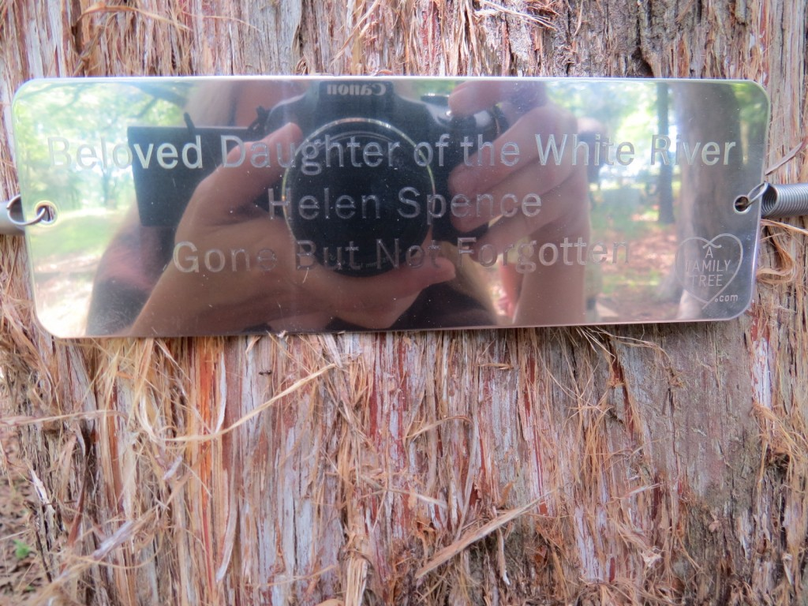
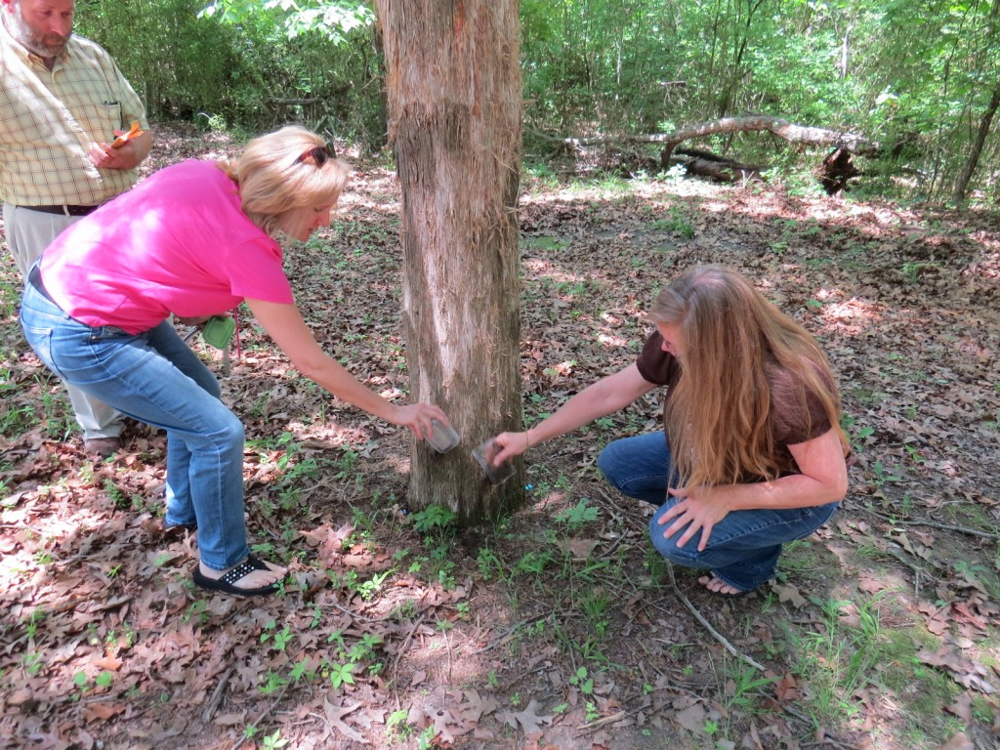
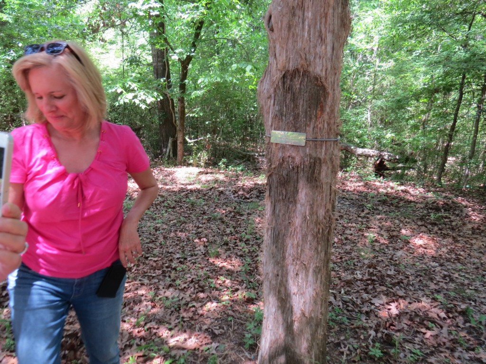
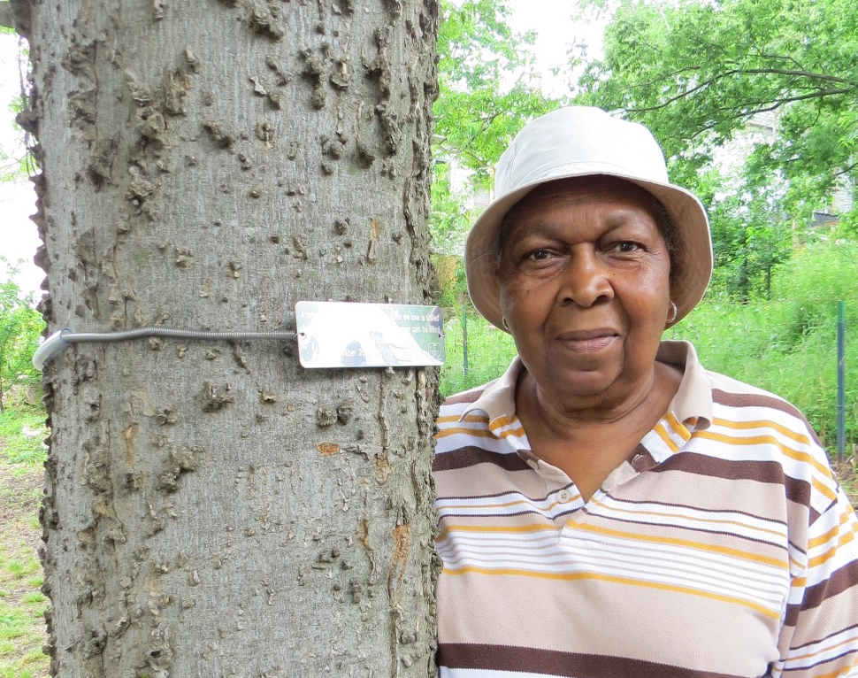

600 oak trees at the nation's 9-11 Memorial wear memorial "tree necklaces" designed by Ann Mayle

Hot Springs entrepreneur overcomes tragedy and loss to create lasting, living memorials.

By Denise White Parkinson

memorial marker at Helen Spence's cedar tree

Meeting Ann Mayle (MAY-lee) is a singular experience: her zest for life and abiding faith are outshone only by her smile. From a vintage high-rise overlooking Lake Hamilton, the Hot Springs entrepreneur recounts a journey that has brought her home to Arkansas roots.

“My grandfather graduated from the University of Arkansas in 1910, when the graduating class numbered less than 100,” she notes. “Roy C. Goodwin—he was from El Dorado.” Ann grew up in Southfield, Michigan, a suburb of Detroit, as her delightful Midwestern accent reveals. When she was 14 years old, she experienced a life-altering event. After driving with friends to an after-school house party, Ann opted to remain behind when her teenage companions jumped in the car for a quick trip to a nearby supermarket.

“There was a temporary construction median set up a block away, a cement wall,” she recalls. “We heard the crash from the basement den.” Because Ann's purse was still in the car, police called Ann's mother, who rushed to the scene and nearly fainted with relief to find her daughter alive. But the four boys and girls in the car—Ann’s best friends—did not survive the crash. “For the next week my mom took care of me,” she says. “I was shaking and crying nonstop. I would get up every day and go to funerals…they were all such good kids.”

Two decades later, she was having lunch with a friend and spotted a Detroit News article about a fatal crash involving local teens. The accident occurred on Woodward Avenue, a well-known street for cruising in the Motor City. During a lunchtime drag race, a car carrying three high school boys spun out and hit a tree. The article included a photograph of the crash site’s makeshift, hand-lettered memorial wooden sign and some plastic flowers drooping in the rain. “How sad that looks,” her friend commented.

Ann grabbed a napkin and began sketching designs for a permanent memorial, something that would last, like the tree upon which it would be placed. After consulting with arborists in Michigan State University’s Urban Forestry program and private companies, she launched her product in 2000, creating the website, www.AFamilyTree.com.

“I call them tree tags,” she smiles. Clients describe them as tree necklaces, tree bracelets or “tree-lets.” The markers are slender, 6-inch X 2-inch stainless-steel plaques inscribed with custom phrases. A special spring-loaded chain encircles the trunk to expand as the tree grows.

The environmentally friendly tree tags are manufactured in the U.S.A. and Ann encourages planting trees as part of the memorial process. When New York’s 9/11 Memorial planted 600 oak trees to honor fallen Americans, A Family Tree created custom oval plaques for each tree, a living legacy. To date, 20,000 memorial tags by A Family Tree have commemorated people, events, places and pets, worldwide. Ann's product made the “O” List, featured in _O Magazine_ as “one of Oprah’s favorite things.”

600 oak trees at the nation's 9-11 Memorial wear memorial "tree necklaces" designed by Ann Mayle

After moving to Hot Springs to be near her elderly mom, Ann donated memorial tree necklaces to two very different, yet intimately connected places, and our paths converged.

Exploring her new hometown, Ann discovered the Community Garden I co-founded several years ago, tucked away in historic downtown’s arts district. Enthused about the prospect of joining the garden in the spring, she went right out and bought some tools and gardening gloves. Then, she happened to read a newspaper article describing _Daughter of the White River_, a book I wrote about a young Arkansas girl named Helen Spence.

Ann was saddened to learn of the girl’s tragic death during the Great Depression and intrigued that Helen Spence's grave is marked only by a cedar tree. Ann decided to donate a tree marker, and so she tracked me down. As it turns out, we live only 10 miles apart. When we met, she still had the gardening tools in the trunk of her car.

Ann appreciates life’s serendipity as a reflection of a deeper truth. Having worked closely with each client, hearing their stories and choosing the right message for loved ones, she marvels at the interconnection of the human family. When we traveled to Arkansas County to place the memorial plaque on Helen Spence’s cedar tree, we were joined by others at the St. Charles cemetery.

first, we sprinkled some soil from Hot Springs at the base Helen's cedar

Brought together in remembrance of a tragic, unjust loss, we sprinkled soil from our homes at the base of the cedar, adjusted the tree tag and stepped back to regard the effect. Suddenly, a discoloration on the trunk’s shaggy bark was evident—the image resembled a silhouette of a young girl, wearing a silver necklace.

as Ann stepped away we saw an image on the trunk

An avid gardener, Ann is enjoying life in the Spa City, where one of her tree necklaces now adorns the Community Garden. The plaque was placed in remembrance of Elnora Bolden, a garden supporter who passed away at the age of 97. Like a jewel in a sacred grove, its silent message is lit by sunbeams:

A precious one from us is gone A voice we love is stilled A place is vacant in our hearts That never can be filled.

Community Garden co-founder Margaret Ballard with the tree memorial to her mother, Elnora Bolden
