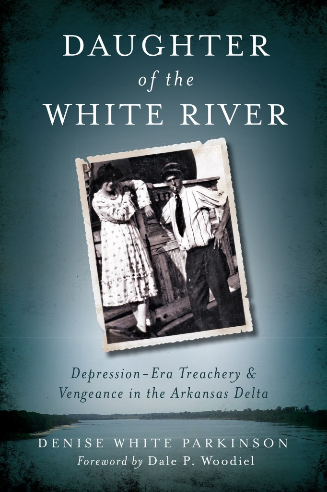

Helen of the White River

A play in three acts based on the life of Helen Ruth Spence, 1912-1934

by Denise White Parkinson

adapted from my book

CHARACTERS:

Spirit of Hattie Caraway, first female Senator elected in the U.S.

Helen Spence, a girl from the White River Delta

Jasper, a tow-headed country boy

LC Brown and John Black, elderly men LC Brown as a child (played by same actor as Jasper)

Miz Brockman, warden of Arkansas’s Women’s Prison, aka the Pea Farm (played by same actress portraying Hattie Caraway)

V.O. Brockman, her husband, assistant superintendent of the Women’s Prison Will Brockman, their 20-year-old son

Frank Martin, 30-year-old trusty guard at Pea Farm; a convicted murderer

The White River, longest river in Arkansas (~700 miles)

The Tree: representing simultaneously the red cedar planted at Helen Spence’s grave, the shade tree in front of the Big House at the Pea Farm, and the tree beside the well.

Setting: Arkansas, from the Crash of 1929 to the ensuing Great Depression and afterward, since as the saying goes, “there’s always a Depression in Arkansas.” The stage holds a large panel on casters. One side of the panel depicts a river scene; the other side, a well. During the prison scene, the panel is hidden offstage or draped; for the scene at John Black’s place, a card table and chairs are present. In foreground, stage left, a tall tree remains throughout scene changes. Green cushions around the tree suggest flora. PLACE: An old well next to a tree in rural North Pulaski County, Arkansas, several miles from Arkansas’s Women’s Prison, aka The Pea Farm. TIME: Just before dawn, July 11, 1934 ACT 1 SCENE 1 At Rise: Music plays and fades, Claude Debussy’s “Maid with the Flaxen Hair,” as images from the White River project onto the walls: houseboats, steamboats, bridges, ferries, giant trees; a watercolor portrait of a Quapaw Brave. The spirit of Hattie Caraway enters stage right, in her hand a lantern uplifted in the pre-dawn darkness, searching. She does not notice Helen Spence asleep under the tree. Hattie Caraway: I swan to my time! You’d think after being in the hereafter for so long, my eyes would improve. I don’t even know why I came back here. I can’t change what will happen. It just hits me on the soft side of the heart to think of that poor young girl being hunted down like a wild animal. Even if she is what they call a River Rat, no child deserves ill treatment. When I was elected, I learnt right quick that even the first woman in the United States Senate gets treated like a common River Rat—at least in the halls of Congress. They sat me in the very last row of the chamber; called me “Silent Hattie.” Well what did those men expect, that I would holler down front from the back of the room like a heathen? But y’all know from sitting in the back pew at church: you can see everything from there. And I saw it all: Senators absent for votes, showing up drunk, sleeping at their desks—during the height of the Great Depression! It was shameful. There I was up in Washington doing my level best to bring Mr. Roosevelt’s New Deal to Arkansas, and all the while, a terrible injustice was taking place back home. A poor girl thrown into prison, and for what? For taking the law into her own hands. Why, in our nation’s capital, I saw countless men day in and day out take the law into their own hands—and reward themselves handsomely for doing so. What was it that spiteful old hillbilly governor said? Oh yes, Governor Futrell, another fine Arkansas politician, he said, “The poor are not worth the powder and lead it would take to blow out their brains.” Guess what? I have it on good authority that Governor Futrell is going straight to perdition when he dies. In fact, he’s there already. At least Helen Spence will die free. No prison can hold her. Ladies and gentlemen, if you happen to see a little lost houseboat girl with dark hair and big brown eyes—would you be so kind to tell her Miz Hattie Caraway sends her regards and will find her in the hereafter, on the other side, where there is no such thing as Time. Thank you. \[EXIT STAGE RIGHT\] \[lights up\] Sunrise reveals Helen asleep under the tree. She is dressed in the canvas pants and blue shirt of the field crew, with a red bandanna around her neck and a black felt hat currently in use as a pillow. The well occupies center stage. Jasper enters stage right, carrying a cane pole and some tackle. Jasper \[whistling\] Bet it’s one of them convicts run off from the Pea Farm. She don’t look too dangerous. Hey, wake up! Helen I was dreaming I was back on the river. Little boy, is the river right near? Jasper The Arkansas River ain’t too far from here. Helen I have to get home to the White River. It’s a long way… I’m so thirsty. Can you give me some water? Jasper Yes ma’am, I was coming to this well for a drink myself. Are you all right? Somebody after you? Helen \[drinks from cup\] Thank you—my daddy used to say, if you can’t get spring water, well water does just fine. Jasper \[drinks from cup\] I’m going fishing; guess I better head on. Helen Wait—what’s your name? Jasper Jasper. Helen That’s a funny name! Jasper Well it ain’t nothing to laugh at. Good day, ma’am. Helen Wait—Jasper. Don’t run off. You remind me of someone I knew back home. Pleased to meet you, my name’s Helen Spence. I got lost in the dark and I don’t have my medicine. Would you sit with me a minute while I catch my breath? \[They sit on edge of stage, legs dangling\] Jasper Medicine? You got a fever? Helen The doctor says I have to take the digitalis for my heart. I get weak spells—but it’ll be all right, once’t I get back on the river. I’m going to live with my Uncle. He’s got a houseboat near St. Charles. He’s a mussel-sheller, mainly. Jasper Is mussel a sort of clam? Helen Yes. Here—it’s the last one I have but I’ll be getting more soon’s I get home. They didn’t find it on me because I had it stitched into the hem. That way, I could always have the river near. Jasper What is that? Helen A pearl, a freshwater pearl from the White River. Help me stand up, I think I feel better now. \[Faints\] Jasper Now what the heck am I s’posed to do with a convict? And a dang pearl? \[lights down\]

SCENE 2 Place Arkansas Women’s Prison, aka “The Pea Farm,” a disgrace of an institution located in the countryside north of the Arkansas River, just a few miles the other side from Little Rock, the Capitol City. Time October 11, 1932: the day Helen comes to the Pea Farm, sentenced to prison for killing the man who shot her father. At rise: Mr. and Mrs. Brockman are standing by the tree waiting for Helen Spence to arrive. Miz Brockman fans herself with a paper fan from a local funeral home. Miz Brockman I don’t know why we have to take her here. They should have sent her to the State Hospital for Nervous Diseases. Everybody knows River Rats are all crazy or degenerates or both. V.O. Brockman There’s been a lot of newspaper stories about this girl. She could be trouble. Miz Brockman Here come Will and Frank now. Let me do the talking. If she’s a pretty one you better keep your mouth shut, hear? \[enter stage right Will Brockman, Frank Martin and Helen Spence.\] Will We brung you a present, Ma. She’s just a li’l cigar-nub of a gal, but plenty feisty. V.O. Brockman Come on boys, I think Ma can handle ‘er. \[men exit stage left\] Helen Looks like the geese are heading back… Miz Brockman You will receive your clothes after you’ve been checked in and de-loused. Helen But I don’t have any lice on me, ma’am, I promise. Miz Brockman Nonsense. After the de-lousing, you will be assigned to a bunk and you will report to the line. Helen The line? Like a trot-line, ma’am? Miz Brockman This is a farm. You will be hoeing potatoes with the other girls. Helen Oh. Well I’m sure I can manage. I was picturing a trot-line, you see—back on the river, we— Miz Brockman Miss Spence, you are no longer on the river. You are at the state Women’s Prison, for killing a man. Helen Mr. George Hartje, the prosecuting attorney, says not to worry, that he’ll help me get a parole, he— Miz Brockman Try to understand, Miss Spence, none of that matters at all. What matters is: are you going to make trouble, or are you going to be a good girl? The fact that you are here suggests you are a bad girl. I cannot be your friend, but I can damn sure be your worst enemy. Don’t try me or your life will become a living hell, I promise you. Helen Yes ma’am. Miz Brockman And all your pretty pictures in the paper—all those stories on the front page—that doesn’t get you any special treatment here. Here, you are nothing—got it? Nothing except whatever we say you are. Helen Yes ma’am. Your house sure is pretty. Miz Brockman It’s one of the finest structures in the county. We have the only telephone for miles. But you won’t be making any calls. And believe me, the only part of that house you will ever see is the basement, and you don’t want to go there. Helen Why, what’s down in the basement? Miz Brockman Make trouble and you will find out, my dear. Now, come along to the showers. \[exit stage left\] SCENE 3 Place: The White River at St. Charles, Arkansas. Two old men, LC Brown and John Black, sit at a table. John Black is very frail. Time: Midafternoon, autumn, 1978. At rise: The two friends are having coffee. LC Brown Looks like the ducks and geese are heading back to the river. John Black Remember when we’s kids, the sky used to turn dark there was so many of ‘em.

LC Brown Look here, John, why’d you call me out here again? It’s a long drive from my place and your cookin’ ain’t that great. John Black I wanted to talk to you about something. I’m dying, LC. Now, it ain’t so much about that. It’s about I need to tell you a secret’s been burning a hole in me for years. I never told anybody, not even my wife. LC Brown Well, all right John. John Black You remember Helen Spence. LC Brown We grew up together, how could I forget? What a shame that was. They say the trusty guard took the rap for killing her—they say he died in his sleep. John Black Frank Martin. Damned Drylander. I heard a different story. LC Brown You heard it too? After Frank Martin got paroled, he went around bragging he was the one shot the notorious Helen Spence. Then one day he goes to buy a loaf of bread at Cloud’s Grocery, and the lady behind the counter was from the river… John Black The lady sold him a different loaf, said it cost less but was just as good. Frank Martin ate dinner that night and never woke up the next morning. LC Brown The river got him. John Black The river gets its revenge. Back when Helen was murdered, the year after she died, the government started kicking folks off the river. They took it over, all right. Sank our houseboats, run us off where we lived and worked. Drove us into exile. LC Brown Yep, now it’s just a sandbox for the Corps of Engineers to play in. But John, Helen wasn’t notorious. She’s just a little river girl. John Black The newspapers and magazines wrote lies about her. Her picture sold a lot of subscriptions. LC, you moved away a long time ago, but for the past fifty years I’ve been volunteer caretaker of the St. Charles cemetery. Didn’t you ever wonder why? It was so I could tend Helen’s grave. It’s time for you to see where she’s buried. It’s right near the potter’s field. I planted a cedar tree to mark the spot—damn near 30 feet tall now. And take these home with you—I’ve been saving all these old photographs and newspaper clippings. I want you to have them. LC Brown Why me, John? John Black Hell, Brown, I figure if anybody can tell Helen’s true story, it would be you. Come on now, I want to show you where she’s been sleeping all these years. \[Lights down on the men, lights up on the tree\] \[CURTAIN\] ACT 2 SCENE 1 Place The White River near the bend at St. Charles, Arkansas. Time Summer, 1929, a few months before the stock market crash. At rise: LC Brown as a child enters stage right. He is a towheaded boy in similar, though different clothes than Jasper and wearing a different hat. He pokes around on the ground with a stick. Helen enters stage left, sits by the tree and waves to the boy. She has longer hair and is wearing a summer dress with white fishnet stockings. Helen Lemuel Cressie Brown, Jr., I see you! LC Brown, do you not see me in the shade? Plenty of room for two. Little LC My daddy is down to the houseboat talking to your daddy. I bet it’s moonshiners again. Helen I’ll have no truck with bootleggers! Sheriff Lem is a-okay in my book; you can tell him I said so. Little LC Helen, tell me a story. Helen Hmmm… Ever hear of the Jenkins boys? The Jenkins boys go to the Drylander church. Every Sunday, families come from miles around in buckboard wagons, like big shoeboxes on wheels. They hitch the horses up in the shade and if a baby starts to fussin’ in church, the momma just wraps the baby up and stows it in the buckboard. The baby sleeps all tucked away, til church lets out. Little LC I slept in a buckboard once’t, on a quilt pallet. Helen Well, one Sunday, Preacher Burton was sermonizing and there had been some babies fussin’ and they were all asleep out in the wagons. The Jenkins boys got together and decided they’d switch all those babies around. So when church lets out, folks head home for Sunday dinner only to find nobody has the right baby! They got to turn around and take ‘em all back where they belong. After a few Sundays of this, those drylanders got wise and start to checking their babies before they leave. Little LC Tell me another one about the Jenkins boys! Helen \[standing to act out the story\] The Jenkins boys always sit in the back pew of the drylander church. One Sunday, Preacher Burton was sermonizing and those boys start to scuffing their big ol’ boots on the floor, drowning him out. Now, Preacher Burton doesn’t say anything, but the next Sunday he shows up to preach, he takes out his Bible and sets it on the pulpit. Then he pulls out his pocket watch and sets that down beside. Then Preacher Burton takes out his pistol and lays it down, too, and he says, “I come here to preach the word of the Lord. But if anybody in the back row wants to make noise, I’ll be happy to send him to Hell!” Little LC \[Rolls around laughing\] Helen I like the Brush Arbors down by the river, where folks go to get baptized. Seems better than an indoor church. Here, stroll w/me a bit. Shhhh, want to see something? Little LC What? Helen \[holds open a little drawstring purse\] Looky here. Little LC You got a gun in there!? Helen It ain’t loaded. But I got some bullets, just in case. Daddy’s been teaching me how to shoot. Want to see something else? Little LC Sure! Helen \[pulls up her skirt a little ways to show a wad of bills tucked behind her stockings\] – Daddy needed a place to hide his money. That’s $300! Hey, you hungry? Miz Dupslaff makes the best bread pudding. Let’s go—she always gives me some! Little LC Lordy! I’d kill for some of Miz Dupslaff’s bread pudding! \[exit, stage right\] \[lights down\] Act 2, Scene 2 Place The river scene. Time January, 1931: the day Jack Worls is standing trial for killing Helen’s father, Cicero Spence. At rise: Helen enters stage left wearing a red velvet dress with matching cape and rabbit fur muff, paces about alone. Helen Daddy, I wish I didn’t have to do this, but I’m praying you will understand. Especially now that you’re up in heaven with momma. I’m about to go in the courthouse. Today’s the trial. The deputies are telling me Jack Worls might get off scot free! I don’t understand it. He already admitted he shot you! He stole everything I ever loved… They won’t even let me go back to the houseboat, they say it’s not safe, but how can any place or anyone be safe as long as that no-good Jack Worls thinks he can get away with murder? Well he won’t get away, not today, not on the River. I promise you, daddy. \[pulls pistol from inside the fur muff and exits stage right\]. \[The sound of three shots rapidly fired. Noise of people yelling, screams. Lights down.\] Act 2, Scene 3: Place The well beside the tree. Time Moments after Helen has fainted and is starting to come to. At rise: Jasper fans Helen with his hat and offers more water.

Helen I must have fainted. Look what they did to my hair… they cut it all off on purpose. It’s so when folks see you working in the fields, they know you’re a troublemaker that got punished. I used to have such long hair. Jasper I’ve got some deer jerky, you can have it. You need it worse than I do. Helen Thanks, I haven’t eaten since before…since yesterday morning. Jasper That’s because we got Oppression in Arkansas, and it’s making folks go hungry. If it don’t rain soon daddy may have to sell another one of our cows. Helen Back home, the drylanders always talk about a Depression in Arkansas, but you know something? We never go hungry on the river. It’s just fish fries, frog-gigging and swimming all summer long. That, plus hunting and trapping. River Folk laugh at hunting season—huntin’ season’s just what you use to flavor the meat. Jasper I sure hope nobody in that house over yonder sees us sitting here. Momma says the lady that lives there is a nosy ol’ busybody. She might turn you in to the… you know. Helen If she knew what goes on at that place, she might not be so quick to judge. Jasper Whenever my sister and I get to fussin’ and fightin’, momma and daddy say “y’all settle down now or we’re sending you to the Pea Farm!” Helen You ain’t just a-wolfin’! I know a lady who got sent to the Pea Farm for “keeping an unruly home.” Jasper I best warn momma about that. Why’d you get sent there? Helen They’re crazy folks at the Pea Farm—Miz Brockman—she’s the warden—she made the girls plant yellow daffodils in rows, right out in front of the Big House! The Big House is where they put you over a barrel. Jasper A barrel? Like a pony keg or a pickle barrel, you mean? But why’d they lock you up anyhow? Helen For killing a man. Jasper Oh. Was it an accident? Helen \[stands unsteadily and paces\] He stood up in court, lying like a dog. Jack Worls was his name and he shot my daddy in cold blood during a fishing trip. Cicero Spence was the best fishing and hunting guide on the White River, and the best daddy a girl could have. Jack Worls was a no-good. So I shot him in the Arkansas County Courthouse, in front of God and everybody. Because he needed killin’. Jasper That beats all I ever heard! Helen—we got to hide you somewhere! Helen Then, they tricked me into confessing I killed another man… Jasper You killed another man? What for? Helen I said I confessed to killing him—not that I did kill him. I wanted him dead, though, sure enough. He was an awful, horrible man who did bad things. Jasper How’d you get away from the Pea Farm? Helen I just climbed the fence. The guard watched me go. It was like they were letting me escape. Not like the other times. Jasper How many times you escaped? Helen Four? Five? I don’t quite recall. But each time they catch me they give me 10 lashes with the blacksnake and lock me in the cage. I need my medicine. Maybe if I lie down for just a spell… Jasper Helen, don’t go to sleep again! We got to hide you. Dang! Now, what the heck is a blacksnake? \[Lights down\] Act 2, Scene 3 Place River scene with tree. Time 1978, the day John Black shows LC Brown where Helen is buried. At rise: The men are standing by the tree.

John Black So they brought her body to the funeral home and those drylanders put her on display in the winder, like she was Bonnie Parker. Folks came from miles around to see Helen Spence, the outlaw girl from the White River. LC Brown I remember momma was madder than a hornet about them doing that. It was the first time I ever saw my momma cry. Some folks said Helen was pregnant when she was killed, but I don’t believe that. Just hateful gossip, is what it was. John Black It’s a damn lie. That funeral home had her in the winder. She looked just like she was sleeping, LC, it were the damnedest thing. We brought her to the cemetery and I planted this cedar tree where we buried her. Cicero Spence is buried over there, and Helen is here. \[They bow their heads\] \[Helen, dressed in a red-and-white-checked gingham dress, steps from behind the tree. The men do not notice her, as she is a spirit\] Helen I know you, John Black—but I liked to not recognize little LC Brown! Time does such funny things to people. I see him now, though—those ears! LC Brown John, did you hear something? Someone laughing… Helen John’s my buddy. Every year, on my birthday, he takes a flower from each grave and strews ‘em all beneath this red cedar tree. He waits til after sunset to do it, and right before the sun comes up, he picks ‘em all up and puts ‘em back where they belong. My birthday’s February 23rd, so sometimes the forsythia’s in bloom. Thank you, John. John Black You’re welcome. LC Brown What? Helen I do wish those two could see the dress I made. It took me a month to sew the gingham into the lining of my uniform. But it makes a fine disguise! LC Brown I used to eavesdrop a lot when I was a kid. I remember hearing momma and daddy talking one night about Helen escaping from the Pea Farm. They were saying how when she worked in the prison laundry, she stashed away a bunch of them red-and-white checkered cloth napkins and stitched ‘em to the inside of her prison dress. John Black That she did… Miz Brockman, the prison warden, sent some of the girls up to Memphis to prostitute ‘em out. They were doing all kinds of devilish things to gin up money for the Pea Farm. When the bus stopped off in West Memphis, Helen asked to use the ladies’ room and went in there, turned her dress inside out and just walked away. LC Brown But they always caught her because they knew she would head for the river. John Black The river gets in your blood. Helen I headed for the river, to breathe it and swim in it and sleep on it and dream again. I couldn’t take another lashing. The Pea Farm’s got no shade—the land is dry as buckshot clay—and every city in Arkansas smells like a cement outhouse. Even the Insane Asylum was a better place to be than the Pea Farm—Miz Brockman sent me there once because I was running her ragged with escaping. But the doctor said I wasn’t crazy, and they sent me back to the Pea Farm and locked me up in the cage. Thank goodness the other girls smuggled in some paper, so I could write a verse about how I feel. I call it “Echoes”: \[dancing and twirling\] Now this is no secret ambition of mine It’s merely to occupy some of the time. You can’t heal the heart with no work for the hand So I pick up my pencil and do what I can. I’d rather be plowing or chopping down brush Or rowing a boat in your Arkansas slush Or scrubbing the fleas from a tiny fox dog Or sawing and hauling a big hickory log Or dodging the ruts in a bumpy old Ford With oodles of kiddies on each running board And picking them up at each turn in the road Til Lizzy called Henry to help with her load Or riding the trail on an old lazy mare Now and then chasing a cottontail hare Here and there ducking a nut thrown at me By a nibbling squirrel that will chuckle and flee… So here by my window I dream of it all When shadows like these come and play on the wall And out of the wreckage I’m forced to confess I might build again and perhaps for the best. \[exit behind tree, stage left\] LC Brown John, you have my word: somehow I’ll make sure Helen’s story gets told. But what do I say if folks start asking me why you kept this a secret all this time? Were y’all in love? You and Helen? John Black We’s just buddies, is all. Ain’t you ever had a buddy? \[lights down\] ACT 3 SCENE 1 Place The well. Jasper is kneeling by the tree where Helen lies in a faint. Time July 11, 1934. At rise: Lights down as Mr. and Mrs. Brockman enter stage right into a spotlight; she is carrying some paperwork and a pen. Miz Brockman You boys better find her, is all I can say. I’m looking at a letter from Mr. A.G. Stedman, superintendent of the whole prison system—says right here, “She must not escape!” V.O. Brockman Don’t fret, we’ll get her. Miz Brockman She knows all about our Memphis business. That can’t get out—I don’t care if we’re crooked as a dog’s hind leg, we ain’t going anywhere. It’s up to you and Will to see we don’t go down for this. You better not let some slut put us out of our position—little river rat thinks she knows everything. I ought to lash her myself this time. V.O. Brockman There’ll be no need for that. Will’s got the pistol. We’ll get her, all right. Miz Brockman What about Frank? He ain’t the sharpest tool in the shed. Did you go over the plan with him again? V.O. Brockman I can handle Frank. You just stay calm. Be back as soon as we got her. \[exits stage right\] Miz Brockman You went and bit off more than you could chew this time, Helen Spence. \[exits stage right\] \[lights up\] Jasper Please, Helen, wake up. They bound to be looking for you! Helen I feel much better. Thank you for setting with me, Jasper. I think I can make it now. Jasper But where to? How you gonna cross the dang Arkansas River? It’s a mile wide, ain’t it? Helen Maybe I can find somebody with a houseboat. Wouldn’t that be something! \[takes another sip from cup\] This here’s the best drinking water—you won’t tell on me will you, Jasper? You’re my buddy, right? Jasper Cross my heart and hope to… I promise. Helen Here’s a Yankee dime for your trouble \[kisses his cheek\]. Good-bye. \[exits stage left\] Jasper Dang it, momma’s gonna want to know where this pearl come from. V.O. Brockman \[from offstage\] Hey you! Boy! \[enter stage right V.O. Brockman, Will Brockman and Frank Martin, the posse from the Pea Farm. Will carries a pistol and Frank carries a shotgun.\] V.O. Brockman Boy, we’re on the trail of an escaped convict. You see anybody come this way? Will Brockman Dad, he’s acting like he’s simple-minded. Let me beat it out of him. \[grabs Jasper by the shoulder\] Boy, I will shake you til your damn head rattles off if you don’t talk! Jasper No sir, I seen nobody! Frank Martin Look—he’s hiding something in his hand, Mr. Brockman. Will Brockman Drop it! \[slaps Jasper\] What is it? V.O. Brockman It’s a pearl, a mussel-pearl like you find on the White River. Come on, boys, she can’t be far. \[Will shoves Jasper to the ground and the posse exits stage left\]. Jasper Please get away, oh please get away! \[one pistol shot\] Jasper Helen! \[pulls up knees, puts head down and cries\] \[lights down; spotlight on the tree, music: Maid with the Flaxen Hair.\]

The end
