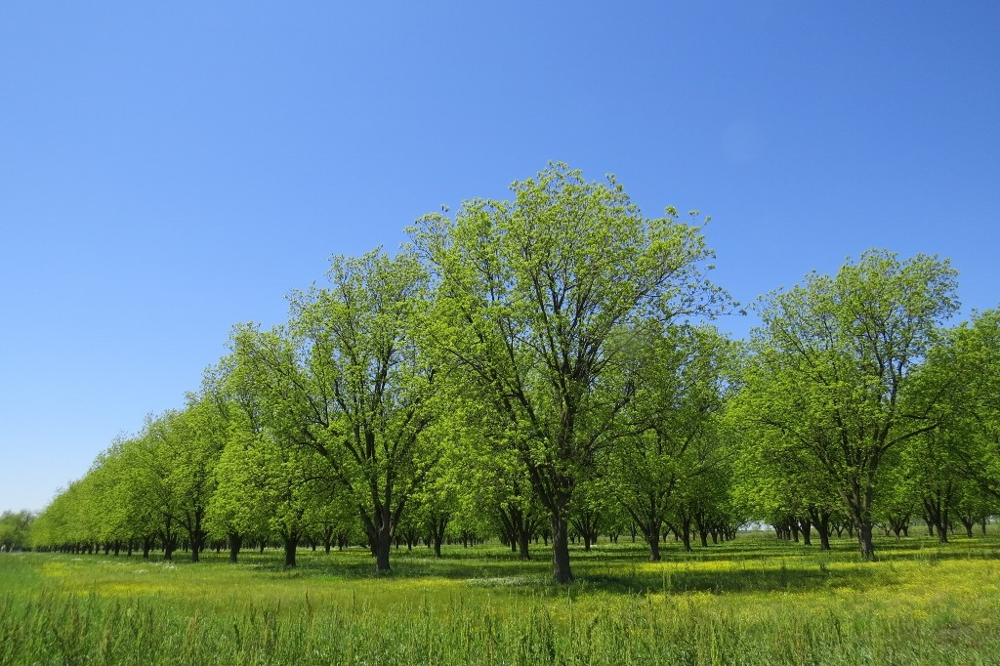
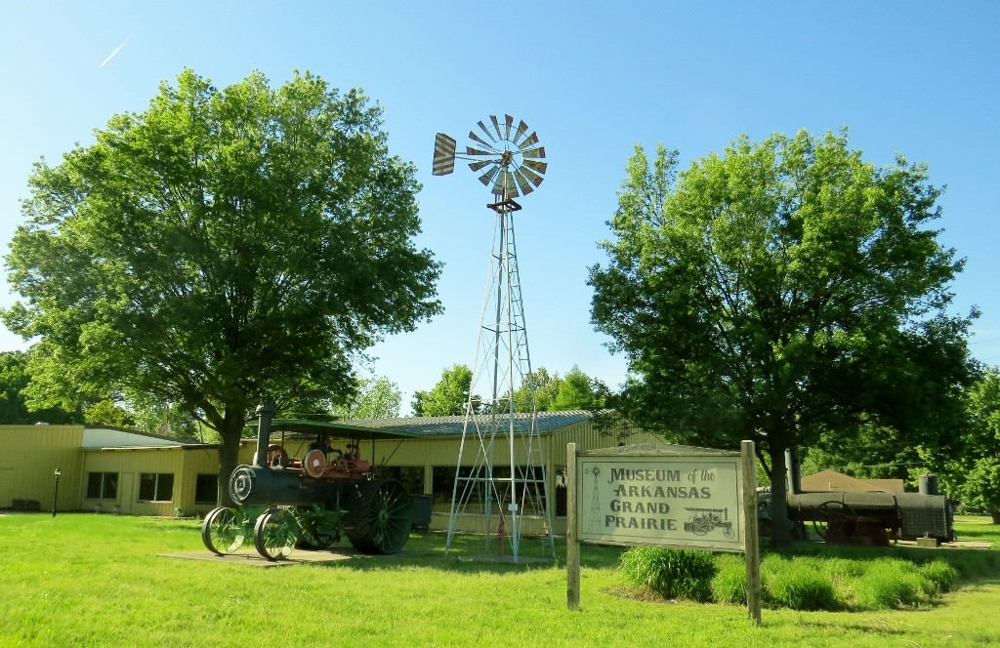
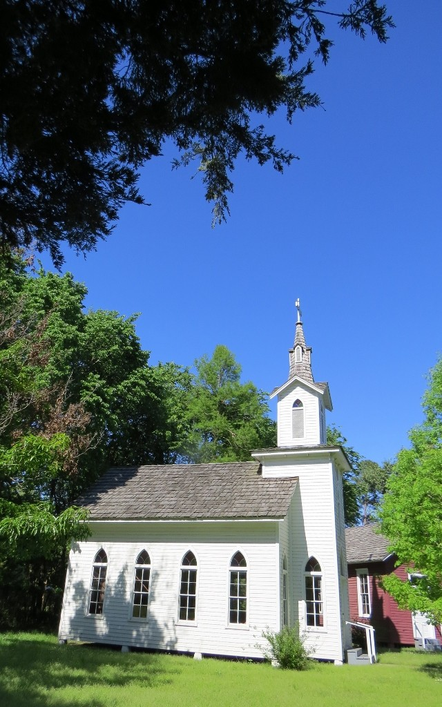
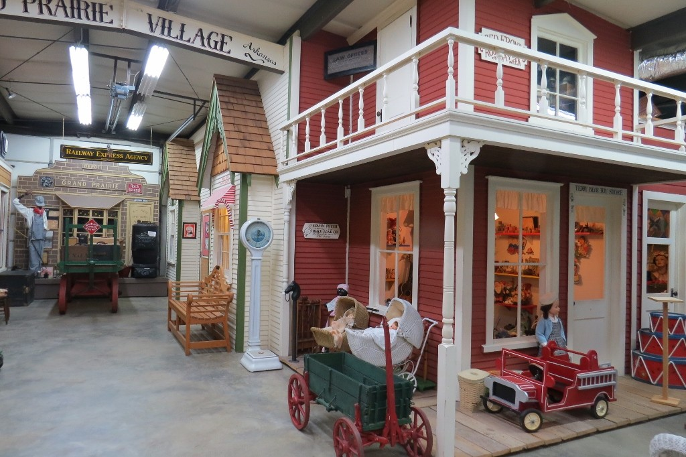
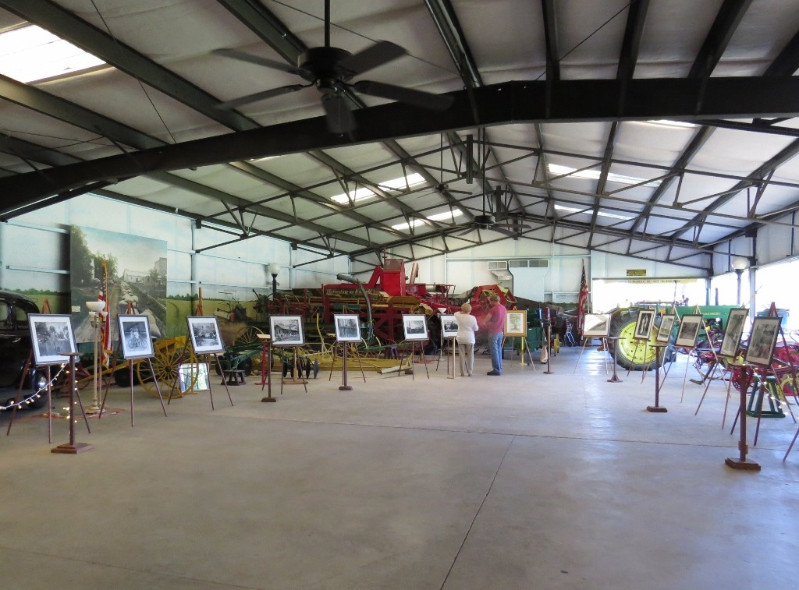
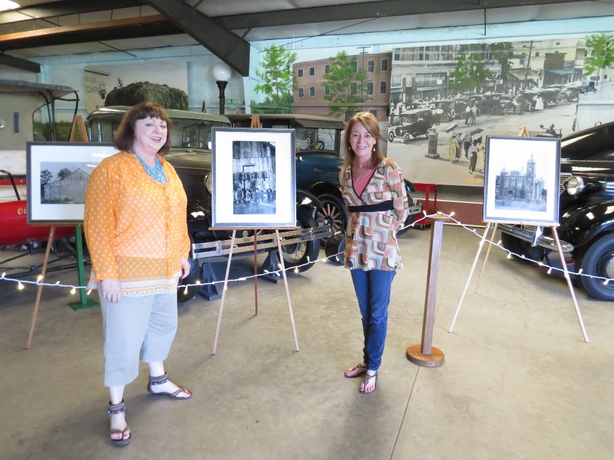

On my day off from MidAmerica Science Museum, I drove to Stuttgart's Museum of the Grand Prairie toting the last pieces of the puzzle: the exhibit "Delta Rediscovered: Arkansas County." After putting together easels, setting it up with the help of the great folks at the Museum and touring the grounds, I am happy to report that Helen Spence has led us to a beautiful place. The Lost Archive of Dayton Bowers is home at last, among dear friends!

on the way to the museum, this pecan grove caught my eye

The Museum of the Arkansas Grand Prairie is so much fun to explore!

A classic church and one-room schoolhouse are located next to cabins, a gazebo, and a molasses-making operation

there's an entire model main street inside one part of the huge interior

we arranged the easels against a backdrop of vintage farm equipment!!!!

thank you to my friends and fellow history-lovers, Gena Seidenschwarz and Nancy Hancock! Looking forward to May 22 opening reception!

Delta Rediscovered: Arkansas County, will be exhibited through July at the Museum of the Arkansas Grand Prairie in Stuttgart. Opening reception Friday, May 22, 5-8 pm. Wine and light hors d'oeuvres.

This traveling exhibit is made possible in part by generous grants from the Morris Foundation and Arkansas Department of Heritage, Heritage Month Grant Program. For more information, contact Denise White Parkinson, 501.276.6870
