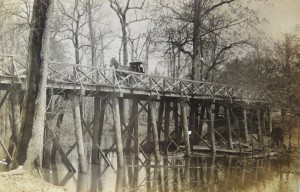

]
lower White River, bayou bridge, circa 1900, by Dayton Bowers

Waking up to a frosty November morning is pure-D pleasure, when the house has heat and there is coffee brewing. I am working on a story about the most important photographic find in Arkansas history. I do not make that claim lightly. The lost archives of Dayton Bowers, who lived and worked in DeWitt (Arkansas County) from the 1880s through the 1920s provide a visual record of the growth of the Delta. Similar to the discovery of Cleburne County's Depression-era portrait photographer, Mike DisFarmer, this discovery is equally significant for its scope: streetscapes and photographs of daily life in Arkansas County were Dayton Bowers' forte. Too bad that Central Arkansas Library System mislabeled the archive, donated by my friend and writing partner, historian LC Brown, making it unavailable to us for the past 5 years. Thank God for the internet, as I chanced to see fellow historian Jim Prange's pic of one of the archive photos and immediately contacted Central Arkansas Library System to set up a viewing. Now, I am writing about this priceless treasure trove, and finally Mr. Brown will get credit for his generosity--no thanks to the Central AR Library System!
