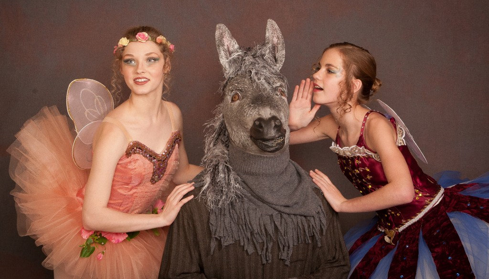

 beauty meets the beast daily!

It has to be Monday. Miles to go before I fully wake, start the day, the week, the endless rhythm of deadlines and moneymaking: a penultimate, wearying timeframe.

Promotional media, print media, social media, you, me, Medea --ripe nuggets of ambivalently valuable reality hang in the balance. But before I even get to work, I must navigate a minefield of ignorance.

I am dropping off the 6th-grader at his new middle school, located in a small town OUTSIDE of Garland County. It's important to note that this public school is NOT located in Garland County.

(Although I'm not sure why it's so important -- this sort of public school thing is widespread, according to the Internet.) We are inside The School Office, home to the Secretary and ante room to the Principal, who has stepped into the office just as we arrive.

I fill out the appropriate student sign-in form (we have a doctor's note, after all), slinging cursive confidently as part of my role as an appropriate parental guardian. But in the background, I detect a note of discord: an apparently delicate conversation between the Middle-School Principal and two terrified little girls standing in the corner.

(Seriously, these girls are little. Think: the character of Newt in "Aliens" or small as Scout in "Mockingbird." The principal is your basic bland white-privileged male, anywhere from 30-50, it's hard to tell b/c of the absence of any expression.)

From the corner of my eye, as I sign my name, I see the two little girls, all of four-feet-tall, trembling in their matching ankle-boots. It's obvious (b/c Monday) that they have spent the weekend coordinating new outfits: knit purple tunics (mock-turtle neck) worn over patterned blue/green/purple knit tights. These are thick knit tights, probably seen featured in a Fall fashion mag's full-color glossy spread as worn by a cadre of attractive ski-bunnies, displayed colorfully before a roaring hearth, probably photoshopped.

"You are breaking the school dress code," the glowering Middle School Principal intones rather creepily. "Are you both in 5th Grade?" he inquires of the cowering pair.

"Yes, sir," whimper the humiliated BFFs.

"Fifth-grade girls grow, on average, about 3 inches a year," muses Principal Creepy-Ass Cracka, addressing the cringing Secretary behind the office countertop. Avoiding her gaze, I duck my head and finish filling out the required form as the Principal admonishes the pair of female children for having chosen garments that fall mid-thigh over such audaciously patterned knit tights. The Principal is shocked, Shocked! at the half-inch-wide deviation from the prescribed public school norm.

As Principal McCreepy gives the unfortunate girls a few more fashion/morality tips, I bid my (safely un-scrutinized male) middle-school child goodbye, wondering as I depart at his slovenly, threadbare, hand-me-down attire (a byproduct of our current Great Recession). I flee the distasteful, early-morning scene, hurrying out to the parking lot where I catch a glimpse of the two chastened 5th-graders scurrying up a flight of steps, the glory of their matching tights destroyed forever, replaced with a traumatic memory of epic scuzziness.

The girls are too far away for me to call out to them. I don't want to frighten them by shrieking, "WAIT, WAIT! Your principal is an ASS!!! Your beautiful matching knit tunics that fall to mid-thigh, complemented in color and design by awesomely iconic contrasting knit tights; such timelessly youthful spa ski-wear, totally top of the line fiber art designs constituting a downright credit to the community -- Wait, you girls don't deserve to be insulted by hick, style-averse clods!" This is what I do not yell, to my eternal shame and regret.

I feel the need to apologize to all likewise universally insulted public school 5th-grade girls (and the women they grow into): beautiful Arkansas girls continually punished for being young, fresh and/or brash; the ones who call each other over the weekend to coordinate cool new Fall outfits -- wearers of mock-turtle neck sweaters and matching patterned knit tights that reveal absolutely NO SKIN, except of course that undeniable, universally revolutionary fashion statement: a uniquely identifiable face and hands.

No burkas necessary in Arkansas, Mister Middle School Principal... at least, not yet, despite your patronizing best efforts at humiliating and shaming little girls for wearing clothes that defy outmoded, obsolete Patriarchal Constructs.
