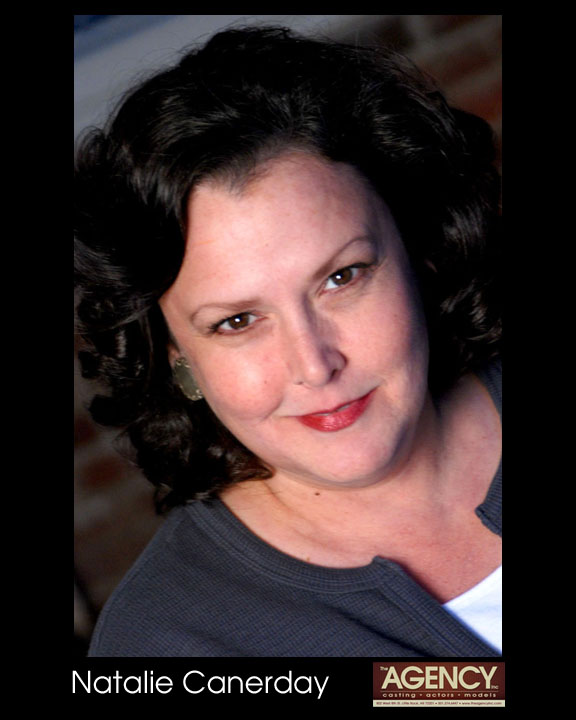
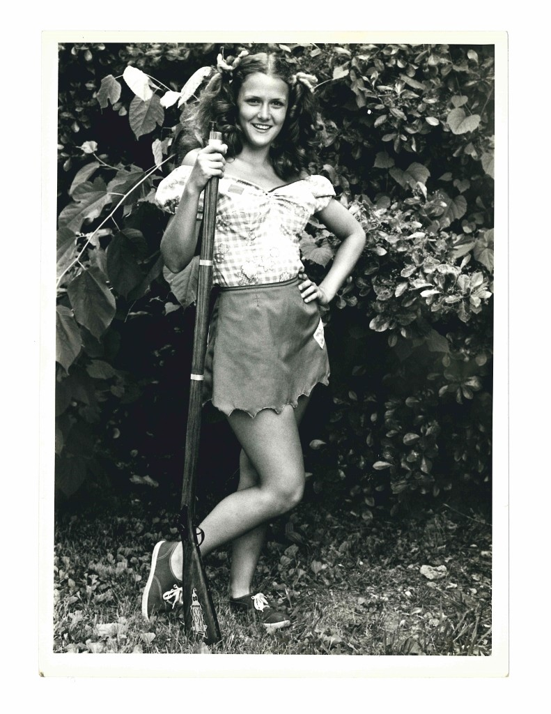
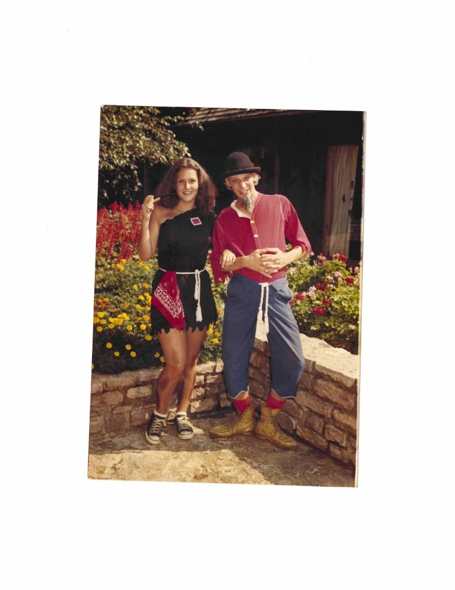
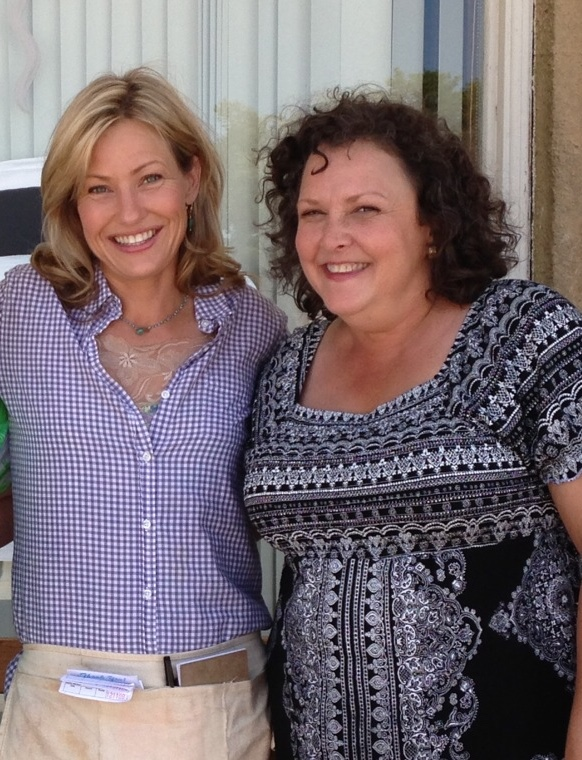
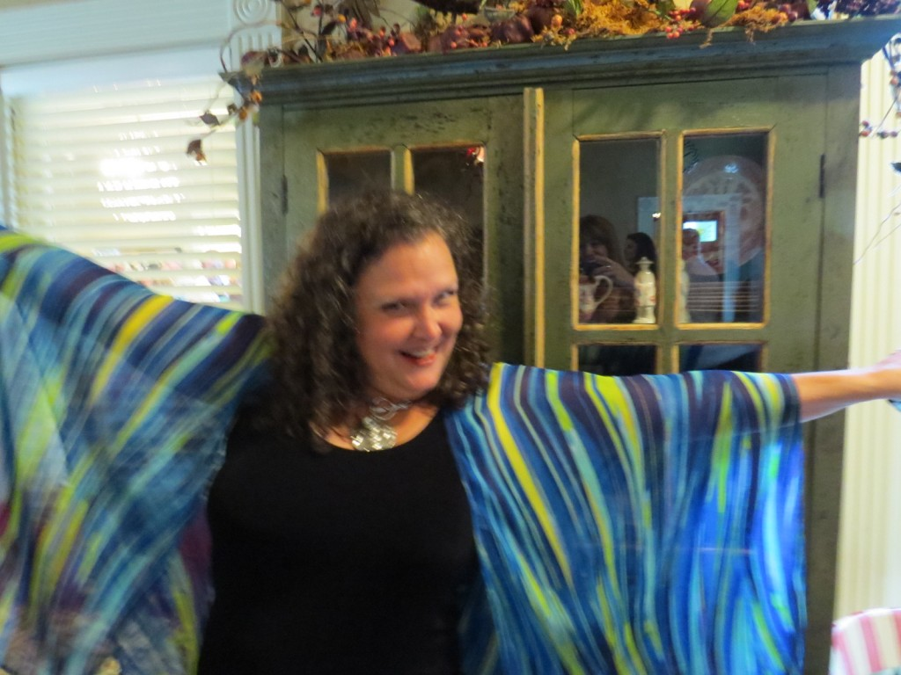

By Denise White Parkinson

Actress Natalie Canerday

Natalie Canerday—stage and screen actress, comedienne, postmodern Southern Belle—is not so much elusive as just plain busy. Catching up with the divine Ms. Nat is a gratifying experience; only do not attempt to find her on Facebook, Twitter, or via email. “I don’t own a computer,” she confesses, grinning.

Ms. Canerday is therefore best appreciated in person, old-school, where her flashing dark eyes and smoky-molasses drawl can be fully enjoyed. Over the past two years, she has completed three films, a television pilot, two webisodes and a play about iconic Arkansas photographer Mike Disfarmer. Earlier this summer, she joined an ensemble cast for the Rep’s production of _August, Osage County_.

But as there is no use trying to rush Natalie Canerday (as we chat, she is making a cake from scratch) we must begin at the beginning: A native of Russellville (“God’s Country,” she interjects), Natalie got her first break performing at Dogpatch USA, the Ozark mountain theme park based on long-running comic strip “Li’l Abner.”

With news of the property’s sale to a motivated owner, generations of Arkansans are expressing hope of a hill-country renaissance. Natalie counts herself firmly among the optimists wanting the park to prosper, in whatever form it takes. Dogpatch was pure-D fun, after all.

“I was a senior in high school when mother saw they were holding auditions for characters at Dogpatch,” Natalie recalls. “I worked up a song from _Oklahoma_ (‘I’m Just a Girl Who Can’t Say No’) and a few bars into it, I forgot the words!”

Instead of freezing in panic, she sashayed up to the man accompanying on piano. “I got behind him so I could cheat and read the words on the sheet music,” she laughs. “I began rubbing his bald head as I sang.” She won the part.

Natalie as "Moonbeam McSwine" posing next to Pappy Yoakum, circa 1981

As the youngest performer of the 1980 summer season, Natalie embarked on an adventure. For young’uns who did not have the good fortune to experience Dogpatch USA during its wild and wacky heyday, a brief intro: the 800-acre theme park near Harrison, Arkansas, based on Al Capp's long-running comic strip, was a destination from the late 1960s until its closure in 1993. Since that time, the abandoned site has attracted intrepid photographers and indie filmmakers that venture into the hills to capture its eerily beautiful landscape.

But the summer of 1980 saw the place in full swing, with amusement rides, musical shows, non-stop roving skits and improvisational performance featuring characters led by Li’l Abner and Daisy Mae. (A thesis could be written on the significance of Li’l Abner’s and Daisy Mae’s archetypal foreshadowing of Jethro Bodine and Ellie Mae Clampett, but probably never will.) Harrison, Arkansas, and surrounding hamlets were amply rewarded for embracing Dogpatch’s hillbilly caricatures as tourism boomed, boosting the local economy.

By the time senior prom arrived, Natalie had been commuting to perform on weekends for over a month. After high school graduation she went full-time at the park. It soon became apparent that the summer of 1980 would go down as the hottest in Arkansas history. Natalie, with trademark enthusiasm, welcomed this trial by fire.

“I drove up in my ‘76 Monte Carlo,” she says. “They housed us in a little circular trailer park called Rock Candy Mountain—honey, it was smaller than any dorm room. All the performers stayed there. The others were in graduate school from Texas, Louisiana and elsewhere. At night, it was cool—they’d sit on the steps drinking, singing songs and playing guitar.” Natalie, all of 18 and away from home for the first time, was captivated by the atmosphere of laid-back creativity.

“That first year I was Dateless Brown—she carried a shotgun looking for a husband,” she explains. Lugging around a heavy antique rifle as a prop, Dateless Brown roamed the park searching for unwary little boys. “If they looked like they still thought girls had cooties, I’d come up to them and say ‘hey little feller, wanna get hitched?’ and make smooching sounds,” she says. The boys would run off screaming in terror and delight.

The following summer, five days a week, she portrayed Moonbeam McSwine, sort of a hillbilly Veronica to Daisy Mae’s blonde Betty. Every sixth day, Natalie played “Nightmare Alice,” the witch of Dogpatch. “I had so much fun—I carried a rubber snake and leather pouch full of potions and things, blacked out my front teeth,” she chuckles. “As Moonbeam, though, I was all pretty and made up.”

By the time Natalie entered Hendrix College she was “pretty wild,” she recalls. In the 1980s at Hendrix, however, that just meant she was in good company. She studied theatre but maintains that she learned everything she knows about staying in character during those sweltering Dogpatch summers, where heat stroke was a daily occurrence and the whole place, from town square to train depot and lake, was a theatre in the round.

“You could never break character, no matter if the train jumped the track (the heat kept loosening the rails) or if someone fainted,” she muses. “You couldn’t stop to tie your shoe, much less adjust your bloomers or wipe away sweat. Dogpatch was also the biggest influence on my accent—thanks, Al Capp!” She remains in touch with fellow character James White, formerly the Shmoo, now associate editor of the _Harrison Daily Times_. “We bonded because James was one of the few kids my age. He toured Dogpatch with the new owner, and wrote that it’s in better shape than he thought it would be.”

At Harrison’s annual Women of Distinction awards banquet, Natalie was invited to be guest speaker (“comic relief,” she interjects). The organizers wanted her to share how Dogpatch influenced her career. “Afterward, every single person came up to me with some kind of connection with or good memory of Dogpatch,” she recalls. “People in the region know that back in the 1970s-80s, Dogpatch was a bigger draw than Branson and Silver Dollar City. It really affected the economy when that place closed. At one point I even dreamed about buying Dogpatch. I wanted it to become an artists’ colony—the Sundance of the South!”

After performing in plays in college, joining the Arkansas Repertory Theatre and taking off a year to work, she received her Bachelor of Arts in Theatre from Hendrix. Her leap from the stage to the big screen soon came with roles in _Biloxi Blues, Walk the Line_ and _One False Move_. When she joined the cast of a film written and directed by fellow Arkansan Billy Bob Thornton, she became part of the legend that is _Sling Blade_.

Winner of the 1996 Academy Award for best adapted screenplay, _Sling Blade_ remains a cult classic. As the beleaguered mom in the movie, Natalie endured the abuse of her sinister boyfriend Doyle, played by Dwight Yoakam. _Sling Blade’s_ cast, which also included Robert DuVall and John Ritter, was nominated for the Screen Actors Guild Award for Best Cast in a Motion Picture (1996).

The film _October Sky_ followed, in which Natalie starred with Laura Dern and a teenage Jake Gyllenhaal. Eventually, returning to Arkansas and the stage was, for her, the natural thing to do—Hollywood could only compare for so long with “God’s Country.” She says, “I’ve filmed in nine states but my favorite is Arkansas. There’s a ‘let’s all pitch in and put on a show’ vibe here that you cannot find anywhere else.” She’s the go-to gal for the Arkansas Repertory Theatre and Murry’s Dinner Playhouse, and currently splits her time between film locations, Little Rock and the family spread in Russellville, home to her biggest fan: Mom. She lost her other biggest fan—her father—three years ago.

When her father Don got sick, Natalie says, “I literally dropped out of a play at Murry’s and came home and kept Daddy for the next five months. He lasted longer than anybody thought he would. I’m a Pisces; we’re natural nurses… but it was hard.” Her mother, Nancy Canerday, was in the audience for the Argenta Community Theatre premier of _Disfarmer_, written by Natalie’s fellow Hendrix alum Werner Treischmann and directed by the repertory’s Bob Hupp. Natalie stole the show as a downtrodden “ordinary woman” doing her best not to lose her sense of humor during the not-so-great Depression.

Despite a broken ankle sustained in a fall from Murry’s Dinner Playhouse stage, Natalie proved the show must go on by appearing in _Valley Inn_, a film shot on location in Hindsville, Arkansas. In the film, Natalie plays the innkeeper, starring with fellow Arkansas luminaries Joey Lauren Adams and Mary Steenburgen, who cameos with Kris Allen on a song he wrote especially for the film: “Love in a Small Town.”

with fellow Arkansas actor/producer Joey Lauren Adams on the set of Valley Inn

Writer/director Kim Swink, who grew up in the area, partnered with Arkansas producer Kerri Elder to tell a story of a town that, like so many rural areas, struggles to regain its footing after being stranded on the downside of a new highway. Just in time for the shoot, life imitated art: a couple bought the real Valley Inn and reopened its cherished restaurant—even the area’s legendary pie lady returned, bringing the Valley Inn Café back to its former glory. Currently touring the indie film festival circuit, _Valley Inn_ is described by IMDB.com as “a love letter to small-town America.”

Natalie’s other recent films include _The Grace of Jake_, starring Jake LaBotz and Jordin Sparks, written and directed by Forrest City native Chris Hicky and shot on location in Forrest City in 2013; and _All the Birds Have Flown South_, filmed in Benton in January, 2014.

“The motel where we shot it was where the cast and crew of _Sling Blade_ stayed,” marvels Natalie. “I texted Billy Bob to let him know I was having a flashback!” Written, directed and produced by brothers Josh and Miles Miller of Benton, the film also features Joey Lauren Adams and Paul Sparks of _Boardwalk Empire_. Afterward, Natalie headed for the Ouachita Mountains to film the television pilot _Catch ‘Em Lane_ with world champion Bass Master Mark Davis, a native of Mount Ida.

As Natalie Canerday has matured in her craft, gracing Arkansas with inimitable style, the impish twinkle in her brown eyes has only deepened along with her voice’s uniquely husky purr. She can go from flirty to feisty to fierce in a split second, and everyone blessed to work with or know her adores her as a treasure akin to the Murfreesboro diamond. The following summation came to Natalie suddenly, while she was mixing the cake batter:

“I’ve been so very lucky… I’ve worked at Dogpatch; done Shakespeare, and I’ve stripped in a wheelchair live on stage. In films I got to be sweet and hateful; I got to die of neuropathy and have a cult following thanks to _Sling Blade_. I am the luckiest girl in showbiz.”

(photo of Natalie Canerday chilling at a shindig for the Hot Springs Documentary Film Institute taken by Dee, her blondest fan!)
