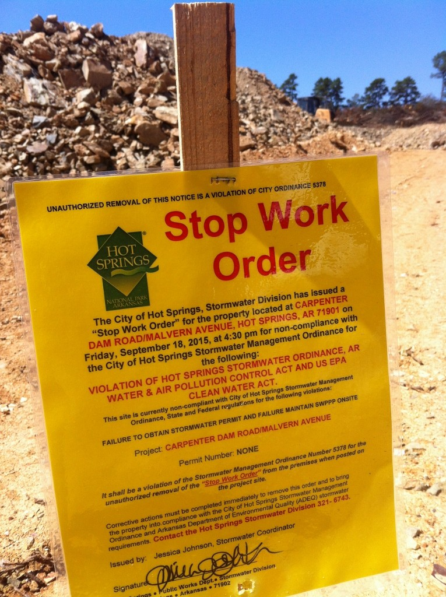
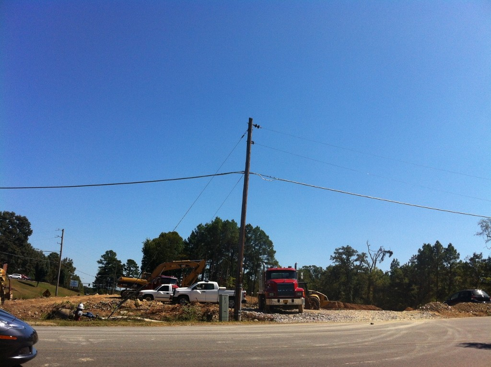
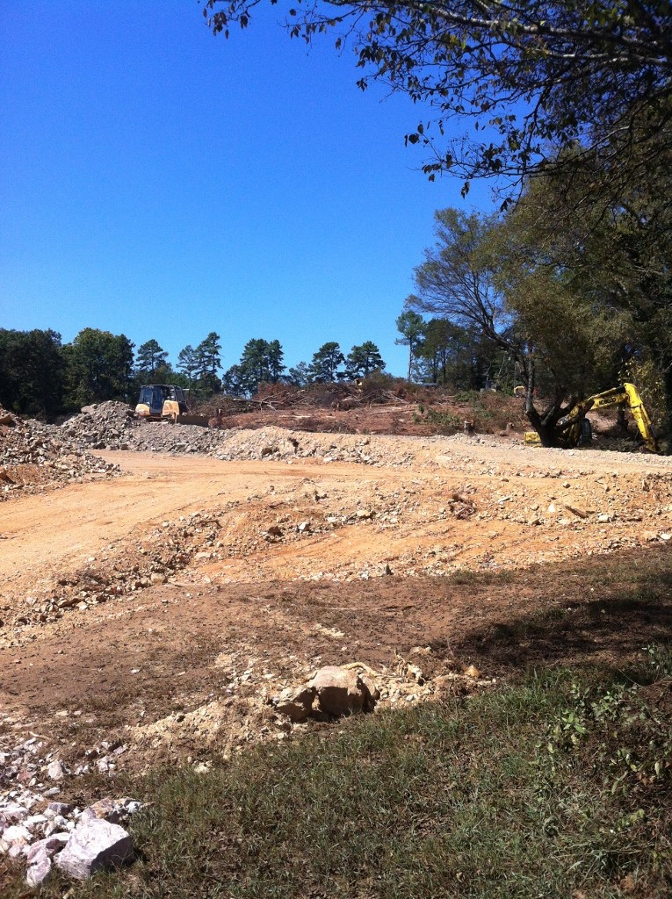
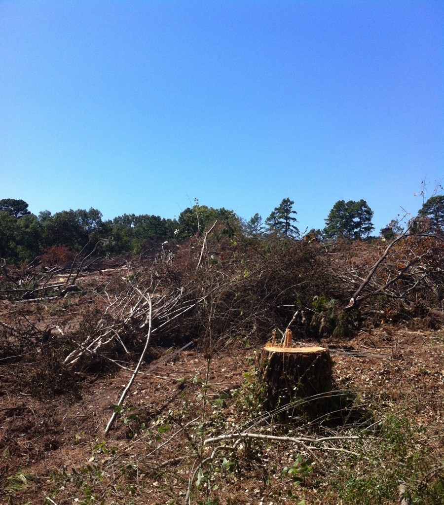
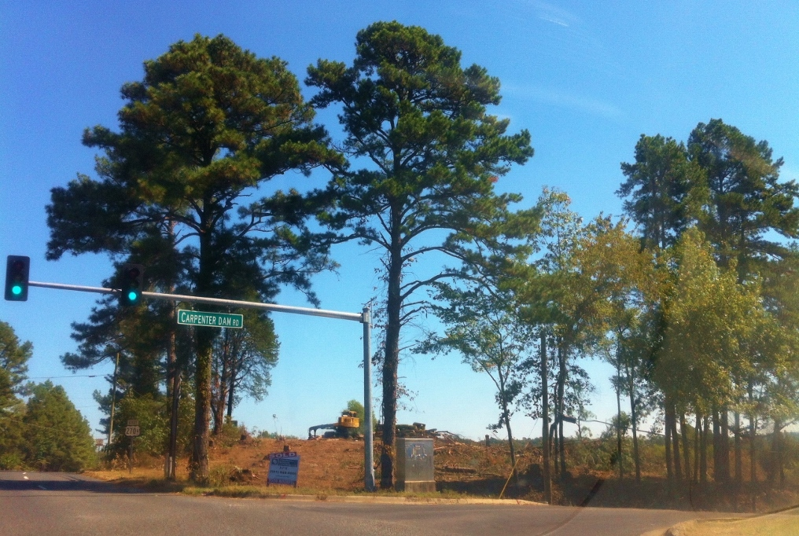

A violation @ Carpenter Dam & Malvern Ave.

I may no longer live in Hot Springs, nor Garland County for that matter, but I did for seven years, and I still work there every weekday and go there nearly every weekend. So today's view was jarring, to say the least.

Malvern Avenue is getting a close shave for some odd reason, considering two sudden and pathetic attempts at what will probably be called "in-fill" development by the powers-that-be.

The woodsy knoll at Golf Links has been completely obliterated, with nary a buffer zone nor screen o'green to compensate for the loss of a once-steep hill filled with natural beauty.

This used to be a hill with tall trees (Golf Links & Malvern Ave).

But when the travesty of a sham of a mockery of a travesty began taking place a block away, at the intersection of Carpenter Dam Rd. and Malvern Avenue, my eco-rage-ometer zoomed into the red. I drove into the side street to take a picture of this ecological holocaust in the middle of a once-serene neighborhood, and lookie what I found:

This used to be a hill of really tall trees.

The city's response to this desecration of a main corridor of Hot Springs can best be summed up as too little too late. But after writing about ecological issues and natural resources of my home state for a quarter century, I have to ask:

Am I naïve to think city officials did not know about this building plan, which covers more than an acre in the heart of town? Could this development be just another oopsie daisy, or is this horror the work of a Hassanflu or a Malt, or some other plundering, well-connected fool? There have been so many, from outside Arkansas as well as from inside.

Garden City of the Natural State deserves better!

I spent the late 1990s attending countless city board meetings in another city, one that had no tree ordinances or desire for vision. Citizen appeals (including crying children) did not prevent the destruction of neighborhoods by rapacious developers in league with city hall. But then, Little Rock has never had much of an identity as a city.

Hot Springs is a different story: Hot Springs is as culturally unique as it is blessed with natural beauty. If Hot Springs wants to become another Little Rock, keep it up! You are getting there. Keep closing the barn door after the cows are long gone, and you will have arrived.

Thankfully, it is not too late to plant seeds, generate a vision and become the Garden City of the Natural State. Time to grow up, Hot Springs!

This used to be a hill w/trees on it.....
