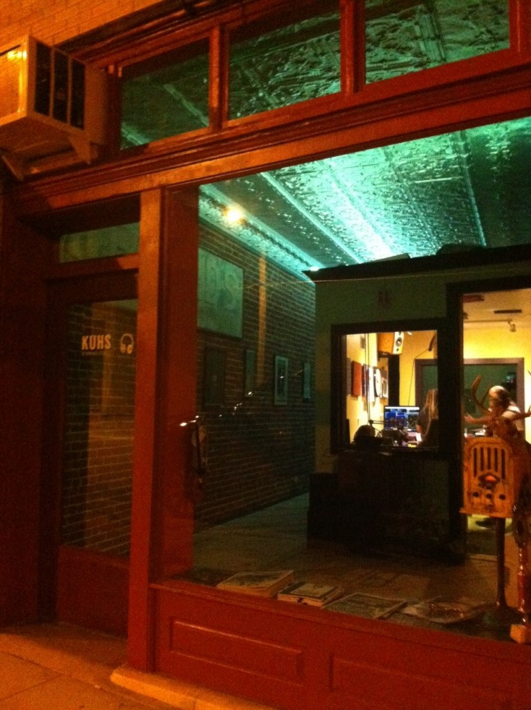

 KUHS 97.9 FM Hot Springs Community Radio

Today I drove downtown listening to local radio: KUHS FM, Hot Springs’ new solar-powered community station. The rain’s been coming down for days with no discernible effect on the transmission, which makes solar power even more impressive.

A mellow DJ was spinning some ‘80s tunes, including the B-52s’ “Channel Z” and the German version of “99 Luft Balloons.” After a bit, the DJ addressed the listening audience:

“Today’s theme is songs about nuclear war,” he explained. “I was 11 back during that particular Cold War era. I didn’t follow geopolitics.” The DJ then described a recurring image from his childhood, “nuclear propaganda,” some film of a boy at a dinner table dropping a fork in slow motion. Before the fork hits the table comes the atomic flash.

“You were vaporized,” he intoned, his deep DJ voice echoing through my car as I drove through steady rain, heading back to the office.

I remember where I was when those songs first got airplay: Hendrix College, walking across campus in the twilight as KHDX FM streamed music out of an open window overlooking the fountain. One of my favorite songs then was “Melt the Guns” by XTC. Sometimes, walking across the lush, shady lawns of the campus, I’d suddenly imagine a mushroom cloud filling the horizon. It was the 1980s and I was barely 21, but it occurs to me that the only thing more unsettling would be to endure such visions at the age of 11.

The nation’s first Cold War happened before I was born, but I was prepared for it due to my upbringing by End-Timers. Apocalyptic imagery of a nuclear flavor originally permeated the minds of writers that came together in the early 1950s. The Beat Poets signaled the first literary movement to address an omnipresent threat of mutually assured annihilation due to the splitting of atoms.

“Beat,” as in beat down to the point of beatitude, beat down to the nanoparticle level, suggests willful groveling in the dirt and mud of life:

"Life is a snake. What do I lose when I lose the snake? I lose my writhing properties..." -- Jack Kerouac

This theme recalls an earlier mystic:

“I am content to live it all again And yet again, if it be life to pitch Into the frog-spawn of a blind man’s ditch...” -- WB Yeats

As I sit here on the night porch listening to the rain's drumbeat, it occurs to me that if it be life to confront the pain of ceaseless war again and again, I'm there. I’m also grateful for radio-waves sending music into timeless darkness. Like the rain, let come what may!
