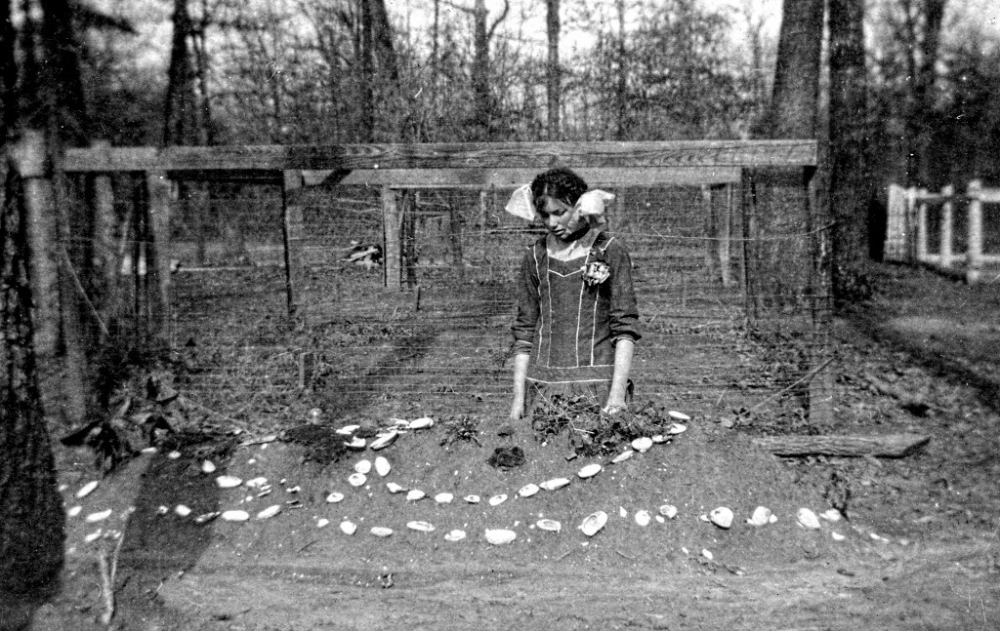
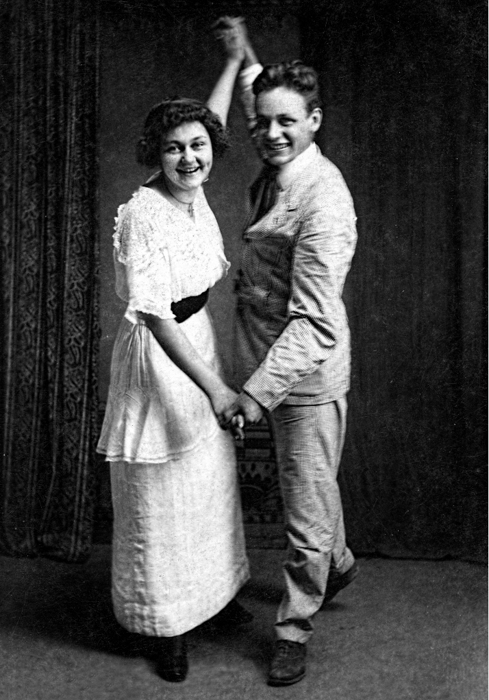

Today, driving out of the Ouachita hills to come to Little Rock and pick up the most important flashdrive of my life, I reflected on the wonderful folks I have gotten to know over the years, fellow lovers of Arkansas History.

The road back to the White River, my lost family history and the rediscovered photographs of the Arkansas Delta -- it's been a wild ride, thanks to my forever buddy LC Brown and our unsinkable muse, Helen Spence.

The most recent kind soul to add to the list is named Ken Hastings, a Little Rock-dwelling Brit who has worked for a quarter century at his craft: photographic restoration. At his workshop (Cantrell Video & Photography, which is stuffed with computers, printing machines and countless frames and mats, yet still conveys an aura of the workshop) Ken performs magic.

"I enjoy bringing history back to life," he told me today, as we stood gazing at the prints he's enlarged for the upcoming Heritage Month Exhibit "Delta Rediscovered: Arkansas County," showcasing photographs by Dayton Bowers of DeWitt. Using a silver halide process on photographic paper (not sub-par dry or inkjet processing) Ken transmutes tiny, brittle, 3 X 5 photographs more than a century old, enlarging prints to 16 X 20 inches. DeWitt photographer Dayton Bowers, whose studio thrived from 1880-1924, can finally be appreciated! The resulting exhibit opens a window on lost worlds.

See for yourself in the juxtaposition of this magnificent image of a lost ceremony of the River People: the decoration of graves with White River mussel shells. View in person at the Museum of the Arkansas Grand Prairie in Stuttgart from May through August. This travelling exhibit is made possible in part by grants from the Arkansas Department of Heritage, 2015 Heritage Month program, and by the Morris Foundation.

_The public is invited to an opening reception for "Delta Rediscovered: Arkansas County," at Museum of the Arkansas Grand Prairie, from 5-8 pm Friday, May 22nd, at 921 East 4th Street, Stuttgart, Arkansas. For more information, contact Denise Parkinson, 501.276.6870._

 who are these young, laughing dancers, fresh as springtime yet from another era?
