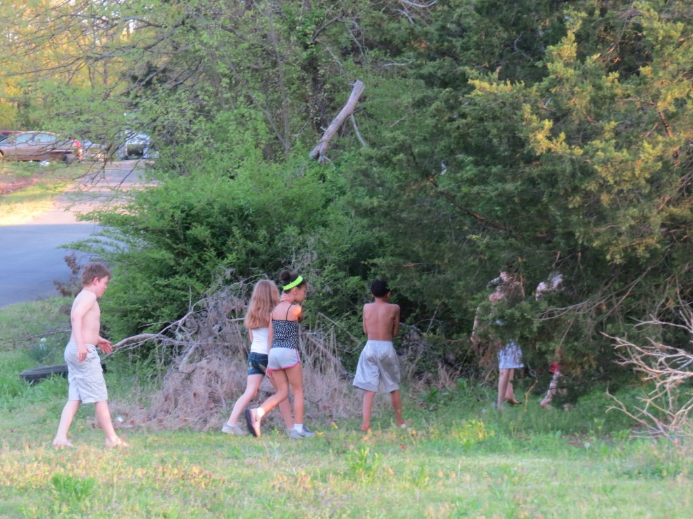

...how a small Southern town made a big noise.

By Denise White Parkinson

 Suggins children of Arkansas in their natural habitat

Cast of Characters:

Jean Petite: Art School grad arriving in Iron Gulch to open the town’s first Art Center

Colonel Crackerfrakkin: Evil slumlord and owner of the local mining industry

Mrs. Crackerfrakkin: Wicked wife of the Colonel; fancies herself an interior decorator

Laken: The Greers Fairy – stirred up over plans to frack beneath Greers Ferry Lake

Tad McTacky: Nephew of the Colonel; an artist who paints barnyard scenes-- roosters a specialty

Lola: Classless daughter of the Crackerfrakkins – had her name legally changed to Lola (from her given name of Gina Mae Crackerfrakkin)

The Suggins Children: Little kids of the town that want the Art Center because they’ve never studied art in school

Reverend Chip: Small-town preacher with big political ambitions; sucks up to the Crackerfrakkins

Rednecks 1,2,3: Greek Chorus with banjos

She-Who-Must-Not-Be-Named: The Director of the Arkansas Department of Environmental Quandary

MC Fouke & Jazzquatch: Disaffected youth of the Arkansas bottomlands

Hobo: Refugee from the Not-So-Great Depression

Cernunnos: Druidic forest deity: part man, part stag

MUSICAL NUMBERS

Battle of Iron Gulch (Rednecks 1, 2 & 3)

Iron Gulch, Keep On Mining (Rednecks 1, 2 & 3)

Pig in a Pen (Rednecks 1, 2 & 3)

Little Man Eulogy (Suggins Children)

Flow (MC Fouke & Jazzquatch)

Fault Line Blues (Hobo)

End of Days Blues (Redneck #3)

Battle of Iron Gulch Reprise (Cast)

PLACE:

Iron Gulch, Arkansas, the county seat of Dimrock County

TIME: Summertime

ACT 1

SCENE 1

Setting: The Old Springs Depot, a historic train station next to an ancient coldwater spring in Iron Gulch, Arkansas.

At Rise: Laken, the Greers Fairy, hovers unnoticed over the Three Rednecks as they lounge on benches by the depot. They have a guitar, banjo and harmonica.

LAKEN: Iron Gulch, population Not Many, is the county seat of Dimrock County, Arkansas. Its mining heyday came and went long ago. After the boom-and-bust, the area’s Vanadium Ore played out, leaving behind the steaming wastes of the Gulch.

Now there’s a new plan: Fracking for Natural Gas! Dimrock County is situated atop the area’s biggest shale play: The Dimwit Shale! Alas, the only uncontaminated water left in Iron Gulch is the fountain at the Old Springs Depot. The Depot was bequeathed to unsuspecting art teacher Jean Petite. She’s on her way to Iron Gulch right now, to claim her inheritance and turn the Depot into the town’s very first Art Center for Children. What could possibly go wrong? (FLUTTERS OFFSTAGE)

SONG: BATTLE OF IRON GULCH – Rednecks 1,2 & 3 (to tune of Battle of New Orleans) “In 2015 we took a little trip With Colonel Crackerfrakkin in the shale of Dimwit We mined all the ore, sludge leaked into the streams And then we set to frackin’ And a-poisoning the springs. We mined that ore and the sludge kept a-comin’ We fracked that shale til the water was aglow We dumped that sludge where no-one was a knowin’ Down the Ouachita River to the Gulf of Mexico.

\[Redneck #3: I thought the glow over the Gulch was the Second Coming, but turns out, it’s just radioactive waste from the mining sludge!\] {reprise} We mined in the hills and we fracked in the valleys We fracked in the bushes where the rabbits wouldn’t go We mined all the ore til the water was a-glowin’ Down the Ouachita River to the Gulf o’Mexico.

\[Redneck #3: Who coulda predicted that vanadium sludge makes people sick? Surely not the State Health Department – why, they’ve known about the radioactivity for years!

Redneck #2: They’s the ones that sent me the documents!\]

We dumped our sludge in the creeks and the valleys Making people sick like your Maw and your Paw Frackin’ that shale til the air be a-stankin’ Aided and abetted by the State of Arkansaw...

REDNECK #1: I ‘magine I best be getting back to the house. REDNECK #2: Aw, what’s your hurry?

REDNECK #3: Yeah, what’s anybody’s hurry? That’s the thing about the Endtimes – you don’t have to rush around doing stuff no more. The Endtimes is all about stopping to smell the roses…

REDNECK #1: Iron Gulch ain’t never smelled like no rose. There ain’t a single rose in this town. Daddy used to say: ‘Smell that, son? Smells like money! Our stink is our pride,’ Daddy always said. Remember back before they closed down the school cuz of the mold problem? The Iron Gulch Odors never lost a home game! REDNECK #2: The Iron Gulch Odors – yeah we had us a great football program, ‘cept for them shower room scandals. You were all-state werentcha?

REDNECK #3: Hey y’all – lookee there, who is that walking down the tracks? Looks like Jesus a-comin!

REDNECK #1: I can’t see that far without my glasses.

REDNECK #2: Whoever they are, they’re wearing some kinda hat or shawl or something on their head. I can’t tell if it’s a dude or a lady.

REDNECK #3: Is that a muslim head-thing, a jihad hanky, what’s it called?

REDNECK #1: Definitely a furriner. Looks like they’re waving at us, should we wave back?

REDNECK #2: Maybe if we all wave together – 1, 2, 3

REDNECK #1: Shut up y’all – here they come –

\[Jean arrives, carrying suitcase. She removes her scarf.\]

JEAN PETITE: Whew! It’s warm – um, excuse me, but is this the town of Iron Gulch?

REDNECK #1: “Excuse you” – why? Did ya cut one?

REDNECK #2: He means, did ya fart!

JEAN PETITE: I beg your pardon – I –

REDNECK #1: Beg? Now you’re beggin? Who do I look like, Colonel Crackerfrakkin? You ain’t got to beg me for nothing, ma’am!

JEAN PETITE: It’s just that the train let me off way back there, and I had to walk the last mile to get here, and that sign says “Old Springs Depot,” but I’m supposed to be going to Iron Gulch…I’m a little tired and thirsty…

REDNECK #1: Here, sit down, get a cup of water – this here’s the best water in Iron Gulch –

REDNECK #2: This here’s the only drinking water in Iron Gulch –

REDNECK #3: It’s a sign of the Endtimes.

JEAN: So this is Iron Gulch, and this is the right train depot? \[Takes a drink\] Wow, that water is awesome, thanks! Oh, I’m getting some more! \[drinks cup after cup\] It’s ice-cold too! So refreshing!

REDNECK #1: And while you’re getting a drink of water, we’ll sing you a little song about Iron Gulch. Ready boys? Ah one and a two—

\[Bluegrass song to the tune Blue Moon of Kentucky\]:

Iron Gulch, Iron Gulch, keep on minin’ Mine all the ore down in the ground Iron Gulch, Iron Gulch, a-keep on minin’ Mine all the ore that can be found. Well it was on a moonlit night, Crackerfrakkin done it right Mined all the ore and more and piled it high Iron Gulch, Iron Gulch, a-keep on mining Frack the shale till all the springs run dry.

JEAN: Oh my, what a colorful history… Maybe you knew my Great-Aunt Nellie? She owned this Depot and left it to me in her will.

REDNECK #3: Miss Nell, yes she went home to heaven to meet her Lord Jesus Christ. She ain’t one o’them Left-Behinds.

JEAN: My name’s Jean -- Jean Petite.

REDNECK #1: I’m Bobby, that’s Billy, and this here’s Buddy. So you’re the little lady Miss Nell left the place to! Well I’ll be darned. Say, aren’t you from the Big City?

JEAN: I’m from Small Pebble – Aunt Nellie paid for me to go to college, and in return I agreed to come back and help her turn the Depot into Iron Gulch’s very first Art Center… but she passed away just a few days before I graduated.

REDNECK #2: Graduated?

JEAN: Yes, I have a Master’s Degree in Arts Education, and I minored in theater. Aunt Nellie’s lawyer sent me this key… \[unlocks door and peers in\] wow – it’s so roomy in here!

REDNECK #3: I got me a degree too. I’m a 3rd degree black belt. Part of my survival training for the Endtimes.

REDNECK #1: And I minered in ore ‘til the Vanadium played out.

REDNECK #2: Speaking of mining, did you hear what Colonel Crackerfrakkin’s up to now?

JEAN: Who is this Colonel Crackerfrakkin anyway?

REDNECK #1: Ma’am -- You sure ain’t from around here!

REDNECK #2: The Colonel is a rich-ass cracker who won’t stop frackin’. He’s got drilling pads and gas wells up north a here, and now he wants to frack this very spot. We’re standing atop the Dimwit Shale, Ma’am! The biggest natural gas play in Dimrock County!

JEAN: The Dimwit Shale?

REDNECK #1: Hang on, Ma’am! – yep, feel that? There’s a tremor – bout a 3.4 I’d say – there’s your Colonel Crackfrakkin right now!

REDNECK 2: Whenever we get a tremor, folks around here say, ‘there goes Colonel Crackerfrakkin a-rollin’ the dice.’ That weren’t no 3.4 -- felt like a 4.1 on the rickety scale.

REDNECK #3: “And behold, the seventh angel did pour out a fluid upon the ground, and the earth shook, and a third of the rivers did turn to blood—

REDNECK #1: Stop with the Endtimer shit, will ya?

JEAN \[emerges from Depot w/a broom\]: Was that an earthquake? I felt something shaking – But wait a minute, he can’t drill for gas here – it would poison the water – everybody knows that methane gas released by drilling gets into wells and ruins the –

REDNECKS: You sure ain’t from around here!

JEAN: Look, gentlemen, I own this depot now – I’ve got the papers to prove it– it’s going to be a beautiful Arts Center, for children’s programs and art festivals, classes, studio exhibits – I’m state-certified to teach –

REDNECKS: Ma’am, this is Iron Gulch! Good luck to ya! We ain’t never had no art center here!

REDNECK #1: The only artist in these parts is Tad McTacky – does he know you’re doing this?

JEAN: \[sweeping breezeway of the Depot\]: Tad McTacky? I’m not familiar with his work – what is his medium?

REDNECK #1: I’d say Tad ain’t no medium – he’s more like an extra-large.

REDNECK #2: Yeah he’s a big ol boy, born with a full set o’ teeth, like a beaver—

JEAN: I mean, what sort of art does he do?

REDNECK #1: Oh-- his paintings have that fancy glow – like that Thomas Kincade feller.

REDNECK #2: I love me some Thomas Kincade – we’ve got one of his paintings out in our guest shed.

REDNECK #3: Tad McTacky’s a pro – he studied art from that afro guy on TV.

JEAN : You mean Bob Ross?

REDNECK #1: Ain’t he a local feller? Didn’t he win the Draw Sparky contest?

JEAN: I am definitely interested in local art and artists – could you put Mr. McTacky in touch with me? I’ve got to roll up my sleeves now and get to work fixing up my new home and business! I think I’ll call it The Springs Art Center – how does that sound? \[exits\]

REDNECK #1: Colonel Crackerfrakkin ain’t gonna like this…

REDNECK #2: No he ain’t…

REDNECK #3: Well I’ll be -- Art coming to Iron Gulch – it’s a Sign o’the Endtimes! \[exit\]

ACT 1

SCENE 2

Setting: The exterior of the transformed Depot, with new signage, flowers, and easels displaying works by Van Gogh and Chagall.

At rise: Suggins Children enter and stand beside the Rednecks.

SUGGINS CHILDREN: Miss Jean can we help? We wanna help!

JEAN: Thank you! You guys have already done so much – would you like to water the flowers? \[hands them the watering can\] I set out some snacks – they’re inside on the table – help yourself! There’s some sidewalk chalk in this bucket if you want to make some chalk art, too.

SUGGINS CHILDREN: Snacks! Sidewalk Chalk! Wow -- thanks Miss Jean! \[exit thru doorway into Depot\]

REDNECK #1: You’re spoilin’ them kids, Ma’am.

REDNECK #2: Spoilin’ em rotten!

JEAN: But they’re such good kids – I’m writing a grant for an after-school program, so I’m getting ready to –

REDNECK #3: Uh-oh, look who’s coming – it’s Tad McTacky and his entourage!

REDNECK #1: Looks like the whole Crackerfrakkin clan is with him…

REDNECK #2: AND Reverend Chip, that ol’ brown-nosing sumbitch. Actin’ like he’s the biggest hog at the trough! JEAN: Thanks for telling Mr. McTacky that I wanted to meet with him –

REDNECK #1: Oh, we didn’t tell him nothin’! But we did write a song about him, ready boys? Ah one and a two:

\[Bluegrass song, to the tune of “Pig in a Pen”\]

I got a pig, home in a pen, and corn to feed him on And Tad McTacky’s paintin’ him to hang on my shed wall. I got a rooster home in the barn, a-crowing to the sun And Tad McTacky paintin’ his portrait, paintin’ til it’s done

\[Redneck #3: They say that every chicken in Dimrock County knows Tad McTacky!\]

{reprise}

I got a cow home in the yard, a moo-in’ soft and low, oh And Tad McTacky’s paintin’ her afore his next art show… Tad, Tad McTacky, yeehaw!

JEAN: I gather Mr. McTacky paints barnyard scenes…?

REDNECK #1: He specializes in roosters, but he does all the livestock – he’s got a gift.

REDNECK #2: His paintings hang over the best divans in Iron Gulch. The saying goes, ‘If it ain’t McTacky, then it ain’t art.’

REDNECK #3: The sunsets he paints give off this intense glow – once, he painted a Jersey heifer o’mine against a flaming sunset and danged if she didn’t look like some cow right outta the Endtimes!

REDNECK #1: You know what his secret is, dontcha? He collects the sludge outta the Gulch and mixes it in with his paints. All those heavy metals and iron oxides give his landscapes a sorta burnt-orange, oily rainbow sheen. They even smell like gasoline, mm -- mmmm!

REDNECK #2: When did you become an art critic?

COLONEL CRACKERFRAKKIN: Hello boys – I came to greet the newest addition to Iron Gulch high society, Miss Jean Petite. So pleased to meet you -- I was a great friend of your Aunt, young lady.

JEAN: And you must be the Crackerfrakkins – welcome to The Springs Art Center.

MRS. CRACKERFRAKKIN: My card – call me for your interior decorating needs, if you ever have any… It’s so kind of you to come all the way from the big city to our humble little town, and bring culture to the hills of Iron Gulch. The Reverend Chip came along with us to see your charming art shop. May I present our daughter –

REDNECK #2: Howdy, Gina Mae – long time no see!

LOLA: I had my named changed to Lola last year and you know it!

MRS. CRACKERFRAKKIN: And this is our nephew: Tad McTacky, “Painter of Light”… surely you’ve heard of him, especially in the big city? Tad also happens to be the most eligible bachelor in Dimrock County!

JEAN: So kind of you all to come – Actually, Small Pebble is not a very big city –

MRS. CRACKERFRAKKIN: Nonsense! And you must let us help with your dear little Art Center, can we take a peek – Oh I see you have some of that hippie drug art up already…

JEAN: Oh no, Mrs. Crackerfrakkin -- those are originals on loan from the Wal-Mart headquarters in Bentonville.

\[Suggins Children come out of the Depot, laughing and talking\]

MRS. CRACKERFRAKKIN: I swan to Jesus! I swan to my time! Git – Git! all of you, you Suggins Children – run along now and play in the Gulch. The grownups have important business to discuss.

LOLA: You heard Mrs. Crackerfrakkin – ew, they probably have head lice, Momma!

\[Suggins Children exit sadly\]

JEAN: Would you like a tour?

COLONEL CRACKERFRAKKIN: I’m looking at your sign right now, and wondering why you ain’t a-calling it the Iron Gulch Art Center?

REDNECK #1: Here we go.

JEAN: That’s a great question. I really wanted a cross-promotional platform for the history of the springs and fountain, and also to suggest the act of knowing from an inspirational –

COLONEL CRACKERFRAKKIN: Hold up there Ma’am, you talk as fast as a Yankee. First off, I got me a few ideas myself about this here Art Center. For one, would you like to sell it? Naturally, you could still run the place as my Art Manager. How does $80,000 a year sound?

JEAN: What? Sir, I planned to run this as a non-profit organization! That’s certainly very generous of you, but—

COLONEL CRACKERFRAKKIN Well then how about a tax deductible donation to your nonprofit organization? Say, $80,000?

JEAN: Oh my God— REDNECK #1: Wait for it…

MRS. CRACKERFRAKKIN: Obviously, if we are to become patrons of the Arts, we’d want to sponsor year-round exhibits of the entire McTacky oeuvre. Tad, show Ms. Petite your portfolio.

TAD: My what?

LOLA: Your paintings, you inbred idiot! Show her your art work!

TAD: Okay Cousin! \[produces several versions of a white rooster – in overalls, on a fence, in a sunset.\]

\[Rednecks whistle in admiration\]

REDNECK #1: Now that’s a Tad McTacky!

JEAN: More than a tad, I’ll say… are these part of a series?

TAD: A what?

COLONEL CRACKERFRAKKIN: So it’s settled then.

\[Mrs. Crackerfrakkin dumps the paintings off the easels and begins installing Tad’s work as the Colonel starts writing a check\]

Now I wanna talk to you Ma’am about an exhibit I want set up in this courtyard area. See where this little park runs alongside the fountain? Crackerfakkin Industries will sponsor an interactive exhibit – an actual drilling pad and natural gas well – mighty educational for the kiddoes. I’ll donate back 10 percent of the profits from selling the gas, of course.

JEAN: Of course…

REVEREND CHIP: I hope you realize, young lady, the generosity being displayed by our very own Colonel Crackerfrakkin. I also need a word with you about certain, ahem, exhibits and whether or not they meet the Purity Standards of the Dimrock Endtimers All-American Church. For example, will you be having boobies on display here?

JEAN: Wait a minute – I thought we might discuss board memberships or volunteer possibilities, but this is ridiculous! I can’t take your check – and I can’t tell you if there will be paintings of bare breasts in the gallery – and I certainly can’t – won’t -- exhibit Foghorn Freaking Leghorn!

\[Jean starts replacing the dumped paintings and tries to hand McTacky’s work to him, only to encounter Mrs. Crackerfrakkin blocking her way\]

MRS. CRACKERFRAKKIN: How dare you – you outsider! You ingrate! You have no idea of the art of Tad McTacky – he loves his subject matter inside and out – why I’ve taken his lunch out to the barn many a time and found him stroking a chicken til it hardly squawked at all! Never have I seen a man love a chicken as much as Tad McTacky! He paints from dawn til dusk – he was practically raised in a barn!

JEAN: I can see that.

REV. CHIP: We’ll just see what the Purity Squad has to say about your heathen, sodomite Art Center!

COLONEL CRACKERFRAKKIN: I ain’t done with you yet, Ma’am. I aim to frack the hell outta the Dimwit Shale, and ain’t no fancy-pants Big City art lady gonna stop it. \[they EXIT\]

JEAN: I can’t believe these people – what planet is this?

\[Rednecks play a slow, sad version of Iron Gulch, Iron Gulch, keep on mining…\]

\[CURTAIN\]

ACT II

SCENE 1

Setting: The Gulch, midday. A place of strange lights and mists. At rise: The Suggins Children poke around dispiritedly.

SUGGINS #1: Granmaw says this place is haunted…

SUGGINS #2: Granmaw needs to get offa that pipe!

SUGGINS #3: Sure is stanky today. Miss Jean ain’t gonna like it when it kills all her flowers – ain’t nothing can survive Ozone-action level 13!

SUGGINS #1: My daddy says it’s a sign o’the Endtimes!

SUGGINS #2: Your daddy’s a Crackerfrakkin inbred!

SUGGINS #1: You don’t know nothin’! I bet you don’t know the names of the Four Horses of the ‘Pocalypse! Cuz my daddy does!

SUGGINS #3: Y’all stop arguing. What are the Four Horses of the Pocket Lips, anyhow?

SUGGINS #1: The Four Horses come outta nowhere to trample everything and bring on the Endtimes! Wanna know their names? First one is called Pegasus—he’s got big, black, oily wings like a giant bat. Pegasus destroys the lakes. Next up, is Magellan—he’s in charge of destroying the rivers… Then you got Valero, that’s the one that finishes off the creeks and swamps.

SUGGINS #2: But that’s only three horses of the Pocket Lips. You’re dumb!

\[Suddenly, dead blackbirds rain down upon the Suggins Children’s heads. They stand stock-still in amazement then run into each other trying to get away. Two fall in a heap among the dead birds, while the 3rd one staggers offstage.\]

SUGGINS #1: Now whatcha got to say about my daddy!?

SUGGINS #2: Aw shut up. Look at all these dead birds! Where’s Jolene?

SUGGINS #3/JOLENE \[offstage\]: Over here – I found something – come help me y’all, it’s heavy!

\[Sugginses drag the limp body of Laken, the Greers Fairy, into center stage and place gently on the ground\]

SUGGINS #1: It’s got wings – look! Where do you think it came from?

SUGGINS #2: Do you s’pose there was one of them Raves out in the county somewhere? JOLENE: That ain’t a costume. I yanked on the wings real good wallago and they wouldn’t come off.

\[Laken comes to, moaning\]

LAKEN: Water….Water!

JOLENE: Let’s take it to Miss Jean! She’ll know what to do!

SUGGINS #2: Cover its head, here come some more o’them blackbirds a-falling outta the sky! SUGGINS #1: It’s a sign o’the Endtimes!

\[CURTAIN\]

ACT II

SCENE 2

Setting: Interior of Springs Art Center, afternoon, same day

At rise: Jean paces back and forth talking on a cellphone

JEAN: I’m telling you Mom, if it weren’t for the kids in this town–but they need this Art Center so bad – Mom? Mom? Can you hear me now? OOOHHH this Crackerfrakkin cellphone! Wow, this place is starting to get to me.

SUGGINS CHILDREN \[offstage\]: Miss Jean! Help, Miss Jean!

JEAN: What’s that you found? Oh my God, bring her inside \[lays the Fairy on a couch\] Jolene, get some water, quickly!

JOLENE: Yes Ma’am!! \[Fairy drinks the water slowly reviving\]

JEAN: You’re going to be okay... I’m Jean, what’s your name?

LAKEN: Laken – my name is Laken. Where am I?

JEAN: You’re in the Springs Art Center in Iron Gulch, Arkansas.

LAKEN: Oh wow. Thank you – I must have passed out.

SUGGINS #1: Most people do first time they visit the Gulch.

JEAN: How did you get here?

LAKEN: There was an explosion – they were drilling sideways under my lake, and the fracking fluids spilled, and the next thing I knew, I was here.

JEAN: Your lake? You mean, Greers Ferry Lake?

LAKEN: Yes, my bad – I’m the Greers Fairy.

SUGGINS CHILDREN: The Greers Fairy!!!

JEAN: Jolene, run lock the door -- let me know if you see anybody coming this way, okay? Now, Miss, um, Laken? I understand that you are some sort of Nyad or water sprite or…? Is there someone in your family I could call about coming to get you?

LAKEN: I’ve got an uncle down in Fouke, Arkansas – but you wouldn’t want to call him. He’s rather unpleasant…

SUGGINS #1: She’s talking about the Fouke Monster – my granmaw was in that movie, The Legend of Boggy Creek.

SUGGINS #2: Granmaw needs to get off the pipe!

JEAN: Kids, please! Laken, is there anyone at all that we could contact on your behalf?

LAKEN: I would call my sister—but the Pegasus pipeline poisoned her lake and she’s been sick ever since…poor Connie! She’ll never be the same.

SUGGINS #1: See? Even it knows about the Four Horses!

JOLENE: Miss Jean! Miss Jean! Somebody’s comin’!

JEAN: Laken, I’m terribly sorry but would you please step into the other room – I’ll handle this and then we can talk some more – Kids, please – don’t say anything until I figure out what’s going on.

SUGGINS CHILDREN: Yes Ma’am.

\[Enter Colonel Crackerfrakkin and Rev. Chip\]

COLONEL C.: Good day Miss Petite. How’s business?

JEAN: Fine – at least, it would be fine if I could get a dependable cellphone or internet connection.

COLONEL C: Oh, that. The cell tower was settin’ right on top of a big shale deposit, so I had to take it down and put a drillin’ rig up in there…

JEAN: But this town needs to communicate with the outside world.

REV. CHIP: And why would Iron Gulch want to do that? We’ve seen what your big city ideas can do – these children are being exposed to boobies!

SUGGINS #1: Nuh-uh! We ain’t seen no boobies – all we seen is a fairy!

SUGGINS #2 Shut up! Miss Jean told us not to tell about the fairy!

REV. CHIP: Just as I suspected – where is the Sodomite? Where are you hiding him, or It as I should say? Colonel Crackerfrakkin -- these children are being introduced to alternative lifestyles at this Art Center! As soon as I’m elected, I’m a-closing it down!

SUGGINS CHILDREN: Noooo!

COLONEL C. : You hear that Miz Petite? We gonna close you down!

\[Fairy bursts into the room in a blinding light\]

LAKEN: Get out! Out in the name of Clean Water! Get away from these children!

\[She shoves them out the door and closes it\]

LAKEN: They won’t be back today.

JEAN: How do you know?

LAKEN: I just know, that’s all… I need to lie down… could you please get me something to eat? Some strawberries or pecans or something… \[faints into Jean’s arms\]

JEAN: Kids – see what you can find in the kitchen, I’m putting her to bed – \[exits\]

JOLENE: What’s a strawberry?

SUGGINS #2: I dunno… what’s a pecan?

\[exit – lights dim\]

Digital film interlude: Dream sequence – Greers Fairy dances among scenes of nature vs. scenes of fracking, mining, and pipeline spills. Children dance to the original song, “Little Man Eulogy,” by Joseph Grundl: When I no longer find a Mom & Pop to shop for sundries My heart is broken, wandering lost Singing the Little Man Eulogy.

When first the sailing ships arrived From Far Eastern ports aplenty The stevedores first heard my song Singing the Little Man Eulogy.

(chorus) I am one you must turn to When the world is cold to you And if you need a hand to hold Tomorrow may never know today

His whip was woven of three cords Omni Trium Perfectum Father Son and Holy Ghost Adeste fideles. (repeat chorus) \[Curtain\]

Act III Scene 1

Setting: Iron Gulch, Night. Darkness and rumble of drums.

At rise: Residents take turns sitting up and speaking from their beds. \[kettle-drums rumble\]

MRS. CRACKERFRAKKIN: \[sits up, turns on light\] Colonel, did you do that?

COLONEL C. : Well, Sugar, in a manner of speakin’ – I guess you could say I did. That’s the sound of the Dimwit Shale getting fracked!

LOLA: \[rushes past wearing robe and cold-cream\]: Daddy I hate you! I’m trying to get my beauty sleep!

REDNECK #2: \[walks past w/a flashlight\] Looks like they’s been a lot o’sleepless nights at the Crackerfrakkins! \[lights off, rumbling of kettle-drums\]

REDNECK #3: \[sits up and turns on light\]: Oh my Lord – if this ain’t the endtimes, they’s a-comin’ soon – I better run check on my beans!

\[lights off, rumble again\]

LAKEN: \[turns on light\] And so it goes.

JEAN: What was that? Another earthquake?

LAKEN: Don’t worry – it’s not going to happen tonight.

JEAN: Huh? What?

LAKEN: Go back to sleep, Jean. Sweet dreams….

\[faint rumble, lights down\]

\[Spotlight falls on a hobo camp where Hobo sits on a log by a spent campfire, MC Fouke and Jazzquatch stand nearby\]

(Song: Flow) MC FOUKE & JAZZQUATCH

We represent the youth Betwixt and betweens The ones getting busted for a broken machine Yo, Moloch, hey man in the moon 800 pound elephant in the room What’s this? What’s that? You say you got something new? You can’t trust the rust When the bust has gone boom. Hey, man, play us a song.

(Song: “Faultline Blues”) HOBO:

Living on the fault line, biding my time Second Great Depression and I don’t mind I’m lonely, what’s to become of me I was a thousandaire and I’m quite aware of my life. Living on the fault line, walking that road Quakin’ and a-shakin’ is taken its toll I’ll never know why you went and looked at me I’m a revolutionaire and I’m quite aware of my life. \[guitar solo\] Living on the fault line, biding my time Sniffing the air and squeezing a lime Hey Mister Charlie, you gotta give me more time Because I’m living on the fault line And I’m well aware of my life. \[Curtain\]

ACT III

SCENE 2

Setting: Morning, Interior of Springs Art Center. At rise: Jean and Laken wake up in a panic.

JEAN: Wake up, Laken, please wake up – Oh My God - they’re coming!

LAKEN: We’ve got to make a stand! Water is life! This is the last pure spring in the Natural State of Arkansas –the buck stops here. Speaking of buck -- where IS the antlered deity of the Druids when you need him, anyway! Cernunnos, god of the Forest – where are you??

JEAN: You’re delirious – sit down over here on the couch. \[Rednecks 1, 2 & 3 burst in – they doff their hats and bow to Laken\]

REDNECK #1: Colonel Crackerfrakkin's a-coming, Miss Jean and Miss – um, well, they’re all a-comin up the road and we want to help.

JEAN: What do we do? They might have eviction papers. Who knows what Reverend Chip came up with on his ridiculous Booby-witch-hunt!

REDNECK #2: Reverend Chip ain’t the only hog at the trough!

\[Colonel Crackerfrakkin, Rev. Chip and Tad McTacky swarm in, change out the art on easels with Tad McTacky’s rooster series\]

JEAN: What are you doing!?

REV. CHIP: This artwork does not meet the Purity Standards of the Dimrock Endtimers All-American Church!

JEAN: But that’s Van Gogh and Chagall!

REV. CHIP: You best stop cussing me in French, young lady!

JEAN: You people are impossible to deal with!

COLONEL CRACKERFRAKKIN: That ain’t no way to talk to your betters, Ms. Petite! We got us a State Official that’s gonna certify our interactive exhibit from Crackerfrakkin Industries. Here she comes now! JEAN: Who is she? Laken, do you know who that is?

LAKEN: Know her? I can smell her stench a mile away. She’s the most dangerous woman in Arkansas – “She-Who-Must-Not-Be-Named” – the Director of the Arkansas Department of Environmental Quandary!

REDNECK #1: Don’t look her in the eye, boys – she’ll turn you to stone! REDNECK #2: And then the Colonel will frack us all to hell!

REDNECK #3: It’s the Whore o’Babylon all right!

SHE: As a lawyer and appointed Director of the Arkansas Department of Environmental Quandary, I hereby certify this site as the new interactive, educational Hydraulic Fracturing Museum and jobs-training program of Dimrock County. Thanks to Crackerfrakkin Industries, this exhibit will showcase progress towards our ultimate goal: Total dominion over the Dimwit Shale play!

REV. CHIP: Ahhhh! A Dominionist – Now we’re talkin’.

SHE: Yes indeed -- I discovered a little-known clause in the state’s annotated code that allows us to take this property via eminent domain, Ms. Petite – so clear out and take your goody-two-shoes art project back to Small Pebble. Leave Dimrock County to its fate. There’s nothing you can do to stop us – the public comment period closed \[CHECKS HER WATCH\] about ten minutes ago – BWAHAHAHAHAH!

JEAN: You’re an evil witch!

SHE: How else do you think I got where I am today? By my looks or my brains? Okay, Colonel, I’m done here. Where’s my payoff? I have to get back to an urgent meeting of the Oil & Gas Commission – we’re changing Arkansas’s slogan from “The Natural State” to something more realistic: “Land of Missed Opportunity.”

LAKEN: Over my dead, wingless body, you abomination against Nature! \[GRABS PITCHER OF SPRING WATER AND THROWS IT ONTO “SHE”\].

SHE: What have you done? That’s pure spring water! I’m melting, MELTING! Ohhh what a world, what a world – all I wanted was a state-sponsored vehicle, a bottomless expense account and a golden parachute – now my beautiful evil plans are ruined, ruined…. \[expires\]

\[TREMOR STARTS TO RUMBLE\]

REDNECK #1: That there was a 5.1 I tell ya!

REDNECK #2: More like a 4.8 on the rickety scale!

LAKEN: You’re both wrong – The fools have re-started the Pegasus Pipeline! It’s gonna blow!

\[CRASH, LIGHTS OUT, EVERYONE FALLS TO THE FLOOR, SILENCE\]

REDNECK #3: \[raises up slowly, grabs a guitar out of the rubble, plays to tune of “Folsom Prison Blues:”\] I see the Lord a-comin’ Descending from the sky We trusted Exxon Mobil, and now we’re gonna die! We should have gone with solar And changed our sinning ways But now the Lord’s a-coming And it’s the end of days.

\[Song: reprise: Battle of Iron Gulch CAST: We mined that ore and the sludge kept a-comin’ We fracked that shale til the water was aglow We dumped our sludge where no one was a knowin’ Down the Ouachita River to the Gulf of Mexico.

\[cast gets up and starts to sing faster, louder, and dance around\]

We mined in the hills and we fracked in the valleys We fracked in the bushes where the rabbits wouldn’t go We dumped our sludge til the water was a-glowin’ Down the Ouachita River to the Gulf of Mexico.

\[CERNUNNOS, Druidic horned GOD OF THE FOREST, enters with SUGGINS CHILDREN and they all JOIN THE DANCE\]

Piping that oil through the creeks and the valleys Making people sick like your Maw and your Paw Frackin’ that shale til the air be a-stankin’ Aided and abetted by the state of Arkansas Aided and abetted by the state of Arkansas!!!

REDNECK #3: And the Game & Fish Commission! The end.
