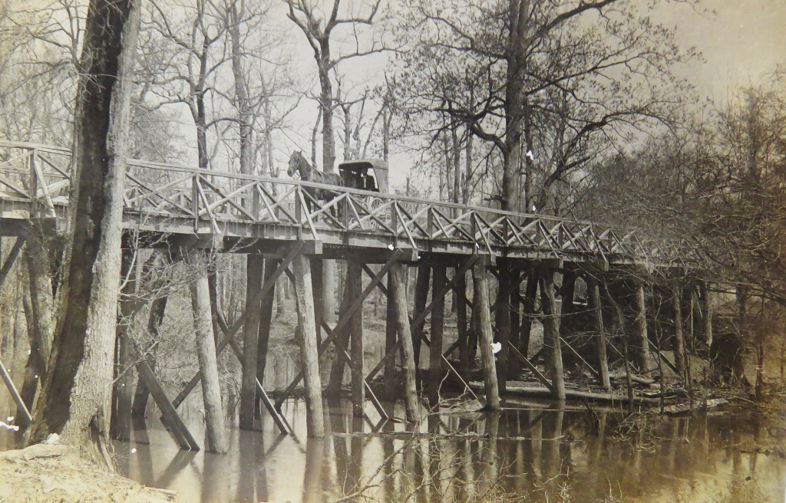
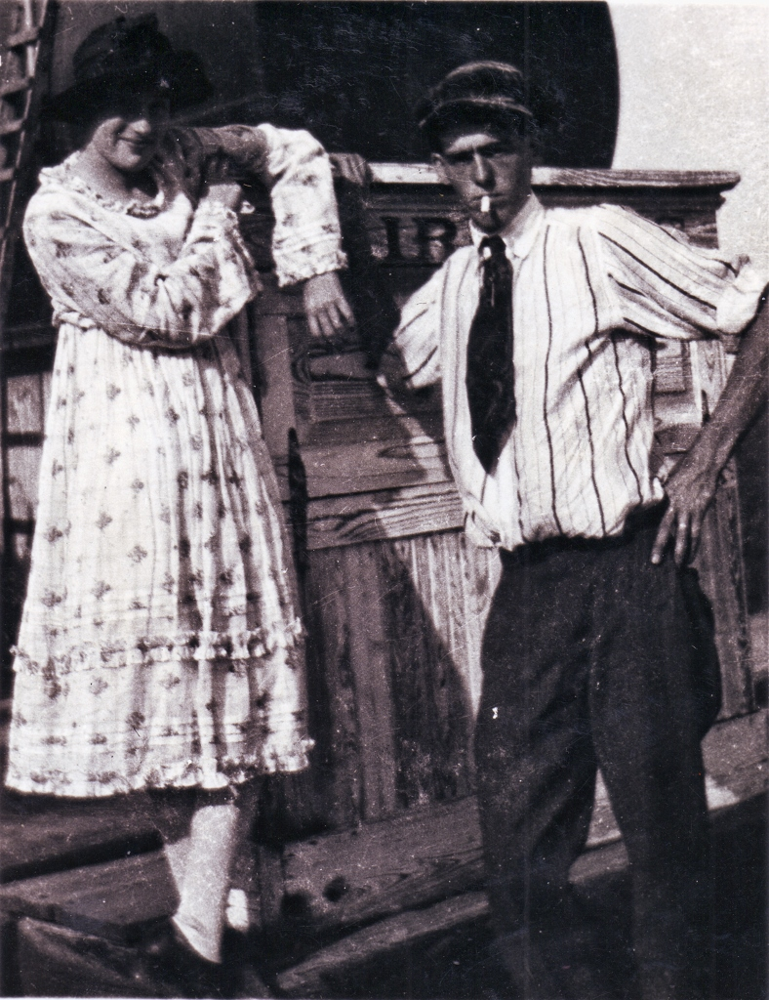
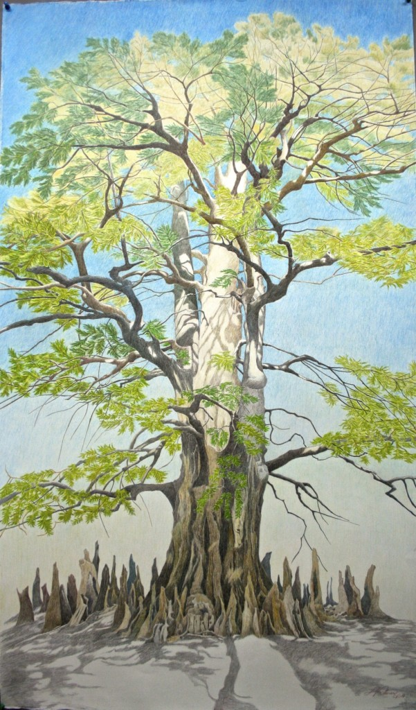

 lower White River, bayou bridge, circa 1900, by Dayton Bowers

By Denise White Parkinson

I journeyed many miles through this topsy-turvy world of love and loss before I found I did not have to walk alone. When I sought out a wise old river-man I had heard about, I gained a buddy for life. LC Brown shared his story, taking me back to my lost ancestral home (well, houseboat) on the White River, haunted as it is by the ghost of Helen Ruth Spence. I listened wholeheartedly, marveling as something invisible took tangible form.

As a muse, Helen Spence is matchless; as an avenging angel (LC's name for her), she paid the price. No prison could hold her. She died a free woman. She beat the system in the only way possible, without going mad.

I miss my buddy terribly, but after six years working side-by-side to bring to light Arkansas's (often dark) past, I can take comfort in the fact LC died at peace, knowing that the work was good and nearly complete. _Daughter of the White River_ is a tribute to LC Brown, as are two upcoming exhibits that feature the Brown family's archive of lost photos of the Delta.

This beautiful, ephemeral Spring sets a magical tone for Helen to make her debut. Her original photograph joins the traveling exhibit "White River Memoirs" for its Little Rock premiere next Friday, April 10, at Little Rock's Butler Center Gallery. Reception from 5-8 pm.

In May, photographic archives from the family collection of LC Brown will premiere as "Delta Rediscovered: Arkansas County." These lost photographs of Dayton Bowers of DeWitt span 1880-1924, depicting the rise of the Delta, its beauty and fertility. Stuttgart's Museum of the Arkansas Grand Prairie welcomes this historic exhibit with a reception from 5-8 pm, Friday, May 22, in the gallery at 921 East 4th Street.

Visitors to "Delta Rediscovered: Arkansas County," can view two dozen iconic images of lost Delta culture, digitally enlarged in a timeless union of past technique and present technology. In colorful counterpoint stands Linda Williams Palmer's Prismacolor portrait of Arkansas's Champion Bald Cypress, from her traveling exhibit "Champion Trees of Arkansas." The state's biggest tree, a landmark of the White River delta since before the river people came, will be standing long after we're gone. Encounter a vision of cultural continuity relevant today as Arkansas struggles with looming shadows. This project is made possible in part by grants from the Arkansas Department of Heritage for May 2015 Heritage Month; and by the Morris Foundation.

Champion Bald Cypress of Arkansas County, by Linda Williams Palmer
