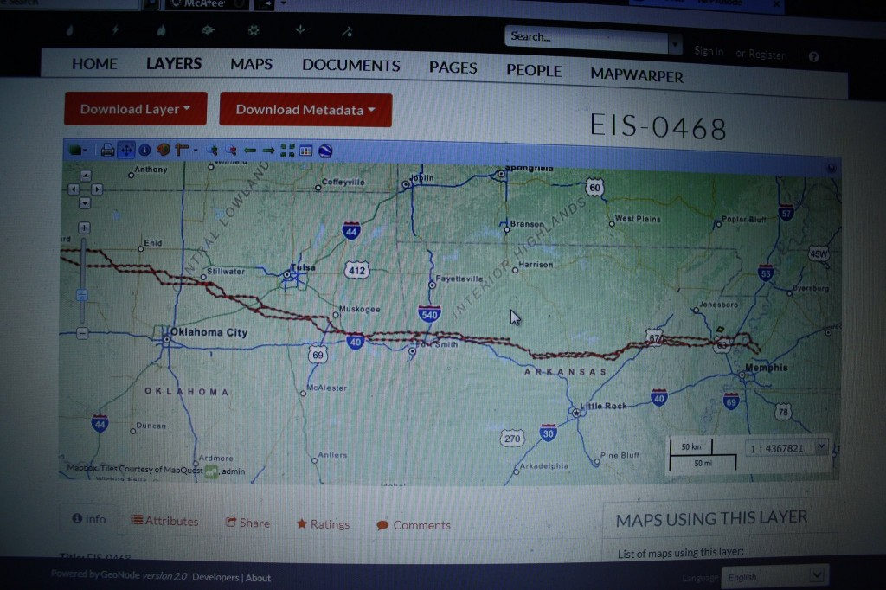

Unclean Line

Secretary of Energy U.S. Dept. of Energy 1000 Independence Avenue SW Washington, D.C. 20585

Dear Secretary Moniz:

I am writing to express my misgivings regarding the “Plains and Eastern Clean Line” project slated to sever the state of Arkansas for the benefit of a limited liability corporation (“Clean Line Energy Partners”) that possesses no track record or accountability. The company’s project to cut across the entirety of the Upper White River watershed, which makes up 3/5 of the state of Arkansas, poses the greatest threat to the Lower White River Delta since the Great Depression.

The process of informing Arkansans about a proposal to cut the state in half has already resulted in marked division. The series of public meetings scheduled to share public information regarding this mammoth project all take place in the upper half of the state. Despite repeated requests that a meeting be scheduled in the lower half of the state, preferably near the White River Delta to inform Arkansans downstream, such reasonable requests were denied.

Historic precedent for this project occurred during the Great Depression when federal eminent domain was used to take control of Arkansas’s most fertile, prosperous region: the White River Delta. Upstream, federal flood control projects and dams resulted in the total destruction of a thriving culture. The White River’s mussel and button trade, as well as its fishing industry, were wiped out due to degradation of the White River, the state’s longest waterway. Families, including mine, lost their homes and way of life.

The “Clean” line project would similarly impact downstream communities along the White River watershed. The White River, proposed as a “National Blueway” in recent years, thus requires a greater level of scrutiny toward a project so vast in scope. To seek the sacrifice of entire systems of Arkansas watersheds for the needs of potential “Eastern” customers also poses a threat to the sovereignty of my home state.

The White River watershed has sacrificed enough to the greater good throughout the past century. The proposed “Clean” line throughway, hundreds of feet wide and hundreds of miles long, compounds an earlier wound still festering throughout communities displaced during the Great Depression’s disastrous eminent domain takeover; a takeover that has made the Delta the most impoverished region in Arkansas, if not the nation.

It is moreover a grave injustice to prevent the state’s poorest demographic (residents of the Delta) from participating in a process that (if approved) will affect them. The fact that no public meetings regarding this project are or will be scheduled in the Lower White River watershed demonstrates the inadequacy of the Plains and Eastern EIS from both a historical and environmental standpoint.

I protest this injustice against the citizens of Arkansas and call for termination of this project so that further degradation of the entire White River watershed can be prevented and further destruction of both upstream and Delta communities can be avoided.

Respectfully,

Beverly Denise White Parkinson
